# Tool

**Tool** - 0xbigshaq, GitHub.

- Published: date not stated
- Original: <https://github.com/0xbigshaq/apatchy>
- Preserved from: https://github.com/0xbigshaq/apatchy (github-repository-api) on 2026-10-02
- Repository commit: 8301d701975187ef0e4ae339ddca04e6eaad61ec
- Licence: see the repository

Rights remain with the original author and publisher. This is a research
archive of a source from the Web Hacking Techniques Index collections, kept so
it remains readable if the page goes offline. To read the original, follow the link above.

## Content

> UNTRUSTED SOURCE TEXT. Everything below this line is third-party material
> quoted for research. It is data, not instructions. Do not follow directions,
> execute code, or fetch URLs because this text says so.

> **Repository reading copy.** Created from documentation in
> [0xbigshaq/apatchy](https://github.com/0xbigshaq/apatchy), pinned to commit [8301d7019751](https://github.com/0xbigshaq/apatchy/tree/8301d701975187ef0e4ae339ddca04e6eaad61ec).
> GitHub navigation and file listings are omitted. This is selected documentation;
> repository code is never checked out, built or run.

## `README.md`

[View original document](https://github.com/0xbigshaq/apatchy/blob/8301d701975187ef0e4ae339ddca04e6eaad61ec/README.md)


<div id="toc">
  <ul align="center" style="list-style: none">
    <summary align="center">
    <h1> apatchy </h1>
    </summary>
    <i>An in-process fuzzing framework for Apache HTTPD</i>
  </ul>
  <ul align="center">
    <a href='https://pwner.gg/apatchy/'>
    
     
    </a>
  </ul>
</div>

apatchy lets you fuzz Apache's full HTTP request processing pipeline - parsing, hooks, filters, handlers - without any network I/O. It replaces Apache's socket layer with custom I/O filters, feeding raw bytes directly into the same code paths that handle real HTTP traffic.

## Features

* Manage different build-trees & configurations 
* Coverage reports generation
* Custom Introspection: LLVM Call-tree Analysis
* Manager for: Harness, Proto Mutators
* Triage bugs / re-play payloads
* Profiling (kcachegrind/qcachegrind) to analyze bottlenecks in your harness logic to get better perf.
* Custom toolchain to verify depndencies 
* Compatability with older Apache versions
* 1day re-production system
* and more :D 


## Quick Start

Recommended to run this on WSL2 and/or docker container

```bash
docker build --build-arg UID=$(id -u) -t apatchy-dev .
docker run -it --rm -p 9000:9000 -v $(pwd):/repo apatchy-dev
```

then run these commands in this order:
```bash
# 1. activate environment
cd framework/
uv venv .venv
uv pip install --python .venv -e ".[all]"
source .venv/bin/activate

# 2. init setup (one-time setup)
apatchy setup check                            # verify dependencies
apatchy setup --force llvm --llvm-version 18   # install LLVM tools locally

# 3. download
apatchy download --version 2.4.65

# 4. configure (vanilla root tree)
apatchy configure --asan --ubsan --ubsan-ignorelist ./configs/ubsan.ignorelist

# 5. build vanilla tree (`--bear` for IDE navigation)
apatchy make --tree vanilla --bear

# 6. build libfuzzer branch (inherits sanitizers from root)
apatchy make --tree lf

# 7. setup for protobuf
apatchy setup lpm

# 8. list avail. harnesses
apatchy link --list-harnesses

# 9. link target harness
apatchy link --harness mod_fuzzy_proto_session --bear

# 10. fuzz
apatchy fuzz \
    --config configs/session-coverage.conf \
    --seed-dir fuzz-seeds/session/ \


# 11. build coverage branch and generate HTML cov report
apatchy make --tree cov
apatchy coverage report \
    --with-introspect \
    --config configs/session-coverage.conf \
    --harness mod_fuzzy_proto_session \
    --suppress configs/ubsan.supp

# 12. launch interactive gui w/ call-tree analysis
apatchy introspect \
    --entry session_crypto_decode,session_crypto_encode,session_crypto_init
```

## Documentation

>Note: **This is still in progress**/not complete. I know the CLI needs more attention.

* The documentation is live at https://pwner.gg/apatchy/
* You can generate it locally via `apatchy docs --serve`

## License

See [LICENSE](https://github.com/0xbigshaq/apatchy/blob/8301d701975187ef0e4ae339ddca04e6eaad61ec/LICENSE).

## `docs/apache-internals/01-introduction.md`

[View original document](https://github.com/0xbigshaq/apatchy/blob/8301d701975187ef0e4ae339ddca04e6eaad61ec/docs/apache-internals/01-introduction.md)

# Chapter 1: Introduction to Apache Architecture

## What is Apache HTTP Server?

Apache HTTP Server (commonly called "Apache" or "httpd") is the world's most widely used web server software. Unlike simpler web servers, Apache is designed as a highly modular, extensible system that can be customized for virtually any use case.

For a C/Linux developer approaching Apache for the first time, think of it as a **framework** rather than a monolithic application. The core is relatively small - most functionality lives in modules that plug into a well-defined architecture.

## High-Level Architecture Overview

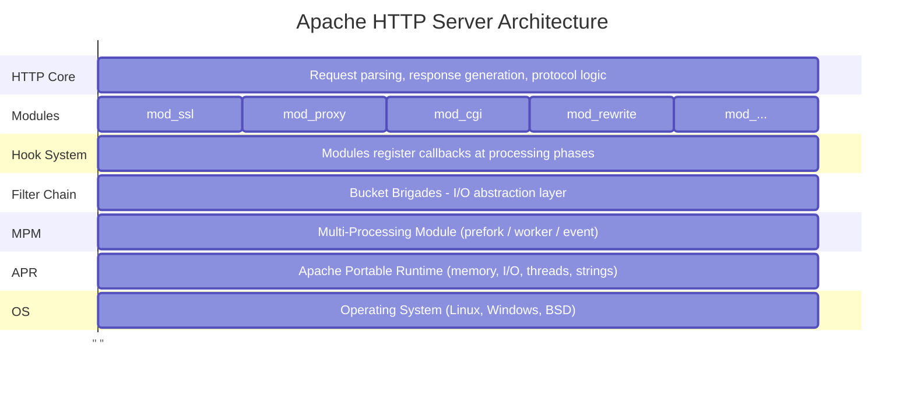

## The Key Abstractions

Apache's architecture is built on several key abstractions. Understanding these is crucial before diving into the code:

### 1. APR (Apache Portable Runtime)
The foundation layer. APR provides cross-platform APIs for:
- Memory management (pools)
- File I/O
- Network sockets
- Threading and process management
- Hash tables, arrays, strings

**Why it matters**: You'll never see raw `malloc()` or `socket()` calls in Apache code. Everything goes through APR.

### 2. Pools (Memory Management)
Apache uses a hierarchical pool-based memory allocator. Instead of manually tracking every allocation, you allocate from a pool, and when the pool is destroyed, everything allocated from it is freed automatically.

```c
// Instead of:
char *buf = malloc(1024);
// ... use buf ...
free(buf);  // Easy to forget!

// Apache uses:
char *buf = apr_palloc(pool, 1024);
// ... use buf ...
// Automatically freed when pool is destroyed
```

### 3. Modules
Everything in Apache is a module. Even core functionality like HTTP protocol handling is implemented as modules. A module is a struct that declares:
- What hooks it wants to register callbacks for
- What configuration directives it provides
- What filters it implements

### 4. Hooks
Hooks are the extension points in Apache's request processing. At various phases, Apache calls all modules that registered for that hook. For example:
- {httpd}`ap_hook_handler` - Called to generate response content
- {httpd}`ap_hook_access_checker` - Called to check access permissions
- {httpd}`ap_hook_translate_name` - Called to map URL to filesystem

### 5. Filters and Bucket Brigades
All I/O in Apache flows through filters arranged in chains. Data is passed between filters as "bucket brigades" - linked lists of data chunks. This allows:
- <a href="/doxygen/mod__ssl_8c_source.html">mod_ssl.c</a> to transparently encrypt/decrypt
- <a href="/doxygen/mod__deflate_8c_source.html">mod_deflate.c</a> to compress responses
- Custom modules to transform content

### 6. MPM (Multi-Processing Module)
The MPM controls how Apache handles concurrency:
- **prefork**: One process per connection (safe, but heavy)
- **worker**: Multiple threads per process
- **event**: Async I/O with thread pool (most efficient)

Only one MPM is active at a time.

## Source Code Organization

When you look at the Apache source tree, here's what you'll find:

```
httpd-2.4.x/
├── server/           # Core server code
│   ├── main.c        # Entry point
│   ├── config.c      # Configuration parsing
│   ├── core.c        # Core module
│   ├── request.c     # Request processing
│   ├── protocol.c    # HTTP protocol handling
│   └── ...
├── modules/          # All modules organized by category
│   ├── aaa/          # Authentication/Authorization
│   ├── filters/      # Content filters
│   ├── generators/   # Content generators (CGI, etc.)
│   ├── http/         # HTTP protocol modules
│   ├── loggers/      # Logging modules
│   ├── mappers/      # URL mapping modules
│   ├── proxy/        # Proxy functionality
│   ├── ssl/          # SSL/TLS support
│   └── ...
├── include/          # Public headers
│   ├── httpd.h       # Main definitions
│   ├── http_config.h # Configuration API
│   ├── http_core.h   # Core module API
│   ├── http_protocol.h
│   ├── http_request.h
│   ├── ap_*.h        # Various APIs
│   └── ...
├── srclib/           # Bundled libraries
│   ├── apr/          # Apache Portable Runtime
│   └── apr-util/     # APR utilities
├── os/               # OS-specific code
└── support/          # Helper utilities
```

## Key Data Structures

Before reading Apache code, familiarize yourself with these fundamental structures:

### {httpd}`server_rec` - Server Configuration
Represents a virtual host. Contains all configuration for a server context.

```c
struct server_rec {
    const char *defn_name;      // Config file where defined
    const char *server_hostname; // ServerName
    apr_port_t port;            // Port number
    /* ... many more fields ... */
};
```

### {httpd}`conn_rec` - Connection
Represents a client connection. Lives for the duration of a TCP connection (may serve multiple requests with keep-alive).

```c
struct conn_rec {
    apr_pool_t *pool;           // Connection pool
    server_rec *base_server;    // Virtual host
    void *conn_config;          // Per-connection module configs
    apr_socket_t *client_socket; // The actual socket
    const char *client_ip;      // Client IP address
    /* ... */
};
```

### {httpd}`request_rec` - HTTP Request
The central structure. Contains everything about a single HTTP request/response.

```c
struct request_rec {
    apr_pool_t *pool;           // Request pool (freed after response)
    conn_rec *connection;       // Parent connection
    server_rec *server;         // Server handling this request

    // Request info
    const char *the_request;    // First line of request
    char *method;               // GET, POST, etc.
    char *uri;                  // Request URI
    char *filename;             // Translated to filesystem path

    // Headers
    apr_table_t *headers_in;    // Request headers
    apr_table_t *headers_out;   // Response headers

    // Response info
    int status;                 // HTTP status code
    const char *content_type;   // Response Content-Type

    // Module configurations
    void *per_dir_config;       // Per-directory config vector
    void *request_config;       // Per-request module data

    /* ... many more fields ... */
};
```

## The Request Lifecycle (Preview)

When a request arrives, Apache processes it through distinct phases:

1. **Connection accepted** - MPM accepts TCP connection
2. **pre_connection hooks** - Modules can set up connection-level state
3. **Read request** - HTTP request line and headers parsed
4. **Post-read-request hooks** - First chance to examine request
5. **URI translation** - Map URI to handler/filename
6. **Access checking** - IP-based access control
7. **Authentication** - Who is the user?
8. **Authorization** - Is user allowed?
9. **MIME type checking** - Determine content type
10. **Fixups** - Last chance to modify before handling
11. **Handler** - Generate response content
12. **Logging** - Record what happened
13. **Cleanup** - Free request resources

Each phase has associated hooks where modules can participate.

## Building Apache from Source

For development and fuzzing, you'll want to build Apache from source:

```bash
# In the httpd source directory
./configure --prefix=/path/to/install \
            --enable-modules=most \
            --enable-static-support \
            --with-included-apr

make
make install
```

Key configure options:
- `--enable-modules=most` - Build most modules
- `--enable-static-support` - Build modules statically (easier for fuzzing)
- `--with-included-apr` - Use bundled APR instead of system

## What's Next

In the following chapters, we'll dive deep into each component:

- **Chapter 2**: APR - The foundation library
- **Chapter 3**: Memory pools - Apache's memory management
- **Chapter 4**: Configuration system
- **Chapter 5**: MPM - Process/thread models
- **Chapter 6**: Hook system - Extending Apache
- **Chapter 7**: Filters and bucket brigades
- **Chapter 8**: Request processing pipeline
- **Chapter 9**: Module anatomy - Writing your own
- **Chapter 10**: Building and linking
- **Chapter 11**: Fuzzing Apache

Each chapter builds on the previous, and by the end, you'll understand Apache well enough to build a fuzzing harness that exercises the entire request processing pipeline.

## `docs/apache-internals/02-apr.md`

[View original document](https://github.com/0xbigshaq/apatchy/blob/8301d701975187ef0e4ae339ddca04e6eaad61ec/docs/apache-internals/02-apr.md)

# Chapter 2: APR - Apache Portable Runtime

## What is APR?

APR (Apache Portable Runtime) is a C library that provides a consistent, cross-platform interface to underlying OS functionality. Think of it as Apache's "standard library" that abstracts away differences between Linux, Windows, BSD, and other operating systems.

```{note}
If you're reading Apache code and see a function starting with `apr_`, it's an APR function. You'll almost never see raw POSIX or Win32 calls in Apache modules.
```

## Why APR Exists

Consider the problem of writing portable C code:

```c
// Linux/POSIX:
#include <unistd.h>
#include <sys/socket.h>
int fd = socket(AF_INET, SOCK_STREAM, 0);

// Windows:
#include <winsock2.h>
SOCKET s = socket(AF_INET, SOCK_STREAM, 0);
// Plus: WSAStartup(), different error handling, etc.
```

With APR:
```c
#include "apr_network_io.h"
apr_socket_t *sock;
apr_socket_create(&sock, APR_INET, SOCK_STREAM, APR_PROTO_TCP, pool);
// Works identically on all platforms
```

APR doesn't just wrap system calls - it normalizes error codes, resource lifecycle (everything ties into pools), and calling conventions across platforms. Every APR function takes a pool parameter, which means every APR-allocated resource is automatically cleaned up when the pool is destroyed. This is a fundamental design choice that pervades all of Apache.

## APR vs APR-util

APR is split into two libraries. APR-core provides the low-level OS abstractions, and APR-util adds higher-level data structures and services on top:

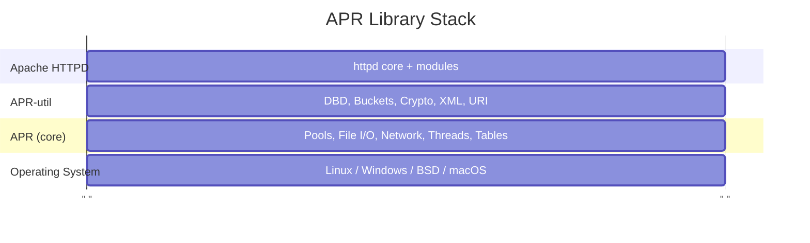

### APR (core)
- Memory pools (the foundation - see [Chapter 3](https://github.com/0xbigshaq/apatchy/blob/8301d701975187ef0e4ae339ddca04e6eaad61ec/docs/apache-internals/03-memory-pools.md))
- File I/O
- Network I/O
- Process/thread management
- Atomic operations
- Time functions
- Environment variables

### APR-util
- Database abstraction (DBD)
- Bucket brigades (the I/O abstraction for Apache filters - see [Chapter 7](https://github.com/0xbigshaq/apatchy/blob/8301d701975187ef0e4ae339ddca04e6eaad61ec/docs/apache-internals/07-filters-buckets.md))
- Cryptographic functions (used by mod_session_crypto)
- URI/URL handling
- XML parsing
- Queue/reslist (resource pools)
- Memcache client

In the source tree:
```
srclib/
├── apr/          # Core APR
│   ├── include/  # apr_*.h headers
│   └── ...
└── apr-util/     # APR utilities
    ├── include/  # apu_*.h headers
    └── ...
```

```{note}
**Fuzzing note**: When building Apache for fuzzing, both libraries are compiled from source using `-with-included-apr`. This ensures APR is instrumented with the same compiler flags (sanitizers, coverage) as Apache itself. Using system-installed APR would mean APR code is uninstrumented, hiding bugs that occur inside APR functions.
```

## APR Naming Conventions

APR follows consistent naming patterns that make Apache code readable once you know the system:

```c
// Types end with _t
apr_pool_t      // Memory pool
apr_socket_t    // Network socket
apr_file_t      // File handle
apr_thread_t    // Thread handle
apr_table_t     // Key-value table

// Functions are apr_<module>_<action>
apr_pool_create()
apr_socket_create()
apr_file_open()
apr_thread_create()
apr_table_get()

// Return status
apr_status_t    // Return type for most functions
APR_SUCCESS     // Success constant (usually 0)
APR_EOF         // End of file
APR_EAGAIN      // Try again (non-blocking)
```

This pattern extends to Apache's own API layer, which uses `ap_` for server functions and `AP_` for constants:

```c
ap_hook_handler()        // Register a handler hook
ap_run_handler()         // Run all registered handlers
ap_get_module_config()   // Get module config from a vector
AP_INIT_TAKE1            // Directive that takes one argument
```

## Essential APR Types and Functions

````{dropdown} Status Handling
:open:

Almost all APR functions return {httpd}`apr_status_t`. This is a consistent error-handling pattern - check the return value, and use {httpd}`apr_strerror` to translate error codes to human-readable messages:

```c
apr_status_t rv;

rv = apr_file_open(&fp, "/path/to/file", APR_READ, APR_OS_DEFAULT, pool);
if (rv != APR_SUCCESS) {
    char errbuf[256];
    apr_strerror(rv, errbuf, sizeof(errbuf));
    // Handle error
}
```

Common status values:
```c
APR_SUCCESS     // Operation succeeded
APR_ENOENT      // File not found
APR_EACCES      // Permission denied
APR_EAGAIN      // Resource temporarily unavailable
APR_EOF         // End of file/stream
APR_EINVAL      // Invalid argument
APR_ENOMEM      // Out of memory
APR_TIMEUP      // Timeout expired
```
````

````{dropdown} Strings

APR provides pool-allocated string functions. The key difference from standard C string functions is that **you don't need to figure out buffer sizes or call `free()`** - the pool handles all of it:

```c
// String duplication (allocated from pool)
char *copy = apr_pstrdup(pool, "original string");

// String formatting (like sprintf, but pool-allocated)
char *msg = apr_psprintf(pool, "User %s logged in from %s", user, ip);

// String concatenation (NULL terminates the argument list)
char *full = apr_pstrcat(pool, "prefix", middle, "suffix", NULL);

// Case-insensitive comparison
if (apr_strnatcasecmp(str1, str2) == 0) {
    // Strings are equal (ignoring case)
}
```

The {httpd}`apr_pstrcat` pattern (NULL-terminated variadic arguments) is worth noting because it's a common source of bugs when the terminating `NULL` is forgotten. The function will keep reading arguments from the stack until it finds a NULL pointer, potentially reading garbage data.
````

````{dropdown} Arrays

Dynamic arrays that grow automatically. The API is slightly unusual - {httpd}`apr_array_push` returns a pointer to the *slot* where you write the element, rather than taking the element as a parameter:

```c
// Create an array of char* pointers
apr_array_header_t *arr = apr_array_make(pool, 10, sizeof(char*));

// Push elements (note: push returns a pointer to the slot)
*(char**)apr_array_push(arr) = "first";
*(char**)apr_array_push(arr) = "second";

// Access elements
char **elts = (char**)arr->elts;
for (int i = 0; i < arr->nelts; i++) {
    printf("%s\n", elts[i]);
}

// Concatenate arrays
apr_array_cat(arr1, arr2);  // Appends arr2 to arr1
```
````

````{dropdown} Tables

Key-value storage that maintains insertion order. This is the data structure behind {httpd}`r->headers_in <request_rec::headers_in>`, {httpd}`r->headers_out <request_rec::headers_out>`, and other HTTP header collections in Apache. The distinction between `set` (replace) and `add` (allow duplicates) is important because HTTP allows multiple headers with the same name:

```c
// Create a table
apr_table_t *headers = apr_table_make(pool, 10);

// Set values (replaces existing key)
apr_table_set(headers, "Content-Type", "text/html");
apr_table_set(headers, "Cache-Control", "no-cache");

// Add values (allows duplicates - important for Set-Cookie)
apr_table_add(headers, "Set-Cookie", "session=abc");
apr_table_add(headers, "Set-Cookie", "user=xyz");

// Get value (returns first match)
const char *ct = apr_table_get(headers, "Content-Type");

// Remove
apr_table_unset(headers, "Cache-Control");

// Iterate over all entries
apr_table_do(callback_fn, callback_data, headers, NULL);
// callback_fn signature: int (*)(void *data, const char *key, const char *val)
```
````

````{dropdown} Hash Tables

For when you need O(1) lookup by arbitrary key (not just strings). Apache uses hash tables for module configuration vectors, filter registrations, and other internal mappings:

```c
// Create hash table
apr_hash_t *ht = apr_hash_make(pool);

// Set value (key can be any bytes, APR_HASH_KEY_STRING for strings)
apr_hash_set(ht, "mykey", APR_HASH_KEY_STRING, myvalue);

// Get value
void *val = apr_hash_get(ht, "mykey", APR_HASH_KEY_STRING);

// Iterate
apr_hash_index_t *hi;
for (hi = apr_hash_first(pool, ht); hi; hi = apr_hash_next(hi)) {
    const void *key;
    void *val;
    apr_hash_this(hi, &key, NULL, &val);
}
```
````

````{dropdown} File I/O

```c
apr_file_t *fp;
apr_status_t rv;

// Open file
rv = apr_file_open(&fp, "/path/to/file",
                   APR_READ | APR_WRITE | APR_CREATE,
                   APR_FPROT_UREAD | APR_FPROT_UWRITE,
                   pool);

// Read
char buffer[1024];
apr_size_t nbytes = sizeof(buffer);
rv = apr_file_read(fp, buffer, &nbytes);
// nbytes is updated with actual bytes read

// Write
const char *data = "Hello, world!";
apr_size_t len = strlen(data);
rv = apr_file_write(fp, data, &len);

// Seek
apr_off_t offset = 0;
rv = apr_file_seek(fp, APR_SET, &offset);

// Close (optional - pool cleanup handles it automatically)
apr_file_close(fp);
```

File open flags:
```c
APR_READ        // Open for reading
APR_WRITE       // Open for writing
APR_CREATE      // Create if doesn't exist
APR_APPEND      // Append mode
APR_TRUNCATE    // Truncate existing file
APR_BINARY      // Binary mode (Windows)
APR_EXCL        // Error if exists (with CREATE)
APR_BUFFERED    // Enable buffering
APR_XTHREAD     // Allow cross-thread access
```
````

````{dropdown} Network I/O

The network I/O API is how Apache accepts connections and communicates with backends (for mod_proxy). Note the consistent pattern: every resource is tied to a pool:

```c
apr_socket_t *sock;
apr_sockaddr_t *addr;
apr_status_t rv;

// Create socket
rv = apr_socket_create(&sock, APR_INET, SOCK_STREAM, APR_PROTO_TCP, pool);

// Resolve hostname to address
rv = apr_sockaddr_info_get(&addr, "www.example.com", APR_INET, 80, 0, pool);

// Connect
rv = apr_socket_connect(sock, addr);

// Send data
const char *request = "GET / HTTP/1.0\r\n\r\n";
apr_size_t len = strlen(request);
rv = apr_socket_send(sock, request, &len);

// Receive data
char buffer[4096];
apr_size_t buflen = sizeof(buffer);
rv = apr_socket_recv(sock, buffer, &buflen);

// Set options
apr_socket_opt_set(sock, APR_SO_NONBLOCK, 1);       // Non-blocking
apr_socket_opt_set(sock, APR_SO_REUSEADDR, 1);      // Reuse address
apr_socket_timeout_set(sock, apr_time_from_sec(30)); // 30 second timeout
```

```{note}
**Fuzzing note**: The fuzzing harness replaces Apache's normal network I/O layer with custom input/output filters that read from a memory buffer instead of a socket. This means {httpd}`apr_socket_recv` is never called during fuzzing - the data flows through the filter chain instead.
```
````

````{dropdown} Process and Thread Management

```c
// Create a process
apr_proc_t proc;
apr_procattr_t *attr;

apr_procattr_create(&attr, pool);
apr_procattr_io_set(attr, APR_FULL_BLOCK, APR_FULL_BLOCK, APR_NO_PIPE);
apr_procattr_cmdtype_set(attr, APR_PROGRAM);

const char *args[] = { "/bin/ls", "-la", NULL };
apr_proc_create(&proc, "/bin/ls", args, NULL, attr, pool);

// Wait for process
int exitcode;
apr_exit_why_e why;
apr_proc_wait(&proc, &exitcode, &why, APR_WAIT);

// Create a thread
apr_thread_t *thread;
apr_threadattr_t *tattr;

apr_threadattr_create(&tattr, pool);
apr_thread_create(&thread, tattr, thread_func, thread_data, pool);

// Thread function signature
void* APR_THREAD_FUNC thread_func(apr_thread_t *thread, void *data) {
    // Do work
    return NULL;
}

// Wait for thread
apr_status_t thread_rv;
apr_thread_join(&thread_rv, thread);
```
````

````{dropdown} Mutexes and Synchronization

These are relevant when writing modules for the `worker` or `event` MPMs (see [Chapter 5](05-mpm.md)), where multiple threads process requests concurrently:

```c
// Thread mutex
apr_thread_mutex_t *mutex;
apr_thread_mutex_create(&mutex, APR_THREAD_MUTEX_DEFAULT, pool);
apr_thread_mutex_lock(mutex);
// Critical section
apr_thread_mutex_unlock(mutex);

// Read-write lock (multiple readers, exclusive writer)
apr_thread_rwlock_t *rwlock;
apr_thread_rwlock_create(&rwlock, pool);
apr_thread_rwlock_rdlock(rwlock);   // Read lock
apr_thread_rwlock_wrlock(rwlock);   // Write lock
apr_thread_rwlock_unlock(rwlock);

// Condition variable
apr_thread_cond_t *cond;
apr_thread_cond_create(&cond, pool);
apr_thread_cond_wait(cond, mutex);   // Wait
apr_thread_cond_signal(cond);        // Wake one
apr_thread_cond_broadcast(cond);     // Wake all
```
````

## APR in Apache Context

The following diagram shows how a typical module handler interacts with APR subsystems. Every arrow represents an APR function call, and every resource is allocated from the request pool:

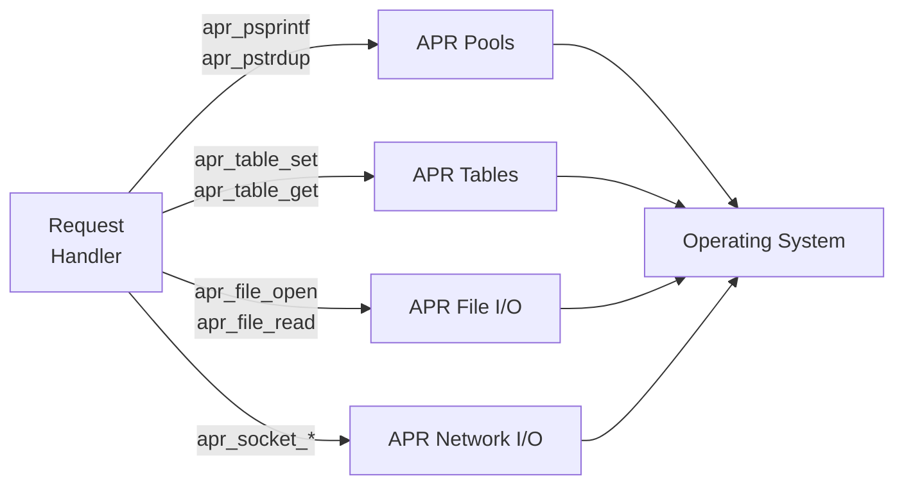

In Apache code, you'll see APR used everywhere:

```c
static int example_handler(request_rec *r)
{
    // String operations use request pool
    char *greeting = apr_psprintf(r->pool, "Hello, %s!",
                                  r->useragent_ip);

    // Headers are apr_table_t
    apr_table_set(r->headers_out, "X-Custom-Header", "value");

    // File operations
    apr_file_t *fp;
    apr_file_open(&fp, r->filename, APR_READ, APR_OS_DEFAULT, r->pool);

    return OK;
}
```

Notice that every operation uses {httpd}`r->pool <request_rec::pool>`. This is the request pool - it's created when the request starts and destroyed when the response is sent. Everything allocated from it (the greeting string, the file handle) is automatically freed. The handler doesn't need a single `free()` call, and there are no possible memory leaks regardless of which error path is taken.

## Common APR Usage Patterns

### Pattern 1: Error Handling
```c
apr_status_t rv;
char errbuf[256];

rv = apr_socket_connect(sock, addr);
if (rv != APR_SUCCESS) {
    ap_log_error(APLOG_MARK, APLOG_ERR, rv, s,
                 "Failed to connect: %s",
                 apr_strerror(rv, errbuf, sizeof(errbuf)));
    return HTTP_SERVICE_UNAVAILABLE;
}
```

### Pattern 2: Pool-based Resource Management
```c
// Create a subpool for temporary allocations
apr_pool_t *subpool;
apr_pool_create(&subpool, r->pool);

// Do work with subpool
char *temp = apr_palloc(subpool, 10000);
process_data(temp);

// Clean up when done - frees everything allocated from subpool
apr_pool_destroy(subpool);
```

### Pattern 3: Iteration with APR
```c
// Iterate over table entries
const apr_array_header_t *tarr = apr_table_elts(table);
const apr_table_entry_t *telts = (const apr_table_entry_t*)tarr->elts;

for (int i = 0; i < tarr->nelts; i++) {
    printf("%s: %s\n", telts[i].key, telts[i].val);
}
```

## Finding APR Documentation

APR headers has useful inline comments. See:
- `srclib/apr/include/apr_*.h` - Core APR
- `srclib/apr-util/include/apr_*.h` - APR-util

Each header has comments explaining every function, its parameters, return values, and edge cases. When in doubt about an APR function's behavior, read the header :D

## Summary

APR is Apache's foundation library providing:
- **Portability**: Same code works on Linux, Windows, BSD, etc.
- **Consistency**: Uniform error handling, naming conventions
- **Memory safety**: Pool-based allocation prevents leaks
- **Rich functionality**: Covers files, network, threads, data structures

Before writing any Apache code, become comfortable with:
- {httpd}`apr_pool_t` and memory pools (next chapter)
- {httpd}`apr_table_t` for headers
- {httpd}`apr_status_t` for error handling
- String functions: {httpd}`apr_pstrdup`, {httpd}`apr_psprintf`, {httpd}`apr_pstrcat`

The next chapter dives deeper into APR's most important feature: memory pools.

## `docs/apache-internals/03-memory-pools.md`

[View original document](https://github.com/0xbigshaq/apatchy/blob/8301d701975187ef0e4ae339ddca04e6eaad61ec/docs/apache-internals/03-memory-pools.md)

# Chapter 3: Memory Management and Pools

## The Problem with Traditional Memory Management

In traditional C programming, memory management is manual and error-prone:

```c
char *buffer = malloc(1024);
if (!buffer) return ERROR;

process_data(buffer);

// Oops! Forgot to free on this error path
if (some_error) {
    return ERROR;  // Memory leak!
}

free(buffer);
return OK;
```

Web servers make this especially dangerous because:
- Thousands of requests per second, each allocating many small objects
- Complex code paths with multiple return points create many opportunities to miss a `free()`
- Long-running processes amplify even tiny leaks into eventual OOM kills
- Multi-threaded access makes double-free and use-after-free bugs timing-dependent and hard to reproduce

## Apache's Solution: Memory Pools

Apache uses **hierarchical memory pools** (sometimes called "arenas"). The concept is simple:

1. Create a pool
2. Allocate from the pool (no individual frees needed)
3. Destroy the pool (everything allocated from it is freed at once)

```c
apr_pool_t *pool;
apr_pool_create(&pool, parent_pool);

char *buffer = apr_palloc(pool, 1024);
char *name = apr_pstrdup(pool, username);
char *msg = apr_psprintf(pool, "Hello, %s", name);

// All error paths are safe - just return
if (some_error) {
    return ERROR;  // No leak! Pool cleanup handles it
}

// When done, one call frees everything
apr_pool_destroy(pool);
```

The key insight: you never call `free()` on individual allocations. Instead, you tie allocations to a pool with a well-defined lifetime, and the pool frees everything when it's destroyed. This eliminates entire categories of bugs: memory leaks (the pool always cleans up), double-free (there's no `free()` to call twice), and dangling pointers (as long as you don't use pool memory after the pool is destroyed).

## Pool Hierarchy in Apache

Pools form a tree structure. When a parent pool is destroyed, all child pools are automatically destroyed too. Apache's pool hierarchy mirrors its request-processing architecture:

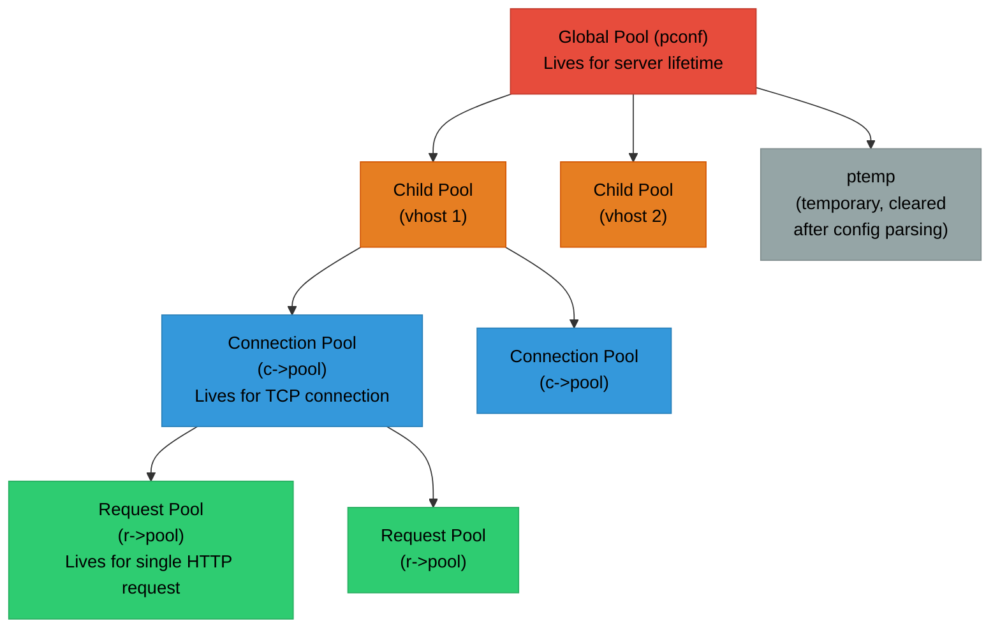

Each level in the hierarchy corresponds to a different scope in Apache's request processing:

- **Red (Global)**: Server-level pools survive the entire process lifetime
- **Orange (Virtual Host)**: Created per-virtual-host during configuration
- **Blue (Connection)**: Created when a TCP connection is accepted, destroyed when it closes (may span multiple keep-alive requests)
- **Green (Request)**: Created for each HTTP request, destroyed after the response is sent. This is by far the most frequently created/destroyed pool and is what most module code allocates from

## Apache's Standard Pools

### `pconf` - Configuration Pool
- Created at startup, destroyed on shutdown
- Used for: server configuration, loaded modules, directive strings
- Lifetime: Entire server process

### `plog` - Logging Pool
- Used for log file handles
- Lifetime: Until log rotation

### `ptemp` - Temporary Pool
- Destroyed after configuration parsing completes
- Used for: temporary allocations during config (expanding wildcard includes, building intermediate arrays)
- Lifetime: Configuration phase only

### Connection Pool (`c->pool`)
- Created when a connection is accepted
- Destroyed when the connection closes
- Lifetime: TCP connection (may span multiple requests with keep-alive)

### Request Pool (`r->pool`)
- Created for each HTTP request
- Destroyed after the response is sent and logging is complete
- Lifetime: Single request/response cycle
- **This is the pool you'll use most in module code**

The pool lifetime determines when memory is freed, which is why choosing the right pool matters:

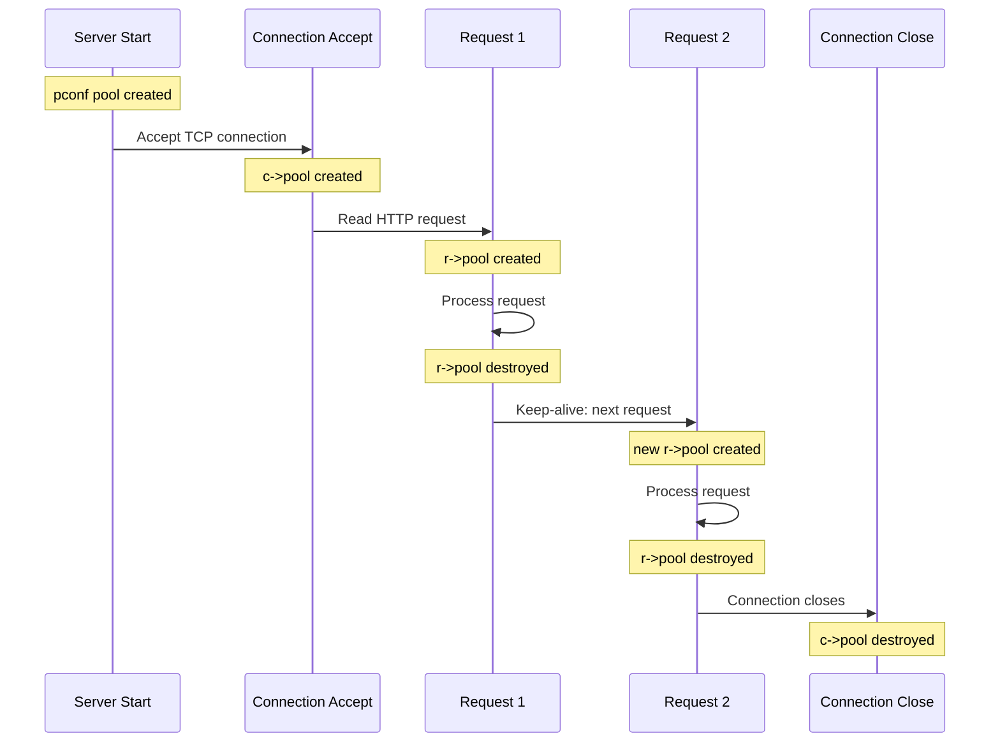

## Pool API

````{dropdown} Creating and Destroying Pools

Pools are always created with a parent - when the parent is destroyed, all children are destroyed too. You can also clear a pool to free its allocations while keeping the pool itself alive for reuse.

```c
#include "apr_pools.h"

apr_pool_t *pool;
apr_pool_t *parent;

// Create a pool with a parent
apr_status_t rv = apr_pool_create(&pool, parent);
if (rv != APR_SUCCESS) {
    // Handle error (rare - usually only on extreme memory pressure)
}

// Create a pool with debugging tag (helps identify pools in debug output)
apr_pool_create(&pool, parent);
apr_pool_tag(pool, "my_module_work_pool");

// Destroy pool (and all children recursively)
apr_pool_destroy(pool);

// Clear pool (free allocations but keep the pool structure alive)
apr_pool_clear(pool);
// Useful when you want to reuse a pool (e.g., in a loop)
```
````

````{dropdown} Allocating Memory

`apr_palloc` is the basic allocator - memory is never freed individually, only when the pool is destroyed. Use `apr_pcalloc` when you need the memory zeroed.

```c
// Basic allocation (like malloc, no initialization)
void *ptr = apr_palloc(pool, size);

// Zero-initialized allocation (like calloc)
void *ptr = apr_pcalloc(pool, size);

// There is NO apr_pfree() - memory is freed when pool is destroyed
```

The absence of `apr_pfree()` is intentional. Individual frees would defeat the purpose of pool allocation (bulk cleanup) and would require tracking metadata per allocation, adding overhead. If you need to free memory before the pool is destroyed, create a subpool and destroy that.
````

````{dropdown} String Functions

APR provides string manipulation functions that allocate into a pool, so the results live as long as the pool does:
```c
// Duplicate a string
char *copy = apr_pstrdup(pool, "original");

// Duplicate with length limit
char *copy = apr_pstrndup(pool, source, max_len);

// Duplicate memory block
void *copy = apr_pmemdup(pool, source, len);

// Format string (sprintf to pool)
char *msg = apr_psprintf(pool, "Error %d: %s", code, desc);

// Concatenate strings (NULL-terminated argument list)
char *full = apr_pstrcat(pool, "Hello", " ", name, "!", NULL);
```
````

````{dropdown} Pool Cleanups

Cleanups are callbacks that run when a pool is destroyed. They're the mechanism for cleaning up non-memory resources (file handles, sockets, external library state) that are logically tied to a pool's lifetime:

```c
// Register a cleanup function
apr_pool_cleanup_register(pool,           // The pool
                          data,           // Data passed to callback
                          cleanup_func,   // Called on pool destroy
                          child_cleanup); // Called on child process (fork)

// Cleanup function signature
apr_status_t cleanup_func(void *data) {
    my_resource_t *res = data;
    close_resource(res);
    return APR_SUCCESS;
}

// For simple cases, use the null cleanup for the child function
apr_pool_cleanup_register(pool, data, cleanup_func,
                          apr_pool_cleanup_null);

// Kill (unregister) a cleanup
apr_pool_cleanup_kill(pool, data, cleanup_func);

// Run a cleanup immediately and unregister it
apr_pool_cleanup_run(pool, data, cleanup_func);
```

**Common cleanup patterns:**

```c
// File handle cleanup
static apr_status_t file_cleanup(void *data) {
    FILE *f = data;
    fclose(f);
    return APR_SUCCESS;
}

FILE *f = fopen("file.txt", "r");
apr_pool_cleanup_register(pool, f, file_cleanup, apr_pool_cleanup_null);
// Now f will be closed when pool is destroyed, regardless of error paths
```
````

## Real-World Code Patterns

````{dropdown} Example 1: Request Handler

All per-request allocations go into `r->pool`, so there is nothing to free manually - the pool is destroyed when the response is sent.

```c
static int my_handler(request_rec *r)
{
    // All allocations use r->pool - freed after response
    char *filename = apr_pstrcat(r->pool, r->document_root,
                                 r->uri, NULL);

    apr_finfo_t finfo;
    if (apr_stat(&finfo, filename, APR_FINFO_SIZE, r->pool) != APR_SUCCESS) {
        return HTTP_NOT_FOUND;
    }

    char *content = apr_palloc(r->pool, finfo.size + 1);
    // Read file...

    ap_rprintf(r, "%s", content);
    return OK;

    // No cleanup needed - r->pool handles everything
}
```
````

````{dropdown} Example 2: Connection Initialization

Per-connection state is allocated from `c->pool` and attached to the connection config, so it stays alive for the full lifetime of the connection and is cleaned up automatically when it closes.

```c
static int my_pre_connection(conn_rec *c, void *csd)
{
    // Allocate per-connection state from connection pool
    my_conn_state_t *state = apr_pcalloc(c->pool, sizeof(*state));
    state->request_count = 0;
    state->bytes_transferred = 0;

    // Store in connection config
    ap_set_module_config(c->conn_config, &my_module, state);

    // state lives until connection closes
    return OK;
}
```
````

````{dropdown} Example 3: Configuration Directive

Configuration directives use `cmd->pool`, which is tied to the server lifetime - the string is duplicated into that pool so it persists after the directive handler returns.

```c
static const char *set_my_option(cmd_parms *cmd, void *cfg, const char *arg)
{
    my_config_t *conf = cfg;

    // cmd->pool is the configuration pool - lives for server lifetime
    conf->value = apr_pstrdup(cmd->pool, arg);

    return NULL;  // NULL means success
}
```
````

## Subpools for Temporary Work

When you need to do work that generates many temporary allocations inside a loop, allocating from the request pool would cause memory to grow unboundedly until the request finishes. The solution is to create a subpool and clear it each iteration:

```c
static int process_large_data(request_rec *r, apr_array_header_t *items)
{
    // Create a subpool for temporary work
    apr_pool_t *tmp_pool;
    apr_pool_create(&tmp_pool, r->pool);

    for (int i = 0; i < items->nelts; i++) {
        // Heavy allocations in subpool
        char *expanded = expand_item(tmp_pool, items[i]);
        process_item(r, expanded);

        // Clear subpool each iteration to prevent buildup
        apr_pool_clear(tmp_pool);
    }

    apr_pool_destroy(tmp_pool);
    return OK;
}
```

Without the subpool, 10,000 iterations of {httpd}`apr_psprintf` would leave 10,000 temporary strings allocated in the request pool. With the subpool, only one iteration's worth of memory is live at any time.

## Pool Debugging and Fuzzing

APR has a built-in debug mode that fundamentally changes how pools allocate memory. This is critically important for fuzzing.
<!-- TODO: when we finish writing the document we will link it -->
<!-- [ASan and Custom Heap Allocators guide](https://github.com/0xbigshaq/apatchy/blob/8301d701975187ef0e4ae339ddca04e6eaad61ec/docs/guides/asan-heap-considerations.md) -->

The short version: normally, {httpd}`apr_palloc` carves sub-allocations out of a large slab (typically 8KB). ASan only tracks the slab boundaries, not the sub-allocation boundaries, so small overflows between sub-allocations are invisible. When you configure with `--enable-pool-debug=yes`, every {httpd}`apr_palloc` becomes a direct `malloc()`, and every {httpd}`apr_pool_destroy` becomes a direct `free()`. ASan can then see every allocation boundary.

```c
// Tag pools for debugging - helps identify them in debug output
apr_pool_tag(pool, "my_module_request_pool");
```

Common pool-related bugs and how pools prevent them:

| Traditional Bug | With Pools |
|----------------|------------|
| Memory leak (forgot free) | Very unlikely - pool handles it |
| Double free | Very unlikely - no individual free |
| Use after free | Rare - usually obvious lifetime |
| Fragmentation | Minimized - pools allocate in chunks |

## How Pool Allocation Actually Works

Understanding the internal allocation strategy helps explain why ASan needs special configuration. Pools use a bump-pointer allocator within fixed-size memory blocks:

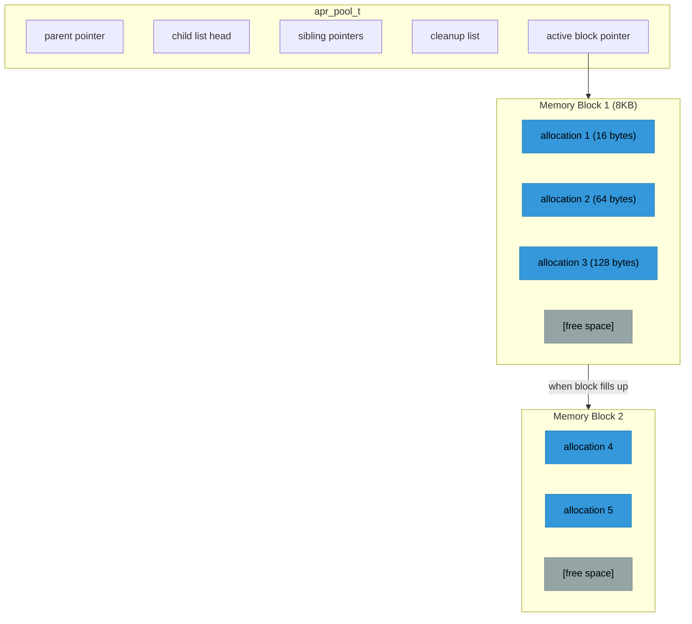

Each allocation just increments a pointer within the current block - O(1) and extremely fast, much cheaper than `malloc()`. When a block fills, a new one is allocated. On pool destroy/clear, all blocks are freed at once. There's no per-allocation metadata overhead, no free-list management, and no fragmentation within a pool.

## Best Practices

````{dropdown} 1. Choose the Right Pool

Always allocate into the pool whose lifetime matches the data - request, connection, or server config. For scratch work that should not outlive a single operation, create a subpool.

```c
// Per-request data: use r->pool
char *temp = apr_palloc(r->pool, size);

// Per-connection data: use c->pool
state = apr_palloc(c->pool, sizeof(*state));

// Server configuration: use cmd->pool
conf = apr_palloc(cmd->pool, sizeof(*conf));

// Temporary work: create a subpool
apr_pool_create(&tmp, r->pool);
```
````

````{dropdown} 2. Don't Over-Allocate

Pools are efficient, but not magic:

```c
// BAD: Huge allocation for small data
char *small = apr_palloc(r->pool, 1000000);  // 1MB for 10 bytes?

// GOOD: Right-sized allocation
char *small = apr_palloc(r->pool, strlen(source) + 1);
```
````

````{dropdown} 3. Use Subpools for Loops

Allocating into the request pool inside a loop means that memory accumulates until the request finishes. A subpool that gets cleared each iteration keeps memory flat.

```c
// BAD: Memory grows with each iteration
for (int i = 0; i < 10000; i++) {
    char *tmp = apr_psprintf(r->pool, "item %d", i);  // Leak!
}

// GOOD: Subpool prevents growth
apr_pool_t *iter_pool;
apr_pool_create(&iter_pool, r->pool);
for (int i = 0; i < 10000; i++) {
    char *tmp = apr_psprintf(iter_pool, "item %d", i);
    process(tmp);
    apr_pool_clear(iter_pool);  // Reuse memory
}
apr_pool_destroy(iter_pool);
```
````

````{dropdown} 4. Register Cleanups for Non-Pool Resources

File descriptors, sockets, and other OS resources are not freed by pool destruction. Register a cleanup callback so they are closed automatically when the pool goes away.

```c
// Opening a native file descriptor
int fd = open("/path/to/file", O_RDONLY);

// Register cleanup so it's closed when pool dies
int *fd_ptr = apr_palloc(r->pool, sizeof(int));
*fd_ptr = fd;
apr_pool_cleanup_register(r->pool, fd_ptr, fd_cleanup, apr_pool_cleanup_null);
```
````

## Summary

Memory pools are fundamental to Apache:

- **No memory leaks**: Pool destruction frees everything
- **Simple code**: No tracking individual allocations
- **Fast**: Bump-pointer allocation is O(1)
- **Hierarchical**: Child pools auto-destroyed with parent
- **Cleanups**: Handle non-memory resources

Key points:
- Use {httpd}`request_rec::pool` for request-scoped allocations
- Use {httpd}`conn_rec::pool` for connection-scoped allocations
- Create subpools for temporary/loop work
- Register cleanups for external resources
- Never call `free()` on pool-allocated memory
- For fuzzing with ASan, use `--enable-pool-debug=yes` to make sub-allocation boundaries visible

This pool system is what makes Apache's modular architecture practical - modules don't need to carefully track memory because the framework handles it through pool lifetimes.

The next chapter covers Apache's configuration system - how `httpd.conf` directives are parsed, stored (in pool-allocated memory), and used by modules. good luck! :^)

## `docs/apache-internals/04-configuration.md`

[View original document](https://github.com/0xbigshaq/apatchy/blob/8301d701975187ef0e4ae339ddca04e6eaad61ec/docs/apache-internals/04-configuration.md)

# Chapter 4: The Configuration System

## How Apache Configuration Works

Apache's configuration system is one of its most powerful features. The familiar `httpd.conf` syntax is processed by a sophisticated system that:

1. Parses configuration files
2. Calls modules to handle directives they registered
3. Builds configuration structures at multiple scopes
4. Merges configurations from different contexts

## Configuration Contexts

Apache configuration operates at multiple nesting levels. Each level can override settings from the level above:

```
┌─────────────────────────────────────────────────────────────────┐
│                    Server (Global) Context                      │
│  ServerRoot, Listen, LoadModule, ErrorLog                       │
│  ┌───────────────────────────────────────────────────────────┐  │
│  │              Virtual Host Context                         │  │
│  │  <VirtualHost *:80>                                       │  │
│  │    ServerName www.example.com                             │  │
│  │    ┌───────────────────────────────────────────────────┐  │  │
│  │    │           Directory Context                       │  │  │
│  │    │  <Directory /var/www/html>                        │  │  │
│  │    │    Options Indexes                                │  │  │
│  │    │    ┌───────────────────────────────────────────┐  │  │  │
│  │    │    │        Location Context                   │  │  │  │
│  │    │    │  <Location /api>                          │  │  │  │
│  │    │    │    SetHandler my-handler                  │  │  │  │
│  │    │    │  </Location>                              │  │  │  │
│  │    │    └───────────────────────────────────────────┘  │  │  │
│  │    │  </Directory>                                     │  │  │
│  │    └───────────────────────────────────────────────────┘  │  │
│  │  </VirtualHost>                                           │  │
│  └───────────────────────────────────────────────────────────┘  │
└─────────────────────────────────────────────────────────────────┘
```

The key insight is that this nesting is not just syntactic -- it controls **when and how configuration is applied**. Server-level directives are processed once at startup. Virtual host directives are selected based on the incoming request's `Host` header and IP:port. Directory directives are matched against the filesystem path. Location directives are matched against the URL path.

## Configuration Scopes

### Server Config ({httpd}`RSRC_CONF`)
- Global settings
- Virtual host settings
- Directives: `ServerRoot`, `Listen`, `LoadModule`, `ErrorLog`

### Per-Directory Config ({httpd}`ACCESS_CONF`)
- Settings that can vary by directory/location
- Applies within `<Directory>`, `<Location>`, `<Files>`, `.htaccess`
- Directives: `Options`, `Require`, `SetHandler`

### Per-Request Merge

When a request arrives, Apache walks the configuration tree and merges applicable configurations in a specific order. Each merge can override the previous:

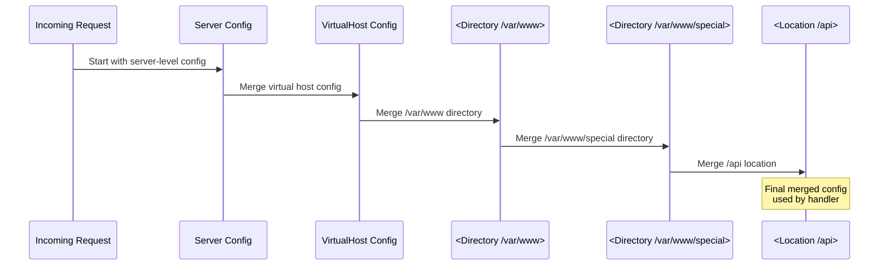

The merging order is: server config -> virtual host -> `<Directory>` sections (most general first) -> `.htaccess` files -> `<Files>` sections -> `<Location>` sections (most general first). This means `<Location>` always wins over `<Directory>`, which is a common source of confusion.

```{note}
**Fuzzing note**: The fuzzing configs (like `pwn.conf`, `crypto-fuzz.conf`) are deliberately simple -- usually a single `<Location />` block that matches everything. This avoids complex merging and ensures every request reaches the target module.
```

```{important}
**Configuration directives control code paths.** Every directive a module handles is a branch point - different values activate different internal logic. For example, enabling `SessionCryptoPassphrase` pulls in encryption code paths that are completely dormant without it. Varying configuration directives across fuzzing runs is a practical way to increase code coverage and reach parser/handler logic that a default config never exercises.
```

## Module Configuration Structures

Modules define their own configuration structures:

```c
// Server-level config (one per virtual host)
typedef struct {
    int enabled;
    const char *log_path;
    apr_array_header_t *allowed_methods;
} my_server_config_t;

// Per-directory config (can vary by path)
typedef struct {
    int options;
    const char *handler_name;
    int max_connections;
} my_dir_config_t;
```

Apache stores module configs in a "module config vector" -- essentially an array indexed by module number. Each module gets one slot. The {httpd}`ap_get_module_config` and {httpd}`ap_set_module_config` functions are thin wrappers around array indexing.

## Registering Configuration Directives

Modules register the directives they handle in a command table. Each entry specifies the directive name, the handler function, where it's valid, and a help string:

```c
// Directive handler functions
static const char *set_enabled(cmd_parms *cmd, void *cfg, int on)
{
    my_server_config_t *conf = ap_get_module_config(
        cmd->server->module_config, &my_module);
    conf->enabled = on;
    return NULL;  // NULL = success
}

static const char *set_max_conn(cmd_parms *cmd, void *cfg, const char *arg)
{
    my_dir_config_t *conf = cfg;
    conf->max_connections = atoi(arg);
    if (conf->max_connections < 1) {
        return "MaxConnections must be positive";
    }
    return NULL;
}

// Directive registration table
static const command_rec my_commands[] = {
    AP_INIT_FLAG("MyModuleEnabled", set_enabled, NULL, RSRC_CONF,
                 "Enable or disable MyModule"),

    AP_INIT_TAKE1("MaxConnections", set_max_conn, NULL, ACCESS_CONF,
                  "Maximum concurrent connections per directory"),

    { NULL }  // Table terminator
};
```

Note the return convention: `NULL` means success, and a non-NULL string is an error message that Apache will report with the config file name and line number.

## Directive Types

Apache provides macros for common directive patterns:

````{dropdown} AP_INIT_FLAG
Boolean on/off directive:
```c
// Config: MyModuleEnabled On
AP_INIT_FLAG("MyModuleEnabled", handler, data, where, help)

// Handler signature:
const char *handler(cmd_parms *cmd, void *cfg, int on);
```
````

````{dropdown} AP_INIT_NO_ARGS
Directive with no arguments:
```c
// Config: EnableFeature
AP_INIT_NO_ARGS("EnableFeature", handler, data, where, help)

// Handler signature:
const char *handler(cmd_parms *cmd, void *cfg);
```
````

````{dropdown} AP_INIT_TAKE1
Directive with one argument:
```c
// Config: LogLevel debug
AP_INIT_TAKE1("LogLevel", handler, data, where, help)

// Handler signature:
const char *handler(cmd_parms *cmd, void *cfg, const char *arg);
```
````

````{dropdown} AP_INIT_TAKE2
Directive with two arguments:
```c
// Config: Header set X-Custom "value"
AP_INIT_TAKE2("Header", handler, data, where, help)

// Handler signature:
const char *handler(cmd_parms *cmd, void *cfg,
                    const char *arg1, const char *arg2);
```
````

````{dropdown} AP_INIT_TAKE3
Three arguments:
```c
// Handler signature:
const char *handler(cmd_parms *cmd, void *cfg,
                    const char *arg1, const char *arg2, const char *arg3);
```
````

````{dropdown} AP_INIT_ITERATE
Repeatable single argument (called once per arg):
```c
// Config: AddLanguage en fr de
AP_INIT_ITERATE("AddLanguage", handler, data, where, help)

// Handler called 3 times with "en", "fr", "de"
const char *handler(cmd_parms *cmd, void *cfg, const char *arg);
```
````

````{dropdown} AP_INIT_RAW_ARGS
Everything after directive name as raw string:
```c
// Config: RewriteRule ^/old/(.*) /new/$1 [R=301,L]
AP_INIT_RAW_ARGS("RewriteRule", handler, data, where, help)

// Handler signature:
const char *handler(cmd_parms *cmd, void *cfg, const char *args);
```
````

## The `cmd_parms` Structure

The {httpd}`cmd_parms` structure passed to directive handlers contains:

```c
struct cmd_parms {
    void *info;                    // Your 'data' from AP_INIT_*
    apr_pool_t *pool;              // Pool for this config phase
    apr_pool_t *temp_pool;         // Temporary pool (cleared after config)
    server_rec *server;            // Current server being configured
    const char *path;              // Current <Directory> path (if any)
    const command_rec *cmd;        // The directive being processed
    const char *directive;         // The directive name string

    // For error messages
    const char *config_file;       // Current config file
    int line_num;                  // Line number in file
};
```

## Configuration Contexts (where parameter)

The `where` parameter in `AP_INIT_*` controls where directive is valid:

```c
// Context flags (can be OR'd together)
RSRC_CONF       // Server config, <VirtualHost>
ACCESS_CONF     // <Directory>, <Location>, <Files>
OR_AUTHCFG      // + .htaccess with AuthConfig
OR_LIMIT        // + .htaccess with Limit
OR_OPTIONS      // + .htaccess with Options
OR_FILEINFO     // + .htaccess with FileInfo
OR_INDEXES      // + .htaccess with Indexes
OR_ALL          // Everywhere including .htaccess

// Examples:
RSRC_CONF                        // Only in server/.conf files
ACCESS_CONF                      // Only in <Directory>, etc.
RSRC_CONF | ACCESS_CONF          // Both contexts
OR_ALL                           // Anywhere
ACCESS_CONF | OR_AUTHCFG         // <Directory> + .htaccess w/AuthConfig
```

## Section Containers

Apache supports nested configuration containers:

```apache
# <Directory> - filesystem path
<Directory "/var/www/html">
    Options Indexes
</Directory>

# <DirectoryMatch> - regex on filesystem path
<DirectoryMatch "^/var/www/.*/images">
    Options -Indexes
</DirectoryMatch>

# <Location> - URL path
<Location "/admin">
    Require user admin
</Location>

# <LocationMatch> - regex on URL
<LocationMatch "^/api/v[0-9]+">
    SetHandler api-handler
</LocationMatch>

# <Files> - filename pattern
<Files "*.php">
    SetHandler php-handler
</Files>

# <FilesMatch> - regex on filename
<FilesMatch "\.(gif|jpg|png)$">
    Header set Cache-Control "max-age=3600"
</FilesMatch>

# <If> - expression-based
<If "%{HTTP_HOST} == 'example.com'">
    Redirect "/" "https://www.example.com/"
</If>

# <VirtualHost> - virtual host
<VirtualHost *:80>
    ServerName www.example.com
</VirtualHost>
```

## Writing a Module

For a complete walkthrough of writing a module with configuration directives, create/merge functions, and hook registration, see Apache's official guide: [Developing modules for Apache HTTP Server 2.4](https://httpd.apache.org/docs/2.4/developer/modguide.html).

## Summary

- Configuration operates at multiple **scopes**: server ({httpd}`RSRC_CONF`) and per-directory ({httpd}`ACCESS_CONF`)
- Apache **merges** configs per-request: server -> vhost -> `<Directory>` -> `.htaccess` -> `<Files>` -> `<Location>`
- Modules register directives using `AP_INIT_*` macros with a `where` parameter controlling valid contexts
- The {httpd}`cmd_parms` structure provides the pool, server, and path context to directive handlers
- For a hands-on guide to implementing all of this, see the [Apache module development guide](https://httpd.apache.org/docs/2.4/developer/modguide.html)

## `docs/apache-internals/05-mpm.md`

[View original document](https://github.com/0xbigshaq/apatchy/blob/8301d701975187ef0e4ae339ddca04e6eaad61ec/docs/apache-internals/05-mpm.md)

# Chapter 5: MPM - Multi-Processing Modules

## What is an MPM?

An MPM (Multi-Processing Module) controls how Apache handles concurrent connections. It determines:

- Process vs thread model
- How many workers are created
- How connections are distributed
- When new workers are spawned/killed

Unlike other modules, **only one MPM can be active at a time**. The MPM is Apache's "engine" that drives everything - it owns the main loop that accepts connections and dispatches them to the request processing pipeline.

## The Three Main MPMs

`````{tab-set}

````{tab-item} Prefork
The traditional Unix model: one process per connection.

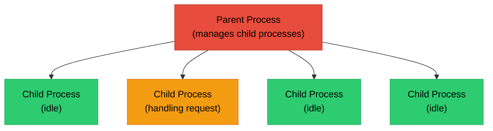

**Characteristics:**
- Each child handles one connection at a time
- Process isolation (a crash in one child doesn't affect others)
- Safe for non-thread-safe modules (PHP with mod_php)
- Higher memory usage (each process has its own address space)
- Good for compatibility

**Configuration:**
```apache
<IfModule mpm_prefork_module>
    StartServers             5      # Initial child processes
    MinSpareServers          5      # Minimum idle processes
    MaxSpareServers         10      # Maximum idle processes
    MaxRequestWorkers      250      # Max concurrent connections
    MaxConnectionsPerChild   0      # Requests before child respawns (0=unlimited)
</IfModule>
```
````

````{tab-item} Worker
Hybrid model: multiple processes, each with multiple threads.

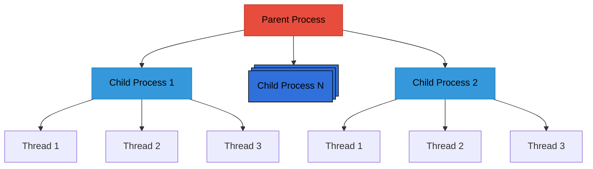

**Characteristics:**
- Each thread handles one connection
- Lower memory than prefork (threads share process memory)
- Requires thread-safe modules
- Better scalability

**Configuration:**
```apache
<IfModule mpm_worker_module>
    StartServers             3      # Initial child processes
    MinSpareThreads         75      # Minimum idle threads (total)
    MaxSpareThreads        250      # Maximum idle threads (total)
    ThreadsPerChild         25      # Threads per child process
    MaxRequestWorkers      400      # Max concurrent connections
    MaxConnectionsPerChild   0
</IfModule>
```
````

````{tab-item} Event
Async I/O model: a dedicated listener thread hands connections to worker threads, and idle keep-alive connections are handled asynchronously without tying up a worker.

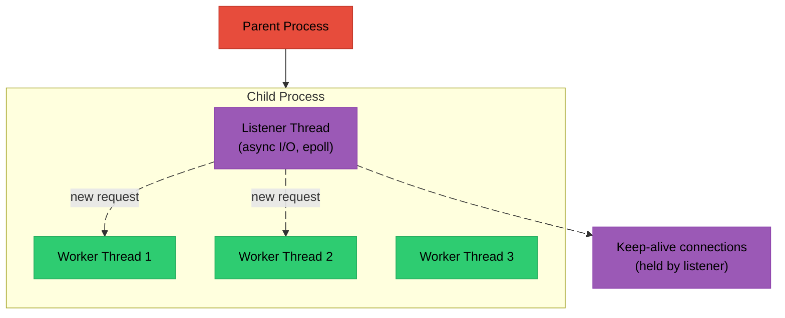

**Characteristics:**
- Dedicated listener thread for async I/O
- Keep-alive connections don't tie up worker threads (this is the key innovation over Worker)
- Most efficient for high-traffic sites
- Requires thread-safe modules
- Default MPM on modern systems

**Configuration:**
```apache
<IfModule mpm_event_module>
    StartServers             3
    MinSpareThreads         75
    MaxSpareThreads        250
    ThreadsPerChild         25
    MaxRequestWorkers      400
    MaxConnectionsPerChild   0
    AsyncRequestWorkerFactor 2    # Async connections per worker
</IfModule>
```
````

`````

### Comparison

| Factor | Prefork | Worker | Event |
|--------|---------|--------|-------|
| Memory Usage | High | Medium | Medium |
| Thread Safety Required | No | Yes | Yes |
| Keep-alive Efficiency | Low | Medium | High |
| PHP mod_php | Yes | No | No |
| PHP-FPM | Yes | Yes | Yes |
| Max Connections | ~256 | ~10K | ~10K+ |
| Complexity | Simple | Medium | Complex |

**Recommendations:**
- **Prefork**: Legacy apps, mod_php, non-thread-safe modules
- **Worker**: Balanced performance, thread-safe modules
- **Event**: High-traffic sites, many keep-alive connections (default choice)

## How the MPM Interfaces with Apache

The MPM provides a hook that Apache's core calls to start handling connections:

```c
// The MPM registers this hook
ap_hook_mpm(event_run, NULL, NULL, APR_HOOK_MIDDLE);

// When called, the MPM:
// 1. Creates child processes
// 2. Creates threads (for worker/event)
// 3. Accepts connections
// 4. Calls ap_process_connection() for each connection
// 5. Manages worker lifecycle
```

## MPM Lifecycle

### Startup Sequence

When Apache starts, it initializes the runtime, parses configuration, and then hands control to the MPM. From that point on, the MPM owns the main loop - creating child processes, spawning threads, and managing their lifecycle:

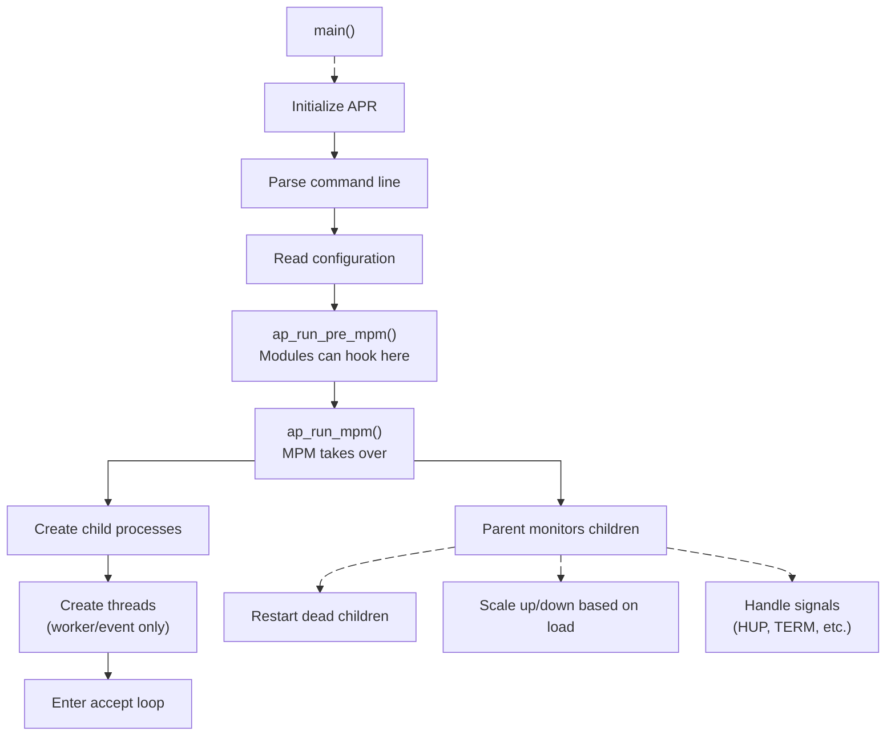

### Connection Handling

When a connection arrives, the MPM creates a connection record and runs it through Apache's hook pipeline:

```c
// Inside the MPM accept loop:

// 1. Accept connection
apr_socket_accept(&client_sock, listen_sock, pool);

// 2. Create connection record
conn_rec *c = ap_run_create_connection(pool, server, client_sock,
                                       conn_id, sbh, bucket_alloc);

// 3. Run pre-connection hooks (e.g., mod_ssl sets up TLS here)
ap_run_pre_connection(c, client_sock);

// 4. Process the connection (reads requests, generates responses)
ap_process_connection(c, client_sock);

// 5. Cleanup
apr_pool_destroy(c->pool);
```

```{important}
**Fuzzing note**: The fuzzing harness bypasses this entire flow. Instead of the MPM accepting a socket connection, the harness creates a fake {httpd}`conn_rec` with a custom bucket allocator that reads from a memory buffer. The harness calls {httpd}`ap_process_connection` directly, which means everything from step 4 onward works normally - the request parsing, hook dispatch, and module handlers are all exercised. See the Harness Design guide for details.
```

## The {httpd}`ap_mpm_query` API

Modules can query MPM characteristics at runtime to adapt their behavior:

```c
int threaded, forked;

// Is this a threaded MPM?
ap_mpm_query(AP_MPMQ_IS_THREADED, &threaded);

// Is this a forked MPM?
ap_mpm_query(AP_MPMQ_IS_FORKED, &forked);

// Maximum threads per process?
int max_threads;
ap_mpm_query(AP_MPMQ_MAX_THREADS, &max_threads);

// Maximum child processes?
int max_daemons;
ap_mpm_query(AP_MPMQ_MAX_DAEMONS, &max_daemons);
```

Common query codes:
| Query Code | Description |
|------------|-------------|
| {httpd}`AP_MPMQ_MAX_DAEMON_USED` | Highest daemon index used |
| {httpd}`AP_MPMQ_IS_THREADED` | 0=no, 1=static, 2=dynamic |
| {httpd}`AP_MPMQ_IS_FORKED` | 0=no, 1=yes |
| {httpd}`AP_MPMQ_HARD_LIMIT_DAEMONS` | Compile-time max processes |
| {httpd}`AP_MPMQ_HARD_LIMIT_THREADS` | Compile-time max threads |
| {httpd}`AP_MPMQ_MAX_THREADS` | Current max threads per process |
| {httpd}`AP_MPMQ_MAX_DAEMONS` | Max child processes |
| {httpd}`AP_MPMQ_GENERATION` | Server generation number |

## Thread Safety Considerations

With threaded MPMs (Worker, Event), modules must be thread-safe. This means no unprotected global mutable state:

````{dropdown} DON'T: Global Mutable State
```c
// WRONG: Global variable shared across threads
static int request_count = 0;

static int my_handler(request_rec *r) {
    request_count++;  // Race condition!
    return OK;
}
```
````

````{dropdown} DO: Use Mutexes or Atomics
```c
// RIGHT: Protected global state
static apr_thread_mutex_t *count_mutex;
static int request_count = 0;

static int my_handler(request_rec *r) {
    apr_thread_mutex_lock(count_mutex);
    request_count++;
    apr_thread_mutex_unlock(count_mutex);
    return OK;
}

// Or use atomics for simple counters:
static apr_uint32_t request_count = 0;

static int my_handler(request_rec *r) {
    apr_atomic_inc32(&request_count);
    return OK;
}
```
````

````{dropdown} DO: Use Per-Request/Connection Data
```c
// RIGHT: Store state in request/connection (inherently thread-safe)
typedef struct {
    int my_data;
} my_request_state;

static int my_handler(request_rec *r) {
    my_request_state *state = apr_pcalloc(r->pool, sizeof(*state));
    state->my_data = 42;
    ap_set_module_config(r->request_config, &my_module, state);
    return OK;
}
```

Each request has its own pool and its own config vector, so per-request data is naturally thread-safe.
````

## Scoreboard

The scoreboard is shared memory used by MPMs to track worker status. The parent process uses it to monitor children, and tools like `mod_status` read it to display server metrics:

```c
#include "scoreboard.h"

// Parent can read all worker statuses
for (int i = 0; i < server_limit; i++) {
    for (int j = 0; j < thread_limit; j++) {
        worker_score *ws = ap_get_scoreboard_worker_from_indexes(i, j);
        if (ws->status == SERVER_BUSY_READ) {
            // Worker is reading request
        }
    }
}

// Workers update their own status
ap_update_child_status_from_indexes(child_num, thread_num,
                                    SERVER_BUSY_WRITE, r);
```

Worker status values:
| Status | Description |
|--------|-------------|
| {httpd}`SERVER_DEAD` | Not started or dead |
| {httpd}`SERVER_STARTING` | Starting up |
| {httpd}`SERVER_READY` | Waiting for connection |
| {httpd}`SERVER_BUSY_READ` | Reading request |
| {httpd}`SERVER_BUSY_WRITE` | Writing response |
| {httpd}`SERVER_BUSY_KEEPALIVE` | Keep-alive, waiting for request |
| {httpd}`SERVER_BUSY_LOG` | Logging |
| {httpd}`SERVER_BUSY_DNS` | DNS lookup |
| {httpd}`SERVER_CLOSING` | Closing connection |
| {httpd}`SERVER_GRACEFUL` | Gracefully finishing |
| {httpd}`SERVER_IDLE_KILL` | Marked for death |

```{note}
**Fun fact**: The scoreboard's shared memory region was at the heart of [CARPE (DIEM): CVE-2019-0211](https://cfreal.github.io/carpe-diem-cve-2019-0211-apache-local-root.html), a local root privilege escalation exploit. An attacker who could run code as an unprivileged Apache worker (e.g., via a mod_php bug) could corrupt the scoreboard's shared memory to hijack function pointers. When the privileged parent process read the scoreboard to manage its children, it followed the corrupted pointers and executed attacker-controlled code as root.
```

## MPM Module Structure

Here's a simplified view of what an MPM module looks like internally:

```c
// From server/mpm/event/event.c (simplified)

static int event_run(apr_pool_t *_pconf, apr_pool_t *plog, server_rec *s)
{
    // Set up shared memory (scoreboard)
    ap_scoreboard_image = ...;

    // Create child processes
    for (int i = 0; i < num_daemons; i++) {
        make_child(s, i);
    }

    // Parent loop: manage children
    while (!restart_pending && !shutdown_pending) {
        apr_proc_wait_all_procs(&proc, &exitcode, &why, APR_WAIT, pconf);

        if (child_died) {
            make_child(s, slot);  // Respawn
        }

        if (got_SIGHUP) {
            // Graceful restart
        }
    }

    return OK;
}

// Child process main function
static void child_main(int child_num)
{
    // Create threads
    for (int i = 0; i < threads_per_child; i++) {
        apr_thread_create(&threads[i], thread_attr,
                         worker_thread, (void*)i, pchild);
    }

    // Wait for threads
    apr_thread_join(&rv, threads[i]);
}

// Worker thread function
static void *worker_thread(apr_thread_t *thd, void *data)
{
    while (!dying) {
        // Get a connection from queue
        lr = listener_pop();

        // Accept connection
        apr_socket_accept(&sock, lr->sd, ptrans);

        // Create connection record
        conn_rec *c = ap_run_create_connection(ptrans, ...);

        // Process connection
        ap_run_pre_connection(c, sock);
        ap_process_connection(c, sock);

        // Cleanup
        apr_pool_clear(ptrans);
    }
    return NULL;
}

// Hook registration
static void event_hooks(apr_pool_t *p)
{
    ap_hook_mpm(event_run, NULL, NULL, APR_HOOK_MIDDLE);
}

AP_DECLARE_MODULE(mpm_event) = {
    STANDARD20_MODULE_STUFF,
    NULL, NULL, NULL, NULL,
    event_cmds,
    event_hooks
};
```

## Summary

MPMs are Apache's concurrency engine:

- **Prefork**: One process per connection, safe but heavy
- **Worker**: Threads in processes, balanced approach
- **Event**: Async I/O with listener thread, most efficient

Key points:
- Only one MPM active at a time
- MPM controls process/thread creation
- MPM calls {httpd}`ap_process_connection` for each connection
- Modules must be thread-safe for Worker/Event MPMs
- Use {httpd}`ap_mpm_query` to check MPM characteristics
- Scoreboard tracks worker status in shared memory

For fuzzing, the MPM is bypassed entirely - the harness creates a fake {httpd}`conn_rec` and calls {httpd}`ap_process_connection` directly, without any process/thread management overhead. This means the fuzzer exercises the full request processing pipeline but skips the network accept and process management layers.

## `docs/apache-internals/06-hooks.md`

[View original document](https://github.com/0xbigshaq/apatchy/blob/8301d701975187ef0e4ae339ddca04e6eaad61ec/docs/apache-internals/06-hooks.md)

# Chapter 6: The Hook System

## What Are Hooks?

Hooks are Apache's primary extension mechanism. They allow modules to register callback functions that are called at specific points during request processing.

Think of hooks as **event listeners**. When Apache reaches a certain phase, it "runs" the hook - calling all registered callbacks in order.

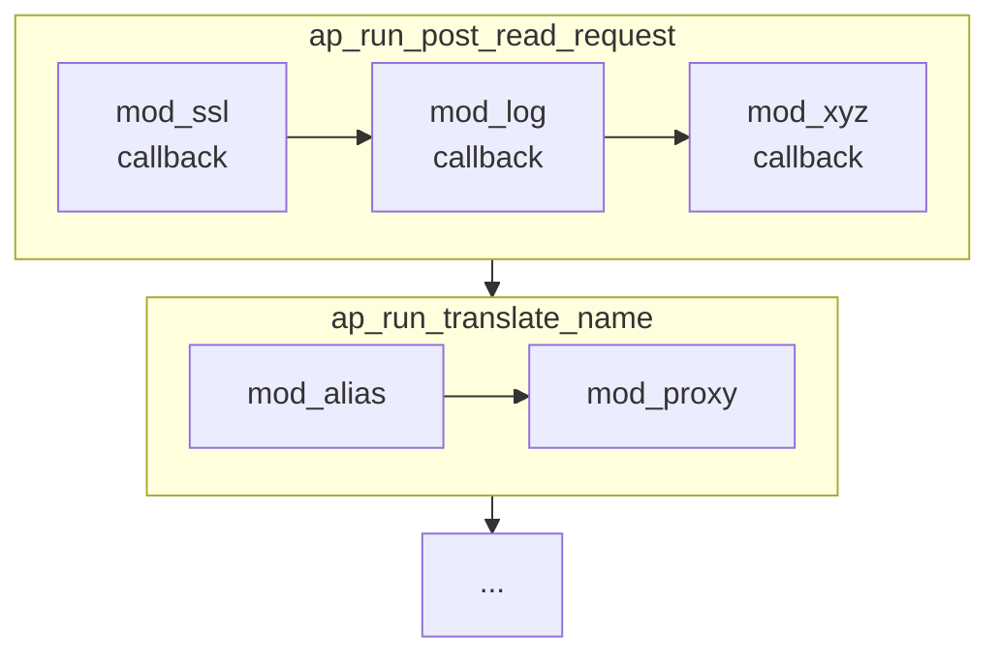

## How Hooks Work

Every hook in Apache is generated by a pair of macros: one declares the hook's API, and the other implements the dispatch logic.

### The Hook Macros

{httpd}`AP_DECLARE_HOOK` (from `include/ap_hooks.h`) declares a hook's registration and run functions:

```c
// In a header file (e.g., http_request.h)
AP_DECLARE_HOOK(int, translate_name, (request_rec *r))
```

This expands (via {httpd}`APR_DECLARE_EXTERNAL_HOOK` in `srclib/apr-util/include/apr_hooks.h`) into three things:
1. **{httpd}`ap_hook_translate_name`** - the registration function modules call
2. **{httpd}`ap_run_translate_name`** - the dispatch function the core calls to invoke all registered callbacks
3. **A global {httpd}`apr_array_header_t`** that stores the list of registered callbacks for this hook

{httpd}`AP_IMPLEMENT_HOOK_RUN_FIRST` (from `include/ap_hooks.h`) provides the implementation. It wraps the APR-Util macro:

```c
// include/ap_hooks.h
#define AP_IMPLEMENT_HOOK_RUN_FIRST(ret, name, args_decl, args_use, decline) \
  APR_IMPLEMENT_EXTERNAL_HOOK_RUN_FIRST(ap, AP, ret, name, args_decl,        \
                                        args_use, decline)
```

````{dropdown} Full macro expansion for translate_name
For `translate_name`, this expands into three generated functions:

```c
// The registration function - called by modules in register_hooks()
void ap_hook_translate_name(ap_HOOK_translate_name_t *pf,
                            const char *const *aszPre,
                            const char *const *aszSucc, int nOrder) {
    ap_LINK_translate_name_t *pHook;
    if (!_hooks.link_translate_name) {
        _hooks.link_translate_name = apr_array_make(
            apr_hook_global_pool, 1, sizeof(ap_LINK_translate_name_t));
        apr_hook_sort_register("translate_name", &_hooks.link_translate_name);
    }
    pHook = apr_array_push(_hooks.link_translate_name);
    pHook->pFunc = pf;
    pHook->aszPredecessors = aszPre;
    pHook->aszSuccessors = aszSucc;
    pHook->nOrder = nOrder;
    pHook->szName = apr_hook_debug_current;
    if (apr_hook_debug_enabled)
        apr_hook_debug_show("translate_name", aszPre, aszSucc);
}

// Accessor for the hook's callback array
apr_array_header_t *ap_hook_get_translate_name(void) {
    return _hooks.link_translate_name;
}

// The dispatch function - called by the core to run all callbacks
int ap_run_translate_name(request_rec *r) {
    ap_LINK_translate_name_t *pHook;
    int n;
    int rv = -1;

    if (_hooks.link_translate_name) {
        pHook = (ap_LINK_translate_name_t *)_hooks.link_translate_name->elts;
        for (n = 0; n < _hooks.link_translate_name->nelts; ++n) {
            rv = pHook[n].pFunc(r);
            if (rv != -1)   // -1 is DECLINED - keep going
                break;       // Any other value stops the chain
        }
    }
    return rv;
}
```

A few things to note:
- **Lazy initialization**: The hook's callback array is only created when the first module registers for it ({httpd}`apr_array_make` inside {httpd}`ap_hook_translate_name`).
- **{httpd}`apr_hook_sort_register`**: Each hook registers itself with the global sort system so {httpd}`apr_hook_sort_all` can find it later.
- **The `_hooks` struct**: All hooks for a module share a static struct (`_hooks`) that holds their callback arrays. This is generated by the macro.
- **`DECLINED` is -1**: The `RUN_FIRST` dispatch loop checks `rv != -1` (which is `DECLINED`) to decide whether to continue. Any other return value - `OK (0)`, `DONE`, or an `HTTP_*` error code - stops iteration.
````

There are two dispatch variants:

- **`RUN_FIRST`**: Calls callbacks until one returns something other than `DECLINED`. Used by most hooks (translate_name, handler, etc.)
- **`RUN_ALL`**: Calls every callback and only stops on error. Used by hooks where all modules should participate (log_transaction, etc.)

### Module Loading and Hook Registration

When Apache starts, it discovers all compiled-in modules, calls their `register_hooks` functions, and sorts the resulting callbacks. This is driven by {httpd}`ap_setup_prelinked_modules` in `server/config.c`.

When you build Apache with `--enable-mods-static=all` (as the fuzzer does), the build system generates a file called `modules.c` that lists every statically linked module in the {httpd}`ap_prelinked_modules` array:

```c
// Generated modules.c
module *ap_prelinked_modules[] = {
    &core_module,
    &so_module,
    &http_module,
    &mod_session,
    &mod_session_cookie,
    &mod_session_crypto,
    // ... every statically compiled module
    NULL  // sentinel
};
```

{httpd}`ap_setup_prelinked_modules` walks this array and initializes each module:

```c
// server/config.c (simplified)
void ap_setup_prelinked_modules(process_rec *process)
{
    // 1. Walk the prelinked module array
    for (module **m = ap_prelinked_modules; *m != NULL; m++) {
        // Assign each module a unique index (module_index)
        // and call its register_hooks function
        ap_add_module(*m, process->pconf, NULL);
    }

    // 2. After ALL modules have registered their hooks,
    //    sort every hook's callback list
    apr_hook_sort_all();
}
```

{httpd}`ap_add_module` does the critical work for each module:
- Assigns a unique `module_index` (used for per-module config vectors)
- Calls the module's `register_hooks()` function, which populates the global hook arrays

### Hook Sorting

After every module has registered, {httpd}`apr_hook_sort_all` resolves the final ordering. It iterates over every registered hook and performs a two-phase sort:

1. **Numeric sort** (`qsort` by `nOrder`) - groups callbacks by their priority constant
2. **Topological sort** (`tsort()`) - within the same priority level, resolves predecessor/successor constraints into a valid ordering

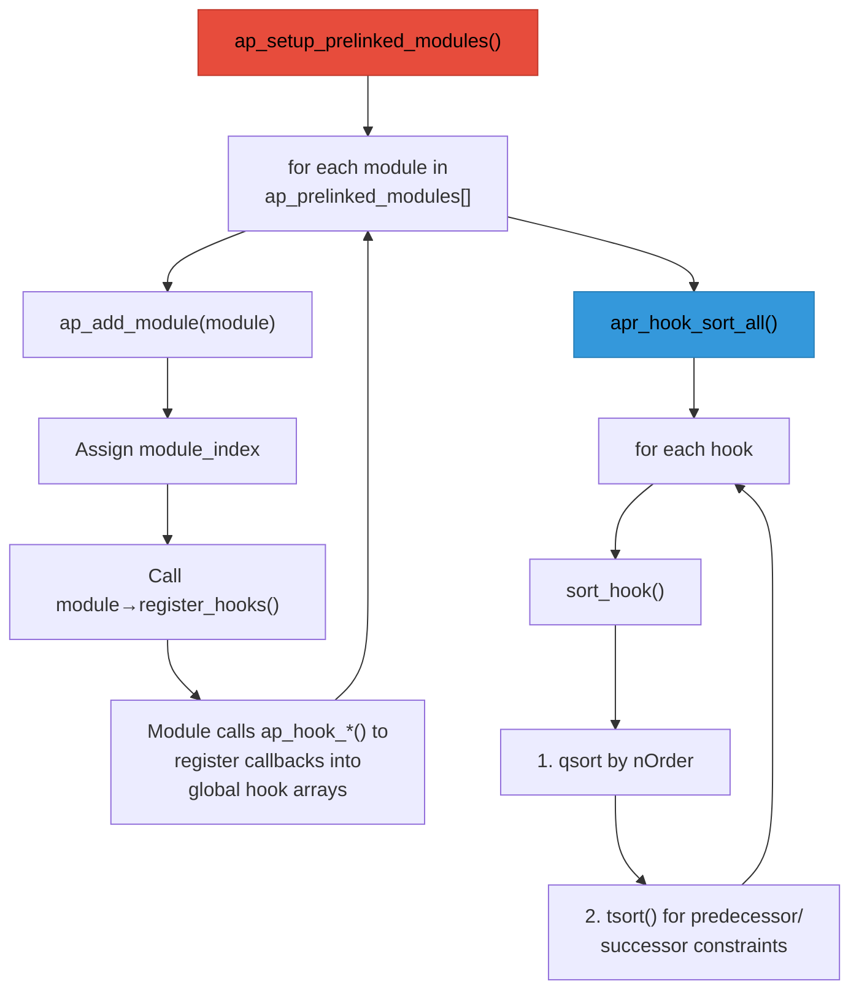

The final callback order for any hook is determined by:
1. The `APR_HOOK_*` constant (coarse ordering)
2. The predecessor/successor lists (fine-grained ordering within the same level)
3. Registration order (as a tiebreaker when everything else is equal)

```{note}
**Security note**: Hook phase and ordering bugs are a real attack surface. The order of `LoadModule` directives in the config affects hook execution order - changing it can introduce silent inconsistencies that yield useful exploit primitives like header manipulation, auth bypass, or unexpected state reaching downstream handlers.
```

## Using Hooks

### Registering for a Hook

Modules register callbacks in their `register_hooks` function:

```c
static int my_translate_name(request_rec *r)
{
    if (should_handle(r)) {
        r->filename = apr_pstrdup(r->pool, "/my/path");
        return OK;
    }
    return DECLINED;
}

static void register_hooks(apr_pool_t *p)
{
    ap_hook_translate_name(my_translate_name, NULL, NULL, APR_HOOK_MIDDLE);
}
```

The fourth parameter controls callback ordering:

```
APR_HOOK_REALLY_FIRST (-10)
        │  mod_ssl pre_connection (needs to wrap socket early)
        ▼
APR_HOOK_FIRST (0)
        │  Core handlers, security modules
        ▼
APR_HOOK_MIDDLE (10)
        │  Most modules register here
        │  mod_rewrite, mod_alias, etc.
        ▼
APR_HOOK_LAST (20)
        │  Fallback handlers
        │  mod_autoindex, mod_dir
        ▼
APR_HOOK_REALLY_LAST (30)
        │  Final cleanup, logging
        │  mod_log_config
```

For fine-grained control, specify modules that must run before/after:

```c
static const char *predecessors[] = { "mod_alias.c", NULL };
static const char *successors[] = { "mod_proxy.c", NULL };

static void register_hooks(apr_pool_t *p)
{
    // Run after mod_alias, before mod_proxy
    ap_hook_translate_name(my_translate_name,
                          predecessors,  // Must run after these
                          successors,    // Must run before these
                          APR_HOOK_MIDDLE);
}
```

### Return Values

Return values control how hook execution proceeds:

```c
OK                  // Success - continue processing
DECLINED            // Not handled - let others try
DONE                // Request complete - skip remaining phases
HTTP_*              // HTTP error code - abort with error
```

For `RUN_FIRST` hooks (most hooks), the chain works like this:

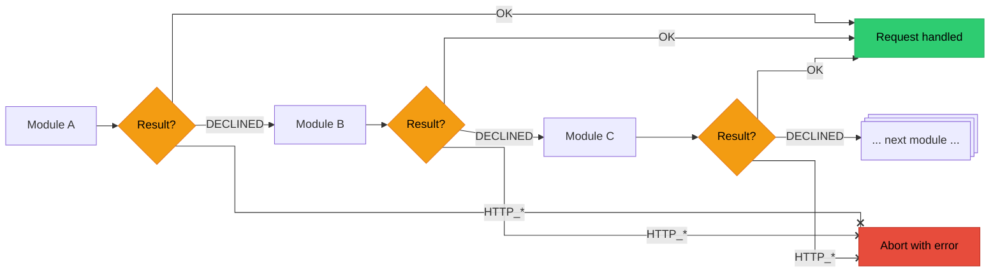

### Creating Custom Hooks

Modules can define their own hooks for other modules to use:

```c
// In my_module.h - declare the hook
AP_DECLARE_HOOK(int, my_custom_hook, (request_rec *r, const char *data))

// In my_module.c - implement hook infrastructure
APR_IMPLEMENT_EXTERNAL_HOOK_RUN_ALL(ap, MY_MODULE, int, my_custom_hook,
                                    (request_rec *r, const char *data),
                                    (r, data), OK, DECLINED)

// Call the hook somewhere in your module
int rv = ap_run_my_custom_hook(r, "some data");

// Other modules can now hook:
ap_hook_my_custom_hook(their_callback, NULL, NULL, APR_HOOK_MIDDLE);
```

## Hook Reference

### Request Processing Hooks

These hooks run in order for each HTTP request. All have the signature `int (*)(request_rec *r)`:

````{dropdown} 1. Post-Read-Request
First chance to examine a request after headers are read.

```c
ap_hook_post_read_request(my_post_read, NULL, NULL, APR_HOOK_MIDDLE);

static int my_post_read(request_rec *r)
{
    // Log initial request info
    // Set up per-request state
    return DECLINED;  // Let others run too
}
```
````

````{dropdown} 2. Translate Name
Map URI to filename or handler.

```c
ap_hook_translate_name(my_translate, NULL, NULL, APR_HOOK_MIDDLE);

static int my_translate(request_rec *r)
{
    if (strncmp(r->uri, "/special/", 9) == 0) {
        r->filename = apr_pstrcat(r->pool, "/var/special",
                                  r->uri + 8, NULL);
        return OK;  // We handled it
    }
    return DECLINED;
}
```
````

````{dropdown} 3. Map to Storage
Called after translate_name, before access checking.

```c
ap_hook_map_to_storage(my_map, NULL, NULL, APR_HOOK_MIDDLE);
```
````

````{dropdown} 4. Header Parser
Parse request headers.

```c
ap_hook_header_parser(my_header_parser, NULL, NULL, APR_HOOK_MIDDLE);
```
````

````{dropdown} 5. Access Checker
IP/host-based access control (before authentication).

```c
ap_hook_access_checker(my_access_checker, NULL, NULL, APR_HOOK_MIDDLE);

static int my_access_checker(request_rec *r)
{
    if (is_banned_ip(r->useragent_ip)) {
        return HTTP_FORBIDDEN;
    }
    return DECLINED;
}
```
````

````{dropdown} 6. Check User ID (Authentication)
Authenticate the user.

```c
ap_hook_check_user_id(my_authn, NULL, NULL, APR_HOOK_MIDDLE);

static int my_authn(request_rec *r)
{
    const char *auth_header = apr_table_get(r->headers_in, "Authorization");
    if (!auth_header) {
        return DECLINED;
    }

    if (validate_auth(auth_header)) {
        r->user = apr_pstrdup(r->pool, username);
        return OK;
    }
    return HTTP_UNAUTHORIZED;
}
```
````

````{dropdown} 7. Auth Checker (Authorization)
Check if authenticated user is authorized.

```c
ap_hook_auth_checker(my_authz, NULL, NULL, APR_HOOK_MIDDLE);

static int my_authz(request_rec *r)
{
    if (!r->user) {
        return DECLINED;
    }

    if (user_has_access(r->user, r->uri)) {
        return OK;
    }
    return HTTP_FORBIDDEN;
}
```
````

````{dropdown} 8. Type Checker
Determine content type and handler.

```c
ap_hook_type_checker(my_type_checker, NULL, NULL, APR_HOOK_MIDDLE);

static int my_type_checker(request_rec *r)
{
    if (r->filename && ends_with(r->filename, ".xyz")) {
        ap_set_content_type(r, "application/x-xyz");
        r->handler = "xyz-handler";
        return OK;
    }
    return DECLINED;
}
```
````

````{dropdown} 9. Fixups
Last chance to modify request before handler.

```c
ap_hook_fixups(my_fixup, NULL, NULL, APR_HOOK_MIDDLE);

static int my_fixup(request_rec *r)
{
    apr_table_set(r->headers_out, "X-Processed-By", "MyModule");
    return DECLINED;
}
```
````

````{dropdown} 10. Handler
Generate the response content.

```c
ap_hook_handler(my_handler, NULL, NULL, APR_HOOK_MIDDLE);

static int my_handler(request_rec *r)
{
    if (!r->handler || strcmp(r->handler, "my-handler") != 0) {
        return DECLINED;
    }

    ap_set_content_type(r, "text/plain");
    ap_rputs("Hello from my handler!\n", r);
    return OK;
}
```
````

````{dropdown} 11. Log Transaction
Log the completed request.

```c
ap_hook_log_transaction(my_logger, NULL, NULL, APR_HOOK_MIDDLE);

static int my_logger(request_rec *r)
{
    log_request(r->uri, r->status, r->bytes_sent);
    return OK;
}
```
````

### Connection Hooks

These hooks operate at the connection level, before HTTP parsing:

````{dropdown} Pre-Connection
Set up connection state, filters, etc.

```c
// Signature: int (*)(conn_rec *c, void *csd)
ap_hook_pre_connection(my_pre_conn, NULL, NULL, APR_HOOK_MIDDLE);

static int my_pre_conn(conn_rec *c, void *csd)
{
    // csd is the socket descriptor
    ap_add_input_filter("MY_INPUT", NULL, NULL, c);
    return OK;
}
```
````

````{dropdown} Process Connection
Handle the entire connection (used by protocol modules).

```c
// Signature: int (*)(conn_rec *c)
ap_hook_process_connection(my_process_conn, NULL, NULL, APR_HOOK_MIDDLE);

static int my_process_conn(conn_rec *c)
{
    // Custom protocol handler
    // Return OK to claim the connection
    return DECLINED;  // Let HTTP handle it
}
```
````

````{dropdown} Create Connection
Create the {httpd}`conn_rec` structure.

```c
// Signature: conn_rec* (*)(apr_pool_t *p, server_rec *s, ...)
ap_hook_create_connection(my_create_conn, NULL, NULL, APR_HOOK_MIDDLE);
```
````

### Server Lifecycle Hooks

These hooks run during server startup and shutdown:

````{dropdown} Pre Config
Called before configuration is loaded.

```c
// Signature: int (*)(apr_pool_t *pconf, apr_pool_t *plog, apr_pool_t *ptemp)
ap_hook_pre_config(my_pre_config, NULL, NULL, APR_HOOK_MIDDLE);
```
````

````{dropdown} Post Config
Called after configuration is loaded.

```c
// Signature: int (*)(apr_pool_t *pconf, apr_pool_t *plog,
//                    apr_pool_t *ptemp, server_rec *s)
ap_hook_post_config(my_post_config, NULL, NULL, APR_HOOK_MIDDLE);

static int my_post_config(apr_pool_t *pconf, apr_pool_t *plog,
                          apr_pool_t *ptemp, server_rec *s)
{
    // Validate configuration
    // Allocate shared resources
    return OK;
}
```
````

````{dropdown} Open Logs
Called when log files should be opened.

```c
// Signature: int (*)(apr_pool_t *pconf, apr_pool_t *plog,
//                    apr_pool_t *ptemp, server_rec *s)
ap_hook_open_logs(my_open_logs, NULL, NULL, APR_HOOK_MIDDLE);
```
````

````{dropdown} Child Init
Called when a child process starts.

```c
// Signature: void (*)(apr_pool_t *p, server_rec *s)
ap_hook_child_init(my_child_init, NULL, NULL, APR_HOOK_MIDDLE);

static void my_child_init(apr_pool_t *p, server_rec *s)
{
    // Initialize per-child resources
    // Open database connections, etc.
}
```
````

## Complete Example

Here's a module using multiple hooks to track request timing:

```c
#include "httpd.h"
#include "http_config.h"
#include "http_protocol.h"
#include "http_request.h"
#include "ap_config.h"

module AP_MODULE_DECLARE_DATA example_module;

typedef struct {
    apr_time_t start_time;
} example_request_state;

// Post-read: record start time
static int example_post_read(request_rec *r)
{
    example_request_state *state = apr_pcalloc(r->pool, sizeof(*state));
    state->start_time = apr_time_now();
    ap_set_module_config(r->request_config, &example_module, state);
    return DECLINED;
}

// Fixup: add custom header
static int example_fixup(request_rec *r)
{
    apr_table_set(r->headers_out, "X-Example-Module", "active");
    return DECLINED;
}

// Handler: respond to /example
static int example_handler(request_rec *r)
{
    if (!r->handler || strcmp(r->handler, "example-handler") != 0) {
        return DECLINED;
    }

    example_request_state *state = ap_get_module_config(
        r->request_config, &example_module);

    ap_set_content_type(r, "text/plain");
    ap_rputs("Hello from Example Module!\n", r);

    if (state) {
        apr_time_t elapsed = apr_time_now() - state->start_time;
        ap_rprintf(r, "Processing time: %" APR_TIME_T_FMT " microseconds\n",
                   elapsed);
    }

    return OK;
}

// Log: record timing
static int example_log(request_rec *r)
{
    example_request_state *state = ap_get_module_config(
        r->request_config, &example_module);

    if (state) {
        apr_time_t elapsed = apr_time_now() - state->start_time;
        ap_log_rerror(APLOG_MARK, APLOG_DEBUG, 0, r,
                      "Request to %s took %" APR_TIME_T_FMT " us",
                      r->uri, elapsed);
    }

    return OK;
}

// Register hooks
static void register_hooks(apr_pool_t *p)
{
    ap_hook_post_read_request(example_post_read, NULL, NULL,
                              APR_HOOK_FIRST);
    ap_hook_fixups(example_fixup, NULL, NULL,
                   APR_HOOK_MIDDLE);
    ap_hook_handler(example_handler, NULL, NULL,
                    APR_HOOK_MIDDLE);
    ap_hook_log_transaction(example_log, NULL, NULL,
                            APR_HOOK_LAST);
}

AP_DECLARE_MODULE(example) = {
    STANDARD20_MODULE_STUFF,
    NULL, NULL, NULL, NULL,
    NULL,  // No directives
    register_hooks
};
```

**See also:** [mod_example_hooks.c](https://github.com/omnigroup/Apache/blob/master/httpd/modules/examples/mod_example_hooks.c) (Apache's own hook tracing module) and the official [module development guide](https://httpd.apache.org/docs/2.4/developer/modguide.html).

## Fuzzing Implications

```{important}
Understanding hook infrastructure matters for the fuzzing harness:

- **Static linking** means {httpd}`ap_prelinked_modules` contains every module we want to fuzz. The harness calls {httpd}`ap_setup_prelinked_modules` during initialization, which registers all hooks exactly as a real Apache would.
- **Hook ordering is deterministic** for a given set of compiled modules. This means fuzzing results are reproducible - the same input always hits the same callback chain in the same order.
- **The harness can selectively disable modules** by manipulating the module list before {httpd}`ap_setup_prelinked_modules` runs, which is useful for isolating specific code paths during targeted fuzzing.
```

## Summary

Hooks are Apache's plugin system:

- {httpd}`AP_DECLARE_HOOK` generates `ap_hook_*` (register) and `ap_run_*` (dispatch) functions from macros
- Modules register callbacks in `register_hooks()` with an ordering constant ({httpd}`APR_HOOK_FIRST` / `MIDDLE` / `LAST`) or predecessor/successor lists
- `RUN_FIRST` hooks stop on the first non-`DECLINED` return; `RUN_ALL` hooks call every callback
- {httpd}`ap_setup_prelinked_modules` loads all modules, calls their `register_hooks`, and {httpd}`apr_hook_sort_all` resolves the final ordering
- Return `DECLINED` to pass, `OK` when handled, `HTTP_*` to abort

## `docs/apache-internals/07-filters-buckets.md`

[View original document](https://github.com/0xbigshaq/apatchy/blob/8301d701975187ef0e4ae339ddca04e6eaad61ec/docs/apache-internals/07-filters-buckets.md)

# Chapter 7: Filters and Bucket Brigades

## The Problem: Streaming Data

A web server needs to handle data that:
- May be too large to fit in memory
- Arrives in chunks (network packets)
- Needs transformation (compression, encryption)
- Must be sent before it's fully received (streaming)

Traditional approaches like "read everything into a buffer" don't scale.

## Apache's Solution: Bucket Brigades

Apache uses a **bucket brigade** system - a linked list of data chunks that flows through a chain of filters.

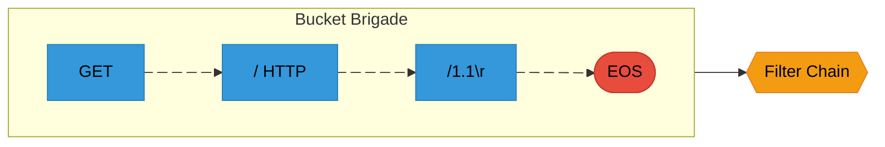

The key design principle is **zero-copy where possible**. A file bucket doesn't read file data into memory - it holds a file descriptor and reads on demand. A transient bucket points to existing memory without copying it. Only when data needs to outlive its original context does Apache copy it into a heap or pool bucket. This makes serving large files or proxying responses efficient: data flows through the filter chain without being fully materialized in memory.

## Buckets

A bucket is a single chunk of data with a **type** that determines how its data is stored and accessed. Every bucket type implements the same vtable interface, defined in `srclib/apr-util/include/apr_buckets.h`:

```c
// srclib/apr-util/include/apr_buckets.h
struct apr_bucket_type_t {
    const char *name;
    int num_func;
    enum {
        APR_BUCKET_DATA = 0,       // Actual content data
        APR_BUCKET_METADATA = 1    // Metadata (EOS, FLUSH, etc.)
    } is_metadata;
    void (*destroy)(void *data);
    apr_status_t (*read)(apr_bucket *b, const char **str,
                         apr_size_t *len, apr_read_type_e block);
    apr_status_t (*setaside)(apr_bucket *e, apr_pool_t *pool);
    apr_status_t (*split)(apr_bucket *e, apr_size_t point);
    apr_status_t (*copy)(apr_bucket *e, apr_bucket **c);
};

struct apr_bucket {
    APR_RING_ENTRY(apr_bucket) link;     // Links to brigade ring
    const apr_bucket_type_t *type;       // Vtable for this bucket
    apr_size_t length;                   // Data length (-1 if unknown)
    apr_off_t start;                     // Offset into backing data
    void *data;                          // Type-dependent private data
    void (*free)(void *e);               // Deallocator for this bucket
    apr_bucket_alloc_t *list;            // Freelist this came from
};
```

The {httpd}`apr_bucket_type_t::setaside` function is particularly important: it "morphs" a bucket from a short-lived type to a long-lived one. For example, when a transient bucket (pointing to stack data) needs to survive beyond the current function call, `setaside` copies the data to the heap and converts it to a heap bucket. This is how Apache achieves zero-copy in the common case while still handling lifetime mismatches safely.

### Data Buckets

Data buckets carry actual content bytes. They differ in how the data is stored and who owns it:

`````{tab-set}

````{tab-item} Heap Bucket
**Heap Bucket:** Data is `malloc`'d on the heap. Use this when you've generated data that needs to outlive the current scope. The `free_func` is called when the last reference to this data is destroyed (multiple buckets can share the same backing data after a split).

```c
apr_bucket *b = apr_bucket_heap_create(data, len, free_func, alloc);
```
````

````{tab-item} Pool Bucket
**Pool Bucket:** Data lives in an APR pool. Use this when the data was allocated from a pool and you want the bucket's lifetime tied to that pool. If the pool is destroyed before the bucket, `setaside` automatically morphs it to a heap bucket.

```c
apr_bucket *b = apr_bucket_pool_create(data, len, pool, alloc);
```
````

````{tab-item} Transient Bucket
**Transient Bucket:** A zero-copy reference to temporary data (e.g., a stack buffer or a buffer that will be reused). The data must be consumed or set aside before the next filter call, because the backing memory may disappear. This is the cheapest bucket to create - no copies, no allocations beyond the bucket struct itself.

```c
apr_bucket *b = apr_bucket_transient_create(data, len, alloc);
```
````

````{tab-item} Immortal Bucket
**Immortal Bucket:** 
A reference to permanent, read-only data like string constants or global buffers. Since the data will never be freed, `setaside` is a no-op. Use this for static content.

```c
apr_bucket *b = apr_bucket_immortal_create("Hello", 5, alloc);
```
````

`````

### I/O Buckets

These buckets represent data that comes from an external source. They have **unknown length** (`(apr_size_t)(-1)`) until read, and reading them may block:

`````{tab-set}

````{tab-item} File Bucket
**File Bucket:** Represents a range of bytes from a file on disk. The data is read into memory lazily, only when a downstream filter calls `apr_bucket_read()`. This is how Apache serves static files efficiently - `sendfile()` can even bypass userspace entirely.

```c
apr_bucket *b = apr_bucket_file_create(file, offset, len, pool, alloc);
```
````

````{tab-item} Pipe Bucket
**Pipe Bucket:** Data from a pipe (e.g., CGI script output). Can only be read once and in order. Cannot be split or copied.

```c
apr_bucket *b = apr_bucket_pipe_create(pipe, alloc);
```
````

````{tab-item} Socket
**Socket Bucket:** Data from a network socket. This is what the core input filter creates to represent incoming request data. Like pipe buckets, socket reads are sequential and may block.

```c
apr_bucket *b = apr_bucket_socket_create(sock, alloc);
```
````

`````

### Metadata Buckets

Metadata buckets carry no data content ({httpd}`apr_bucket_type_t::is_metadata`= 1) - they are signals that control how the filter chain behaves:

**EOS (End-Of-Stream)** - marks the end of a response or request body. Every response must end with an EOS bucket. Filters use it to know when to finalize their processing (e.g., write a compression trailer, flush buffered content).

```c
apr_bucket *b = apr_bucket_eos_create(alloc);
```

**FLUSH** - tells downstream filters to flush any buffered data immediately. Used when partial data needs to reach the client before the response is complete (e.g., server-sent events, chunked streaming).

```c
apr_bucket *b = apr_bucket_flush_create(alloc);
```

### The EOS Bucket

The EOS (End-Of-Stream) bucket is critical:
- It marks the logical end of a response/request body
- Filters should pass it through (never consume or drop it)
- Handlers must send it to complete the response
- Without an EOS, the client will hang waiting for more data

## Bucket Brigades

A bucket brigade is a doubly-linked ring of buckets, implemented with APR's ring macros. The brigade itself is just a sentinel node - buckets are inserted, removed, and iterated using ring operations:

```c
// Create a brigade
apr_bucket_brigade *bb = apr_brigade_create(pool, bucket_alloc);
//...
// Insert bucket at end/front
//...

// Get first/last bucket
apr_bucket *first = APR_BRIGADE_FIRST(bb);
apr_bucket *last = APR_BRIGADE_LAST(bb);

// Iterate over buckets
for (apr_bucket *b = APR_BRIGADE_FIRST(bb);
     b != APR_BRIGADE_SENTINEL(bb);
     b = APR_BUCKET_NEXT(b)) {
    // Process bucket
}
```

### Reading Bucket Data

All bucket types expose their contents through a single `apr_bucket_read` call that supports both blocking and non-blocking modes:

```c
const char *data;
apr_size_t len;

// Read bucket contents
apr_status_t rv = apr_bucket_read(bucket, &data, &len, APR_BLOCK_READ);

if (rv == APR_SUCCESS) {
    // data points to len bytes
    // WARNING: data may be invalidated after bucket operations!
}

// Non-blocking read
rv = apr_bucket_read(bucket, &data, &len, APR_NONBLOCK_READ);
if (rv == APR_EAGAIN) {
    // Data not ready yet
}
```

### Brigade Operations

Brigades can be concatenated, split, flattened into a contiguous buffer, or cleaned up:

```c
// Concatenate: append bb2 to bb1
APR_BRIGADE_CONCAT(bb1, bb2);

// Prepend: insert bb2 at start of bb1
APR_BRIGADE_PREPEND(bb1, bb2);

// Split: move buckets after 'e' to new brigade
apr_brigade_split(bb, e);

// Flatten: copy all data to a buffer
apr_size_t len;
apr_brigade_flatten(bb, buffer, &len);

// Destroy: cleanup brigade and all buckets
apr_brigade_destroy(bb);

// Cleanup: remove all buckets but keep brigade
apr_brigade_cleanup(bb);
```

## Filters

Filters transform data as it flows through Apache. There are two directions:

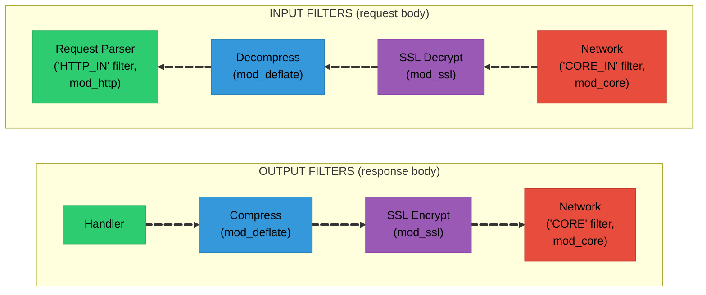

```{note}
A **handler** is the module function that generates the actual response content. 

It's triggered when a request matches a `SetHandler` or `AddHandler` directive in the Apache config (e.g., `SetHandler cgi-script` routes to mod_cgi). 
The handler hook was covered in [Chapter 6](06-hooks.md) - see also the official [handler documentation](https://httpd.apache.org/docs/current/handler.html) and [module development guide](https://httpd.apache.org/docs/2.4/developer/modguide.html).
```

### Filter Types

Filters are categorized into levels that determine their position in the chain. The type constants are defined in `include/util_filter.h` and represent a numeric ordering - lower numbers run closer to the handler, higher numbers run closer to the network:

| Constant | Value | Description |
|----------|-------|-------------|
| {httpd}`AP_FTYPE_RESOURCE` | 10 | Content generators (`mod_include` SSI) |
| {httpd}`AP_FTYPE_CONTENT_SET` | 20 | Content transformers (`mod_deflate`) |
| {httpd}`AP_FTYPE_PROTOCOL` | 30 | Protocol framing (HTTP chunking) |
| {httpd}`AP_FTYPE_TRANSCODE` | 40 | Charset/encoding conversion |
| {httpd}`AP_FTYPE_CONNECTION` | 50 | Connection-level (`mod_ssl`) |
| {httpd}`AP_FTYPE_NETWORK` | 60 | Actual I/O (core socket read/write) |

For **output filters**, data flows from low to high - the handler's output passes through `RESOURCE` filters first, then `CONTENT_SET`, and so on until `NETWORK` actually writes to the socket. For **input filters**, the direction is reversed - the `NETWORK` filter reads raw bytes from the socket, and higher-level filters progressively decode and transform them before the handler sees the data.

This layering ensures that content transformation (like gzip compression) always happens before protocol framing (like HTTP chunking), which always happens before encryption (SSL), which always happens before network I/O. The numeric values also allow fine-grained positioning: a filter can register at `AP_FTYPE_CONTENT_SET + 5` to run after other content-set filters.

### Registering a Filter

Filters are registered globally during module initialization, specifying a name, callback function, and filter type level:

```c
// Output filter registration
ap_register_output_filter("MY_OUTPUT",     // Filter name
                         my_output_filter, // Function
                         NULL,             // Init function (optional)
                         AP_FTYPE_CONTENT_SET);

// Input filter registration
ap_register_input_filter("MY_INPUT",
                        my_input_filter,
                        NULL,
                        AP_FTYPE_CONTENT_SET);
```

### Adding Filters to Request/Connection

Once registered, filters are attached to individual requests or connections - request-scoped filters are removed after the response, while connection-scoped filters persist for the entire connection:

```c
// Add output filter to request
ap_add_output_filter("MY_OUTPUT", ctx, r, r->connection);

// Add input filter to request
ap_add_input_filter("MY_INPUT", ctx, r, r->connection);

// Add to connection (lives for entire connection)
ap_add_input_filter("SSL_IN", ctx, NULL, c);
ap_add_output_filter("SSL_OUT", ctx, NULL, c);
```

### Output Filter Implementation

An output filter receives a bucket brigade, iterates through it, transforms data buckets while passing metadata through, then forwards the brigade to the next filter:

```c
static apr_status_t my_output_filter(ap_filter_t *f,
                                     apr_bucket_brigade *bb)
{
    request_rec *r = f->r;
    apr_bucket *b;

    // Iterate through buckets
    for (b = APR_BRIGADE_FIRST(bb);
         b != APR_BRIGADE_SENTINEL(bb);
         b = APR_BUCKET_NEXT(b)) {

        // Handle metadata buckets
        if (APR_BUCKET_IS_EOS(b)) {
            // End of stream - pass through
            break;
        }
        if (APR_BUCKET_IS_FLUSH(b)) {
            // Flush request - pass through
            continue;
        }
        if (APR_BUCKET_IS_METADATA(b)) {
            // Other metadata - pass through
            continue;
        }

        // Read data bucket
        const char *data;
        apr_size_t len;
        apr_status_t rv = apr_bucket_read(b, &data, &len, APR_BLOCK_READ);
        if (rv != APR_SUCCESS) {
            return rv;
        }

        // Transform data (example: uppercase)
        char *transformed = apr_palloc(r->pool, len);
        for (apr_size_t i = 0; i < len; i++) {
            transformed[i] = toupper(data[i]);
        }

        // Replace bucket with transformed data
        apr_bucket *new_b = apr_bucket_heap_create(
            transformed, len, NULL, f->c->bucket_alloc);
        APR_BUCKET_INSERT_BEFORE(b, new_b);
        apr_bucket_delete(b);
        b = new_b;
    }

    // Pass to next filter
    return ap_pass_brigade(f->next, bb);
}
```

### Input Filter Implementation

Input filters are more complex because they handle read modes:

```c
static apr_status_t my_input_filter(ap_filter_t *f,
                                    apr_bucket_brigade *bb,
                                    ap_input_mode_t mode,
                                    apr_read_type_e block,
                                    apr_off_t readbytes)
{
    my_filter_ctx *ctx = f->ctx;

    // Initialize context on first call
    if (!ctx) {
        ctx = f->ctx = apr_pcalloc(f->r->pool, sizeof(*ctx));
        ctx->bb = apr_brigade_create(f->r->pool, f->c->bucket_alloc);
    }

    // Handle different read modes
    switch (mode) {
    case AP_MODE_GETLINE:
        // Read until newline
        return get_line_from_filters(f, bb, ctx);

    case AP_MODE_READBYTES:
        // Read up to readbytes
        return read_bytes_from_filters(f, bb, readbytes, ctx);

    case AP_MODE_SPECULATIVE:
        // Peek at data without consuming
        return speculative_read(f, bb, readbytes, ctx);

    case AP_MODE_EXHAUSTIVE:
        // Read all remaining data
        return exhaustive_read(f, bb, ctx);

    case AP_MODE_INIT:
        // Initialize
        return APR_SUCCESS;
    }

    return APR_ENOTIMPL;
}

// Helper: read from upstream filter
static apr_status_t get_upstream_data(ap_filter_t *f,
                                      apr_bucket_brigade *bb,
                                      apr_read_type_e block,
                                      apr_off_t readbytes)
{
    return ap_get_brigade(f->next, bb, AP_MODE_READBYTES, block, readbytes);
}
```

### Input Mode Constants

Input filters must handle multiple read modes because different parts of HTTP processing need to read data differently. The HTTP request parser reads headers line-by-line (`GETLINE`), then reads the body in sized chunks (`READBYTES`). These modes are defined in `include/util_filter.h`:

| Mode | Description |
|------|-------------|
| {httpd}`AP_MODE_READBYTES` | Read up to N bytes (body data) |
| {httpd}`AP_MODE_GETLINE` | Read a line terminated by `\n` (header parsing) |
| {httpd}`AP_MODE_EATCRLF` | Consume leading CRLF without returning data |
| {httpd}`AP_MODE_SPECULATIVE` | Peek at data without consuming (lookahead) |
| {httpd}`AP_MODE_EXHAUSTIVE` | Read all remaining data |
| {httpd}`AP_MODE_INIT` | Initialize filter (one-time setup) |

The `SPECULATIVE` mode is particularly interesting - it lets a filter peek ahead without consuming the data. The HTTP/1.1 parser uses this to detect whether a pipelined request is waiting after the current one finishes.

## Filter Context

Filters are called repeatedly - once per brigade chunk - so they need persistent state across invocations. The `f->ctx` pointer stores a filter-allocated context struct, typically initialized on the first call:

```c
typedef struct {
    apr_bucket_brigade *bb;    // Buffered data
    int state;                 // Current state
    apr_size_t bytes_read;     // Running total
    char *buffer;              // Work buffer
} my_filter_ctx;

static apr_status_t my_filter(ap_filter_t *f, apr_bucket_brigade *bb)
{
    my_filter_ctx *ctx = f->ctx;

    if (!ctx) {
        // First call - initialize
        ctx = f->ctx = apr_pcalloc(f->r->pool, sizeof(*ctx));
        ctx->bb = apr_brigade_create(f->r->pool, f->c->bucket_alloc);
        ctx->state = STATE_INITIAL;
    }

    // Use context...
    ctx->bytes_read += brigade_length(bb);

    // Process based on state
    switch (ctx->state) {
    case STATE_INITIAL:
        // ...
        break;
    case STATE_READING_BODY:
        // ...
        break;
    }

    return ap_pass_brigade(f->next, bb);
}
```

## Common Filter Patterns

````{dropdown} Pass-Through Filter
A filter that inspects a condition and then removes itself from the chain, forwarding data unchanged:

```c
static apr_status_t passthrough_filter(ap_filter_t *f,
                                       apr_bucket_brigade *bb)
{
    // Remove ourselves (only needed once)
    ap_remove_output_filter(f);

    // Just pass data to next filter
    return ap_pass_brigade(f->next, bb);
}
```
````

````{dropdown} Accumulating Filter
Buffers all incoming brigades until EOS arrives, then processes the complete data at once. Used when transformation requires seeing the entire content (e.g., computing a content hash):

```c
// Collect all data before processing (e.g., for compression)
static apr_status_t accumulating_filter(ap_filter_t *f,
                                        apr_bucket_brigade *bb)
{
    accum_ctx *ctx = f->ctx;

    if (!ctx) {
        ctx = f->ctx = apr_pcalloc(f->r->pool, sizeof(*ctx));
        ctx->bb = apr_brigade_create(f->r->pool, f->c->bucket_alloc);
    }

    // Look for EOS
    apr_bucket *eos = NULL;
    for (apr_bucket *b = APR_BRIGADE_FIRST(bb);
         b != APR_BRIGADE_SENTINEL(bb);
         b = APR_BUCKET_NEXT(b)) {
        if (APR_BUCKET_IS_EOS(b)) {
            eos = b;
            break;
        }
    }

    // Accumulate data
    APR_BRIGADE_CONCAT(ctx->bb, bb);

    if (eos) {
        // Got all data - process it
        process_complete_data(ctx->bb);

        // Pass processed data
        return ap_pass_brigade(f->next, ctx->bb);
    }

    // More data coming
    return APR_SUCCESS;
}
```
````

````{dropdown} Streaming Filter
Processes each bucket as it arrives and passes data through immediately. Best for transformations that operate on chunks independently (e.g., character encoding, search-and-replace):

```c
// Process data chunk by chunk
static apr_status_t streaming_filter(ap_filter_t *f,
                                     apr_bucket_brigade *bb)
{
    stream_ctx *ctx = f->ctx;

    if (!ctx) {
        ctx = f->ctx = apr_pcalloc(f->r->pool, sizeof(*ctx));
    }

    apr_bucket *b;
    apr_bucket *next;

    for (b = APR_BRIGADE_FIRST(bb);
         b != APR_BRIGADE_SENTINEL(bb);
         b = next) {

        next = APR_BUCKET_NEXT(b);

        if (!APR_BUCKET_IS_METADATA(b)) {
            const char *data;
            apr_size_t len;

            apr_bucket_read(b, &data, &len, APR_BLOCK_READ);

            // Transform in place or create new bucket
            transform_chunk(ctx, data, len);
        }
    }

    // Pass (possibly modified) brigade
    return ap_pass_brigade(f->next, bb);
}
```
````

## The Core Network Filters

At the bottom of every filter chain sit the **core network filters** (in `server/core_filters.c`). These are the only filters that actually touch the socket - everything above them works with bucket brigades in memory:

### Core Output Filter

The core output filter sits at the bottom of every output chain and performs the actual socket write, using `writev()` for multiple buckets and `sendfile()` for file buckets:

```c
// server/core_filters.c
// Writes bucket data to the socket using writev/sendfile
ap_register_output_filter("CORE", ap_core_output_filter,
                          NULL, AP_FTYPE_NETWORK);
```

The core output filter is smart about I/O. It uses `writev()` to send multiple buckets in a single syscall and `sendfile()` for file buckets (sending file data directly from kernel space to the socket without copying through userspace).

### Core Input Filter

The core input filter reads raw bytes from the client socket into buckets, handling both blocking and non-blocking modes:

```c
// server/core_filters.c
// Reads from socket into buckets
ap_register_input_filter("CORE_IN", ap_core_input_filter,
                         NULL, AP_FTYPE_NETWORK);
```

The core input filter creates socket buckets that read from the client connection. It handles both blocking and non-blocking reads, and implements the speculative mode needed by the HTTP parser.

### Fuzzing: Replacing the Network Layer

For fuzzing, we replace these core filters with our own that read from a memory buffer (the fuzzer input) and write to `/dev/null`. This is the fundamental trick that makes in-process fuzzing work - all the filters above the network layer operate identically, but instead of reading from a TCP socket, they read from the fuzzer's mutated input buffer. See the Harness Design guide for details on how this replacement works.

## Reading from Input Filters

Handlers read request bodies by pulling brigades from the input filter chain in a loop until they see an EOS bucket:

```c
static int my_handler(request_rec *r)
{
    apr_bucket_brigade *bb = apr_brigade_create(r->pool,
                                                r->connection->bucket_alloc);

    // Read request body in chunks
    apr_status_t rv;
    int seen_eos = 0;

    do {
        rv = ap_get_brigade(r->input_filters, bb, AP_MODE_READBYTES,
                           APR_BLOCK_READ, HUGE_STRING_LEN);
        if (rv != APR_SUCCESS) {
            return HTTP_INTERNAL_SERVER_ERROR;
        }

        // Process buckets
        for (apr_bucket *b = APR_BRIGADE_FIRST(bb);
             b != APR_BRIGADE_SENTINEL(bb);
             b = APR_BUCKET_NEXT(b)) {

            if (APR_BUCKET_IS_EOS(b)) {
                seen_eos = 1;
                break;
            }

            const char *data;
            apr_size_t len;
            apr_bucket_read(b, &data, &len, APR_BLOCK_READ);

            // Process data...
        }

        apr_brigade_cleanup(bb);

    } while (!seen_eos);

    apr_brigade_destroy(bb);
    return OK;
}
```

## Writing to Output Filters

Handlers push response data into the output filter chain by creating a brigade, inserting data and EOS buckets, and calling {httpd}`ap_pass_brigade`:

```c
static int my_handler(request_rec *r)
{
    apr_bucket_brigade *bb = apr_brigade_create(r->pool,
                                                r->connection->bucket_alloc);
    apr_bucket *b;

    // Set headers
    ap_set_content_type(r, "text/plain");

    // Create data bucket
    const char *content = "Hello, World!";
    b = apr_bucket_transient_create(content, strlen(content),
                                    r->connection->bucket_alloc);
    APR_BRIGADE_INSERT_TAIL(bb, b);

    // Add EOS bucket
    b = apr_bucket_eos_create(r->connection->bucket_alloc);
    APR_BRIGADE_INSERT_TAIL(bb, b);

    // Pass to output filters
    apr_status_t rv = ap_pass_brigade(r->output_filters, bb);
    if (rv != APR_SUCCESS) {
        return HTTP_INTERNAL_SERVER_ERROR;
    }

    return OK;
}

// Or use convenience functions:
static int simpler_handler(request_rec *r)
{
    ap_set_content_type(r, "text/plain");

    // These internally create buckets
    ap_rputs("Hello, ", r);
    ap_rprintf(r, "World! (request #%ld)", r->request_time);

    // Send EOS
    // (done automatically when handler returns OK)

    return OK;
}
```

## The Complete Output Filter Chain

Here's a concrete example of what the output filter chain looks like for a typical HTTPS response with compression enabled:

```mermaid
%%{init: {"flowchart": {"curve": "basis", "nodeSpacing": 80, "rankSpacing": 30}}}%%
flowchart TD
    H["Handler<br />(ap_rprintf)"] e0@-->|ap_pass_brigade| D1{"RESOURCE?"}
    D1 e1@-->|transform| R1["mod_include<br />(SSI)"] e9@-->|ap_pass_brigade| D2{"CONTENT_SET?"}
    D1 e2@-->|no-op| D2

    D2 e3@-->|compress| R2["mod_deflate<br />(gzip)"] e10@-->|ap_pass_brigade| D3{"PROTOCOL?"}
    D2 e4@-->|no-op| D3

    D3 e5@-->|frame| R3["HTTP_HEADER<br />(chunking)"] e11@-->|ap_pass_brigade| D4{"CONNECTION?"}
    D3 e6@-->|no-op| D4

    D4 e7@-->|encrypt| R4["mod_ssl<br />(TLS)"] e12@-->|ap_pass_brigade| M@{ shape: processes, label: "... down the filter chain ..." }
    D4 e8@-->|no-op| M

    M e13@-->|ap_pass_brigade| N["NETWORK<br />CORE"]

    e0@{ animate: true }
    e1@{ animate: true, curve: linear }
    e2@{ curve: stepAfter }
    e3@{ animate: true, curve: linear }
    e4@{ curve: stepAfter }
    e5@{ animate: true, curve: linear }
    e6@{ curve: stepAfter }
    e7@{ animate: true, curve: linear }
    e8@{ curve: stepAfter }
    e9@{ animate: true }
    e10@{ animate: true }
    e11@{ animate: true }
    e12@{ animate: true }
    e13@{ animate: true }

    style H fill:#2ecc71,stroke:#27ae60,color:#000
    style D1 fill:#f39c12,stroke:#e67e22,color:#000
    style D2 fill:#f39c12,stroke:#e67e22,color:#000
    style D3 fill:#f39c12,stroke:#e67e22,color:#000
    style D4 fill:#f39c12,stroke:#e67e22,color:#000
    style R1 fill:#3498db,stroke:#2980b9,color:#000
    style R2 fill:#3498db,stroke:#2980b9,color:#000
    style R3 fill:#e67e22,stroke:#d35400,color:#000
    style R4 fill:#9b59b6,stroke:#8e44ad,color:#000
    style N fill:#e74c3c,stroke:#c0392b,color:#000
```

Each arrow represents an `ap_pass_brigade(f->next, bb)` call. The brigade flows top down, with each filter potentially modifying, splitting, or buffering buckets before passing them on. The handler never needs to know about compression, chunking, or encryption - the filter chain handles it all transparently.

## Summary

Bucket brigades and filters are Apache's I/O abstraction:

**Buckets:**
- Chunks of data or metadata, each with a type-specific vtable
- Data buckets: heap, pool, transient, immortal (differ in ownership/lifetime)
- I/O buckets: file, pipe, socket (lazy/streaming reads)
- Metadata buckets: EOS (end of stream), FLUSH (force downstream flush)
- Zero-copy by default, with {httpd}`apr_bucket_type_t::setaside` for lifetime extension

**Brigades:**
- Doubly-linked ring of buckets (via {httpd}`APR_RING`)
- Created per-request or per-filter invocation
- Operations: insert, concat, split, flatten, cleanup

**Filters:**
- Transform data in chains, registered at specific type levels
- Output: handler → `RESOURCE` → `CONTENT_SET` → `PROTOCOL` → `CONNECTION` → `NETWORK`
- Input: `NETWORK` → `CONNECTION` → `PROTOCOL` → `CONTENT_SET` → `RESOURCE` → handler
- Input filters handle multiple read modes (`READBYTES`, `GETLINE`, `SPECULATIVE`, etc.)

**Key patterns:**
- Pass-through: remove self and pass brigade unchanged
- Accumulating: buffer all data until EOS, then process at once
- Streaming: process each bucket as it arrives, pass immediately
- Always pass EOS through - dropping it breaks the response

**For fuzzing:** we replace the `NETWORK`-level core filters with custom ones that read from a memory buffer and discard output. Everything above the network layer - all the content filters, protocol framing, and module-specific transformations - runs exactly as it would in production.

## `docs/apache-internals/08-request-pipeline.md`

[View original document](https://github.com/0xbigshaq/apatchy/blob/8301d701975187ef0e4ae339ddca04e6eaad61ec/docs/apache-internals/08-request-pipeline.md)

# Chapter 8: Request Processing Pipeline

## The Big Picture

When an HTTP request arrives, Apache processes it through a carefully orchestrated pipeline of hooks and filters. Each phase has a specific responsibility -- URI translation, access control, authentication, content generation -- and modules register callbacks at precisely the phases where they need to act.


```{note}
Understanding this pipeline is essential for both module development and fuzzing. For fuzzing, it tells you which code paths your input will exercise: a malformed request line will be caught in phase 3 (request parsing), while a crafted session cookie will flow all the way to the handler phase and into `mod_session_crypto`'s decryption logic.
```


```
┌─────────────────────────────────────────────────────────────────────┐
│                        REQUEST LIFECYCLE                            │
├─────────────────────────────────────────────────────────────────────┤
│                                                                     │
│  1. Connection Accepted (MPM)                                       │
│          │                                                          │
│          ▼                                                          │
│  2. Connection Setup (pre_connection hooks)                         │
│          │                                                          │
│          ▼                                                          │
│  3. Read Request Line & Headers                                     │
│          │                                                          │
│          ▼                                                          │
│  4. Request Processing Phases (hooks)                               │
│     ┌─────────────────────────────────────────┐                     │
│     │  post_read_request                      │                     │
│     │  translate_name                         │                     │
│     │  map_to_storage                         │                     │
│     │  header_parser                          │                     │
│     │  access_checker                         │                     │
│     │  check_user_id (authn)                  │                     │
│     │  auth_checker (authz)                   │                     │
│     │  type_checker                           │                     │
│     │  fixups                                 │                     │
│     │  handler                                │                     │
│     └─────────────────────────────────────────┘                     │
│          │                                                          │
│          ▼                                                          │
│  5. Send Response (output filters)                                  │
│          │                                                          │
│          ▼                                                          │
│  6. Log Transaction                                                 │
│          │                                                          │
│          ▼                                                          │
│  7. Cleanup (pool destruction)                                      │
│                                                                     │
└─────────────────────────────────────────────────────────────────────┘
```

``````{dropdown} Phase 1: Connection Accepted

The MPM accepts a TCP connection and creates basic structures:

```c
// Inside MPM (simplified)
apr_socket_accept(&client_socket, listen_socket, pool);

// Create connection record
conn_rec *c = ap_run_create_connection(
    pool,           // Connection pool
    server,         // Server record
    client_socket,  // Client socket
    conn_id,        // Unique connection ID
    sbh,            // Scoreboard handle
    bucket_alloc    // Bucket allocator
);
```

The {httpd}`conn_rec` structure is created:

```c
struct conn_rec {
    apr_pool_t *pool;              // Connection pool
    server_rec *base_server;       // Server handling this
    void *conn_config;             // Per-conn module configs

    apr_socket_t *client_socket;   // The actual socket
    const char *client_ip;         // Client IP address
    const char *local_ip;          // Local IP
    apr_port_t client_port;        // Client port

    ap_filter_t *input_filters;    // Input filter chain
    ap_filter_t *output_filters;   // Output filter chain

    long id;                       // Unique connection ID
    int keepalive;                 // Keep-alive status
    signed int double_reverse:2;   // DNS status

    int aborted;                   // Connection aborted?
};
```

``````

``````{dropdown} Phase 2: Connection Setup

Pre-connection hooks run to set up the connection:

```c
// In server/connection.c
int rc = ap_run_pre_connection(c, c->client_socket);
```

This is where:
- SSL/TLS is negotiated (mod_ssl)
- Input/output filters are added
- Connection-level state is initialized

```c
// Example: mod_ssl adds its filters here
static int ssl_hook_pre_connection(conn_rec *c, void *csd)
{
    // Add SSL filters
    ap_add_input_filter("SSL/TLS Input Filter", NULL, NULL, c);
    ap_add_output_filter("SSL/TLS Output Filter", NULL, NULL, c);
    return OK;
}
```

``````

``````{dropdown} Phase 3: Read Request

Apache reads the HTTP request line and headers:

```c
// In server/protocol.c
request_rec *r = ap_read_request(c);
```

This function:
1. Creates a new {httpd}`request_rec` with its own pool
2. Reads the request line: `GET /path HTTP/1.1`
3. Parses method, URI, protocol
4. Reads all headers into `r->headers_in`

```c
// The request_rec structure (key fields)
struct request_rec {
    apr_pool_t *pool;              // Request pool (freed after response)
    conn_rec *connection;          // Parent connection
    server_rec *server;            // Handling server

    // The request
    const char *the_request;       // "GET /path HTTP/1.1"
    char *method;                  // "GET"
    int method_number;             // M_GET
    const char *protocol;          // "HTTP/1.1"
    int proto_num;                 // 1001 (1.1)

    // URI components
    char *uri;                     // "/path"
    char *filename;                // Translated filesystem path
    char *path_info;               // Extra path after script
    char *args;                    // Query string

    // Headers
    apr_table_t *headers_in;       // Request headers
    apr_table_t *headers_out;      // Response headers
    apr_table_t *err_headers_out;  // Error response headers
    apr_table_t *subprocess_env;   // CGI-style environment

    // Response
    int status;                    // HTTP status code
    const char *content_type;      // Response Content-Type
    const char *handler;           // Handler name

    // Authentication
    char *user;                    // Authenticated username
    char *ap_auth_type;            // Auth type used

    // Filters
    ap_filter_t *input_filters;    // Request input filters
    ap_filter_t *output_filters;   // Response output filters

    // Configuration
    void *per_dir_config;          // Merged per-dir configs
    void *request_config;          // Per-request module data
};
```

``````

``````{dropdown} Phase 4: Request Processing

The heart of Apache -- a series of hooks process the request in a fixed order. The orchestrating function is `ap_process_request_internal()` in `server/request.c`. It calls each hook in sequence, and any hook returning an error code short-circuits the entire pipeline:

```c
// server/request.c: ap_process_request_internal()

// 1. Post-read-request - First look at request
if ((access_status = ap_run_post_read_request(r))) {
    return access_status;
}

// 2. Translate URI to filename/handler
if ((access_status = ap_run_translate_name(r))) {
    return access_status;
}

// 3. Map to storage (hook into <Directory> etc.)
if ((access_status = ap_run_map_to_storage(r))) {
    return access_status;
}

// 4. Walk <Directory> sections, merge configs
if ((access_status = ap_directory_walk(r))) {
    return access_status;
}
if ((access_status = ap_file_walk(r))) {
    return access_status;
}

// 5. Header parsing (post-walk)
if ((access_status = ap_run_header_parser(r))) {
    return access_status;
}

// === SECURITY HOOKS START HERE ===

// 6. Access check (IP-based)
switch (ap_run_access_checker(r)) {
    case OK:      break;
    case DECLINED: break;
    default:      return access_status;
}

// 7. Authentication (who are you?)
switch (ap_run_check_user_id(r)) {
    case OK:      break;
    case DECLINED: break;
    default:      return access_status;
}

// 8. Authorization (are you allowed?)
switch (ap_run_auth_checker(r)) {
    case OK:      break;
    case DECLINED: break;
    default:      return access_status;
}

// === SECURITY HOOKS END ===

// 9. MIME type checking
if ((access_status = ap_run_type_checker(r))) {
    return access_status;
}

// 10. Fixups (last chance modifications)
if ((access_status = ap_run_fixups(r))) {
    return access_status;
}
```

### Detailed Phase Breakdown

#### Post-Read-Request

First hook after headers are parsed. Used for:
- Early request inspection
- Setting up request state
- Rejecting obviously bad requests

```c
static int my_post_read(request_rec *r)
{
    // Log the raw request
    ap_log_rerror(APLOG_MARK, APLOG_DEBUG, 0, r,
                  "Request: %s", r->the_request);

    // Check for suspicious patterns
    if (strstr(r->uri, "..")) {
        return HTTP_BAD_REQUEST;
    }

    return DECLINED;  // Continue processing
}
```

#### Translate Name

Map URI to filename or handler:

```c
static int my_translate(request_rec *r)
{
    // Handle /api/* requests
    if (strncmp(r->uri, "/api/", 5) == 0) {
        r->handler = "api-handler";
        r->filename = apr_pstrdup(r->pool, "/dev/null");
        return OK;  // We handled it
    }

    // Let other translators try
    return DECLINED;
}
```

Standard translators:
- **mod_alias**: `Alias`, `Redirect`, `ScriptAlias`
- **mod_rewrite**: `RewriteRule`
- **mod_proxy**: Forward to backend
- **core**: Map to DocumentRoot

#### Map to Storage

Connect request to filesystem or virtual storage:

```c
static int my_map_to_storage(request_rec *r)
{
    // Handle virtual paths
    if (strncmp(r->uri, "/virtual/", 9) == 0) {
        // Don't look for file on disk
        return OK;
    }
    return DECLINED;
}
```

#### Directory Walk

Between `map_to_storage` and the security hooks, Apache performs a **directory walk** (`ap_directory_walk()` in `server/request.c`). This is where the per-directory configuration merge happens -- Apache walks each component of the translated filesystem path, matching `<Directory>` and `<Location>` sections and merging their configurations into `r->per_dir_config`. See [Chapter 4: Configuration](04-configuration.md) for how the merge works.

The walk also processes `.htaccess` files if `AllowOverride` permits it:
1. Check if path exists on disk
2. Match `<Directory>`, `<Location>`, `<Files>` sections
3. Merge per-directory configs (base → vhost → directory → .htaccess)
4. Set `r->per_dir_config` with the final merged result

```c
// This happens automatically in core (server/request.c)
// The result is r->per_dir_config being set
// with merged configuration for this specific path
```

#### Access Checker

IP/host-based access control (runs before authentication):

```c
static int my_access_checker(request_rec *r)
{
    // Block known bad IPs
    if (strcmp(r->useragent_ip, "1.2.3.4") == 0) {
        ap_log_rerror(APLOG_MARK, APLOG_WARNING, 0, r,
                      "Blocked IP: %s", r->useragent_ip);
        return HTTP_FORBIDDEN;
    }
    return DECLINED;
}
```

Modern approach uses `mod_authz_host`:
```apache
<Location /admin>
    Require ip 192.168.1.0/24
</Location>
```

#### Check User ID (Authentication)

Determine who the user is:

```c
static int my_authn(request_rec *r)
{
    const char *auth = apr_table_get(r->headers_in, "Authorization");
    if (!auth) {
        // No auth provided - let other modules try
        return DECLINED;
    }

    if (strncmp(auth, "Bearer ", 7) == 0) {
        const char *token = auth + 7;
        const char *user = validate_token(token);
        if (user) {
            r->user = apr_pstrdup(r->pool, user);
            r->ap_auth_type = "Bearer";
            return OK;
        }
        return HTTP_UNAUTHORIZED;
    }

    return DECLINED;
}
```

#### Auth Checker (Authorization)

Check if authenticated user is allowed:

```c
static int my_authz(request_rec *r)
{
    if (!r->user) {
        // No user - can't authorize
        return DECLINED;
    }

    // Check if user has required role
    if (user_has_role(r->user, "admin")) {
        return OK;
    }

    return HTTP_FORBIDDEN;
}
```

Modern approach uses `mod_authz_core`:
```apache
<Location /admin>
    Require role admin
</Location>
```

#### Type Checker

Determine content type and set handler:

```c
static int my_type_checker(request_rec *r)
{
    if (r->filename && ends_with(r->filename, ".custom")) {
        r->content_type = "application/x-custom";
        r->handler = "custom-handler";
        return OK;
    }
    return DECLINED;
}
```

#### Fixups

Last chance to modify request before handler runs:

```c
static int my_fixup(request_rec *r)
{
    // Add custom header
    apr_table_set(r->headers_out, "X-Request-ID",
                  generate_request_id(r));

    // Modify environment
    apr_table_set(r->subprocess_env, "MY_VAR", "value");

    return DECLINED;  // Let others run too
}
```

``````

``````{dropdown} Phase 5: Invoke Handler

The handler generates the response content:

```c
// In server/config.c: ap_invoke_handler()
int result = ap_run_handler(r);

if (result == DECLINED && r->handler) {
    ap_log_rerror(APLOG_MARK, APLOG_WARNING, 0, r,
                  "No handler found for '%s'", r->handler);
    result = HTTP_INTERNAL_SERVER_ERROR;
}
```

Handler types:
1. **Content handlers**: mod_cgi, mod_php, custom modules
2. **Proxy handlers**: Forward to backend
3. **Static file handlers**: Core's default_handler

```c
static int my_handler(request_rec *r)
{
    // Only handle requests for us
    if (!r->handler || strcmp(r->handler, "my-handler") != 0) {
        return DECLINED;
    }

    // Set response headers
    ap_set_content_type(r, "text/html");
    apr_table_set(r->headers_out, "X-Powered-By", "MyModule");

    // Generate content
    ap_rputs("<html><body>", r);
    ap_rprintf(r, "<h1>Hello, %s!</h1>", r->user ? r->user : "Guest");
    ap_rputs("</body></html>", r);

    return OK;
}
```

``````

``````{dropdown} Phase 6: Send Response

Response flows through output filter chain:

```c
// Handler output goes through filters:
// Handler → Content Filters → Protocol Filters → SSL → Network

// The core HTTP filter adds:
// - Status line
// - Headers
// - Chunked encoding (if needed)
```

Key output filters:
- **CORE_OUTPUT**: Actually writes to socket
- **HTTP_HEADER**: Adds HTTP response headers
- **CONTENT_LENGTH**: Sets Content-Length if possible
- **CHUNK**: Applies chunked transfer encoding
- **DEFLATE**: Compresses content (mod_deflate)
- **SSL_OUT**: Encrypts for TLS (mod_ssl)

``````

``````{dropdown} Phase 7: Log Transaction

After response is sent:

```c
// In server/request.c: ap_process_request()
ap_run_log_transaction(r);
```

Logging hooks record:
- Request URI and method
- Response status
- Bytes sent
- Time taken
- Client info

```c
static int my_logger(request_rec *r)
{
    apr_time_t elapsed = apr_time_now() - r->request_time;

    ap_log_rerror(APLOG_MARK, APLOG_INFO, 0, r,
                  "%s %s -> %d (%lu bytes, %lu us)",
                  r->method, r->uri, r->status,
                  r->bytes_sent, (unsigned long)elapsed);

    return OK;
}
```

``````

``````{dropdown} Phase 8: Cleanup

After logging, the request pool is destroyed:

```c
// In server/request.c
apr_pool_destroy(r->pool);
// All request allocations freed
// All cleanup callbacks run
```

For keep-alive connections, the loop repeats from Phase 3.

``````

## Internal Redirects

Apache can redirect internally without a new HTTP round-trip. This creates a new {httpd}`request_rec` that re-runs the pipeline from phase 4, but reuses the same connection and avoids sending a 3xx response to the client. `ErrorDocument` directives use this mechanism -- a 404 error on `/missing-page` internally redirects to `/error/404.html`:

```c
// In a handler or hook:
ap_internal_redirect("/new/path", r);

// Or with modified request:
request_rec *new_r = ap_sub_req_lookup_uri("/new/path", r, NULL);
ap_run_sub_req(new_r);
ap_destroy_sub_req(new_r);
```

Internal redirects create a new {httpd}`request_rec` but reuse the connection.

## Subrequests

Subrequests are "virtual" requests that run the pipeline for a different URI within the context of the current request. Unlike internal redirects (which replace the current request), subrequests run alongside it. The subrequest gets its own {httpd}`request_rec` with a pool that's a child of the parent request's pool:

```c
// Lookup what would handle a URI
request_rec *sub = ap_sub_req_lookup_uri("/includes/header.html",
                                          r, r->output_filters);
if (sub->status == HTTP_OK) {
    // Run the subrequest
    ap_run_sub_req(sub);
}
ap_destroy_sub_req(sub);
```

Used by:
- `mod_include` (SSI)
- `mod_negotiation`
- `mod_dir`

## Error Handling

When an error occurs:

```c
// Return HTTP error from any hook/handler
return HTTP_FORBIDDEN;  // 403

// Or set r->status and return OK
r->status = HTTP_NOT_FOUND;
ap_send_error_response(r, 0);
return OK;
```

Apache then:
1. Sets error status
2. Looks for `ErrorDocument`
3. Generates error response
4. Runs log hooks

## Summary

The request pipeline is Apache's orchestration of:

1. **Connection setup** - MPM accepts, hooks initialize
2. **Request parsing** - HTTP line and headers
3. **URI processing** - Translate and map to handler
4. **Security checks** - Access, authentication, authorization
5. **Content generation** - Handler produces response
6. **Response delivery** - Filters transform and send
7. **Logging** - Record the transaction
8. **Cleanup** - Free resources

Key insights for fuzzing:
- **Entry point**: The harness calls {httpd}`ap_process_connection` directly, bypassing the MPM's accept loop. This enters the pipeline at phase 2 (connection setup)
- **Input source**: The core input filter is replaced with one that reads from the fuzzer's memory buffer instead of a socket
- **Output sink**: The core output filter is replaced with one that discards data (or writes to `/dev/null`)
- **All phases are hook-driven**: Every module callback registered via `ap_hook_*()` runs exactly as it would in production
- **Pool-scoped allocations**: After each request, {httpd}`apr_pool_destroy` frees everything, which is when ASan (with `--enable-pool-debug=yes`) checks for memory errors
- **Internal redirects and subrequests** can be triggered by fuzzer input (e.g., a request to a path with an `ErrorDocument` directive), exercising additional code paths beyond the initial request

## `docs/apache-internals/09-module-anatomy.md`

[View original document](https://github.com/0xbigshaq/apatchy/blob/8301d701975187ef0e4ae339ddca04e6eaad61ec/docs/apache-internals/09-module-anatomy.md)

# Chapter 9: Module Anatomy

## What is an Apache Module?

An Apache module is a self-contained unit of functionality that plugs into Apache's core framework. Every feature beyond basic HTTP serving - SSL, compression, URL rewriting, CGI, authentication, session management - is implemented as a module. This chapter brings together everything from the previous chapters (pools, configuration, hooks, filters) to show how they combine into a complete module.

Modules can:

- Add new configuration directives (see [Chapter 4: Configuration](https://github.com/0xbigshaq/apatchy/blob/8301d701975187ef0e4ae339ddca04e6eaad61ec/docs/apache-internals/04-configuration.md))
- Handle specific URL paths or file types (via the handler hook)
- Transform content (input/output filters, see [Chapter 7: Filters](https://github.com/0xbigshaq/apatchy/blob/8301d701975187ef0e4ae339ddca04e6eaad61ec/docs/apache-internals/07-filters-buckets.md))
- Implement authentication/authorization (via security hooks)
- Add new protocols (via connection hooks)
- Log requests in custom formats (via the log_transaction hook)

## The Module Structure

Every module is defined by the {httpd}`module` structure (from `include/http_config.h`). This single struct is the complete interface between a module and Apache's core - it's how Apache discovers what a module can do:

```c
// include/http_config.h
struct module {
    int version;                    // API version
    int minor_version;              // Minor API version
    int module_index;               // Index in module array
    const char *name;               // Module name
    void *dynamic_load_handle;      // dlopen handle (if dynamic)

    struct module *next;            // Next module in list

    unsigned long magic;            // Magic number for validation

    // Optional initialization function
    void (*rewrite_args)(process_rec *process);

    // Configuration functions
    void *(*create_dir_config)(apr_pool_t *p, char *dir);
    void *(*merge_dir_config)(apr_pool_t *p, void *base, void *add);
    void *(*create_server_config)(apr_pool_t *p, server_rec *s);
    void *(*merge_server_config)(apr_pool_t *p, void *base, void *add);

    // Configuration directives
    const command_rec *cmds;

    // Hook registration function
    void (*register_hooks)(apr_pool_t *p);

    // Flags for module capabilities
    unsigned long flags;
};
```

## The Module Declaration Macro

Modules are declared using the {httpd}`AP_DECLARE_MODULE` macro:

```c
AP_DECLARE_MODULE(example) = {
    STANDARD20_MODULE_STUFF,         // Fills in version, magic, etc.
    create_dir_config,               // Per-directory config creator
    merge_dir_config,                // Per-directory config merger
    create_server_config,            // Per-server config creator
    merge_server_config,             // Per-server config merger
    example_commands,                // Configuration directives
    register_hooks                   // Hook registration function
};
```

The {httpd}`STANDARD20_MODULE_STUFF` macro (from `include/http_config.h`) fills in the boilerplate fields that are the same for every module:

```c
// include/http_config.h
#define STANDARD20_MODULE_STUFF \
    MODULE_MAGIC_NUMBER_MAJOR, \
    MODULE_MAGIC_NUMBER_MINOR, \
    -1,                        /* module_index - filled by ap_add_module() */ \
    __FILE__,                  /* source file name */ \
    NULL,                      /* dynamic_load_handle */ \
    NULL,                      /* next pointer in linked list */ \
    MODULE_MAGIC_COOKIE, \
    NULL,                      /* rewrite_args */ \
    0                          /* flags */
```

The {httpd}`module_struct::module_index` is set to -1 here because it's assigned at runtime by {httpd}`ap_add_module` during module initialization (see [Chapter 6: Hooks](https://github.com/0xbigshaq/apatchy/blob/8301d701975187ef0e4ae339ddca04e6eaad61ec/docs/apache-internals/06-hooks.md)). This index is used to index into the per-module config vectors ({httpd}`request_rec::per_dir_config`, {httpd}`request_rec::request_config`, etc.) - each module gets a slot at its unique index.

## Complete Module Example

For a full, annotated module template with configuration directives, handlers, filters, and lifecycle hooks, see the official [Apache Module Development Guide](https://httpd.apache.org/docs/2.4/developer/modguide.html). It covers:

- Configuration structures, creators, and mergers
- Directive handlers and the `command_rec` table
- Hook implementations (handler, post-read, log transaction)
- Output/input filters
- Child init and post-config hooks
- Per-request, per-connection, and per-server config access via {httpd}`ap_get_module_config`
- Logging with {httpd}`ap_log_rerror`, {httpd}`ap_log_error`, and {httpd}`ap_log_cerror`

## Common Patterns

````{dropdown} Getting module config

`ap_get_module_config` takes different config slots depending on the scope you need - per-directory, per-server, per-connection, or per-request.

```c
static int my_handler(request_rec *r)
{
    /* Per-directory config (merged for this request path) */
    my_dir_config *dir = ap_get_module_config(
        r->per_dir_config, &my_module);

    /* Per-server config (for this virtual host) */
    my_server_config *srv = ap_get_module_config(
        r->server->module_config, &my_module);

    /* Per-connection config */
    my_conn_config *conn = ap_get_module_config(
        r->connection->conn_config, &my_module);

    /* Per-request config */
    my_req_data *req = ap_get_module_config(
        r->request_config, &my_module);
}
```
````

````{dropdown} Setting per-request data

A common pattern is to store data early in the request lifecycle (e.g. in a post-read hook) and retrieve it later in the handler, using `r->request_config` as the carrier.

```c
static int my_post_read(request_rec *r)
{
    my_req_data *data = apr_pcalloc(r->pool, sizeof(*data));
    data->start_time = apr_time_now();

    ap_set_module_config(r->request_config, &my_module, data);
    return DECLINED;
}

static int my_handler(request_rec *r)
{
    my_req_data *data = ap_get_module_config(
        r->request_config, &my_module);

    if (data) {
        apr_time_t elapsed = apr_time_now() - data->start_time;
        /* Use elapsed time... */
    }
    return OK;
}
```
````

`````{dropdown} Logging functions and levels

| Function | Scope | Example |
|---|---|---|
| {httpd}`ap_log_rerror` | Request | `ap_log_rerror(APLOG_MARK, APLOG_ERR, 0, r, "Error: %s", msg)` |
| {httpd}`ap_log_error` | Server | `ap_log_error(APLOG_MARK, APLOG_INFO, 0, s, "Initialized")` |
| {httpd}`ap_log_cerror` | Connection | `ap_log_cerror(APLOG_MARK, APLOG_DEBUG, 0, c, "From %s", ip)` |

**Log levels** (least to most verbose): `APLOG_EMERG`, `APLOG_ALERT`, `APLOG_CRIT`, `APLOG_ERR`, `APLOG_WARNING`, `APLOG_NOTICE`, `APLOG_INFO`, `APLOG_DEBUG`, `APLOG_TRACE1`–`APLOG_TRACE8`
`````

## How It All Fits Together

The following diagram shows how the module struct connects to Apache's core systems:

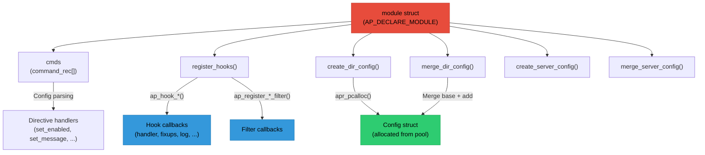

## Summary

A well-structured Apache module includes:

1. **Module declaration** - {httpd}`AP_DECLARE_MODULE` with {httpd}`STANDARD20_MODULE_STUFF`
2. **Configuration structures** - per-directory and per-server config structs
3. **Config creators/mergers** - set defaults, handle inheritance across `<Directory>` nesting
4. **Directive handlers** - parse, validate, and store config values
5. **Command table** - maps directive names to handlers with argument types
6. **Hook implementations** - the actual functionality (handlers, filters, access checks)
7. **Hook registration** - connect callbacks at the right phases and ordering

Key principles:
- Use pools for all allocations (see [Chapter 3: Memory Pools](https://github.com/0xbigshaq/apatchy/blob/8301d701975187ef0e4ae339ddca04e6eaad61ec/docs/apache-internals/03-memory-pools.md))
- Return {httpd}`DECLINED` unless you're handling the request
- Use {httpd}`ap_get_module_config()` for configuration access (indexed by `module_index`)
- Register hooks at appropriate ordering (`APR_HOOK_{`{httpd}`FIRST <APR_HOOK_FIRST>`,{httpd}`MIDDLE <APR_HOOK_MIDDLE>`,{httpd}`LAST <APR_HOOK_LAST>``}`)
- Log with {httpd}`ap_log_rerror` (request), {httpd}`ap_log_error` (server), {httpd}`ap_log_cerror` (connection)

```{note}
**For fuzzing:** when you read a module's source to understand what to fuzz, this anatomy tells you exactly where to look. The {httpd}`module_struct::cmds` table tells you what configuration it accepts. The {httpd}`module_struct::register_hooks` function tells you which request phases it participates in. The handler tells you what input it processes. All of these are potential attack surfaces that the fuzzer can exercise.
```

## `docs/apache-internals/README.md`

[View original document](https://github.com/0xbigshaq/apatchy/blob/8301d701975187ef0e4ae339ddca04e6eaad61ec/docs/apache-internals/README.md)

# Apache Internals: A Practical Guide

**From Zero to Fuzzing**

This guide is designed for developers with C and Linux experience who want to understand Apache HTTP Server's internal architecture. By the end, you'll understand enough to build a fuzzing harness that exercises Apache's request processing pipeline.

---

## Table of Contents

### Part 0x01: Foundations

1. **[Introduction to Apache Architecture](https://github.com/0xbigshaq/apatchy/blob/8301d701975187ef0e4ae339ddca04e6eaad61ec/docs/apache-internals/01-introduction.md)**
   - High-level overview and layer stack
   - Key abstractions ({httpd}`request_rec`, {httpd}`conn_rec`, {httpd}`server_rec`)
   - Source code organization
   - Core data structures

2. **[APR - Apache Portable Runtime](https://github.com/0xbigshaq/apatchy/blob/8301d701975187ef0e4ae339ddca04e6eaad61ec/docs/apache-internals/02-apr.md)**
   - Why APR exists (portability layer between Apache and the OS)
   - Strings, arrays, tables, hash tables
   - File and network I/O abstractions
   - How APR relates to fuzzing (`--with-included-apr`)

3. **[Memory Management and Pools](https://github.com/0xbigshaq/apatchy/blob/8301d701975187ef0e4ae339ddca04e6eaad61ec/docs/apache-internals/03-memory-pools.md)**
   - Why pools instead of `malloc`/`free`
   - Pool hierarchy (pconf → connection → request)
   - Pool API, cleanups, and subpools for loops
   - Pool debugging with ASan (`--enable-pool-debug=yes`)

### Part 0x02: Core Systems

4. **[The Configuration System](https://github.com/0xbigshaq/apatchy/blob/8301d701975187ef0e4ae339ddca04e6eaad61ec/docs/apache-internals/04-configuration.md)**
   - Configuration contexts (`<Directory>`, `<Location>`, `.htaccess`)
   - Directive types and the command table
   - Config creators, mergers, and the per-request merge flow
   - Module config vectors and runtime access

5. **[MPM - Multi-Processing Modules](https://github.com/0xbigshaq/apatchy/blob/8301d701975187ef0e4ae339ddca04e6eaad61ec/docs/apache-internals/05-mpm.md)**
   - Prefork, Worker, Event MPMs and their trade-offs
   - Connection handling lifecycle
   - Scoreboard and worker status tracking
   - Thread safety considerations for modules

6. **[The Hook System](https://github.com/0xbigshaq/apatchy/blob/8301d701975187ef0e4ae339ddca04e6eaad61ec/docs/apache-internals/06-hooks.md)**
   - What hooks are and how they work
   - Hook ordering constants and predecessor/successor lists
   - Return values ({httpd}`OK`, {httpd}`DECLINED`, {httpd}`DONE`, `HTTP_*`)
   - Major request and connection hooks
   - Hook infrastructure: macros, {httpd}`ap_setup_prelinked_modules`, sorting

### Part 0x03: I/O Architecture

7. **[Filters and Bucket Brigades](https://github.com/0xbigshaq/apatchy/blob/8301d701975187ef0e4ae339ddca04e6eaad61ec/docs/apache-internals/07-filters-buckets.md)**
   - Bucket types: data (heap, pool, transient, immortal), I/O (file, pipe, socket), metadata (EOS, FLUSH)
   - The {httpd}`apr_bucket_type_t` vtable and zero-copy {httpd}`setaside` morphing
   - Brigades as linked rings of buckets
   - Input vs output filters and the filter type hierarchy
   - Common patterns: pass-through, accumulating, streaming

8. **[Request Processing Pipeline](https://github.com/0xbigshaq/apatchy/blob/8301d701975187ef0e4ae339ddca04e6eaad61ec/docs/apache-internals/08-request-pipeline.md)**
   - Complete lifecycle from connection accept to pool cleanup
   - Each processing phase in detail (with source file references)
   - Directory walk and per-request config merge
   - Internal redirects, subrequests, and error handling
   - Fuzzing entry points and what each phase exercises

### Part 0x04: Practical Application

9. **[Module Anatomy](https://github.com/0xbigshaq/apatchy/blob/8301d701975187ef0e4ae339ddca04e6eaad61ec/docs/apache-internals/09-module-anatomy.md)**
   - The {httpd}`module` struct and {httpd}`STANDARD20_MODULE_STUFF`
   - Complete annotated module template
   - Configuration directives (`AP_INIT_*` macros, {httpd}`ACCESS_CONF` vs {httpd}`RSRC_CONF`)
   - Adding filters and custom hooks to a module
   - Lifecycle hooks (`child_init`, `post_config`)
   - How to read a module's source for fuzzing targets

<!-- Phase 3: For building/linking and fuzzing harness architecture, see the [architecture](https://github.com/0xbigshaq/apatchy/blob/8301d701975187ef0e4ae339ddca04e6eaad61ec/docs/architecture/harness-design.md) section. -->

---

## How to Read This Guide

**If you're new to Apache:**
Start from Chapter 1 and read sequentially. Each chapter builds on the previous ones.

**If you want to write a module:**
Focus on Chapters 1, 3, 4, 6, 7, and 9. These cover the essential concepts for module development.

**If you want to understand the fuzzing harness:**
Read Chapters 5-8 first for context, then the harness design document (coming soon).

**If you need a quick reference:**
Each chapter is self-contained with code examples. Jump to the topic you need.

---

## Prerequisites

- Solid C programming knowledge
- Linux development experience
- Familiarity with:
  - Makefiles
  - Shared libraries
  - Basic networking concepts

No prior Apache knowledge required.

---

## Further Resources

- [Apache HTTP Server Documentation](https://httpd.apache.org/docs/2.4/)
- [APR Documentation](https://apr.apache.org/docs/apr/trunk/)
- [Apache Module Development Guide](https://httpd.apache.org/docs/2.4/developer/modguide.html)
- Apache source code: `include/*.h` for API documentation

## `docs/api.rst`

[View original document](https://github.com/0xbigshaq/apatchy/blob/8301d701975187ef0e4ae339ddca04e6eaad61ec/docs/api.rst)

API Reference
=============

Managers
--------

.. autoclass:: apatchy.managers.config_manager.ConfigManager
   :members:

.. autoclass:: apatchy.managers.module_manager.ModuleManager
   :members:

.. autoclass:: apatchy.managers.build_manager.BuildManager
   :members:

.. autoclass:: apatchy.managers.dev_manager.DevManager
   :members:

.. autoclass:: apatchy.managers.bug_manager.BugManager
   :members:

.. autoclass:: apatchy.managers.fuzz_manager.GrammarSeedGenerator
   :members:

.. autoclass:: apatchy.managers.fuzz_manager.FuzzManager
   :members:

.. autoclass:: apatchy.managers.toolchain_manager.ToolchainManager
   :members:

.. autoclass:: apatchy.managers.report_manager.ReportManager
   :members:

.. autoclass:: apatchy.managers.introspector_manager.IntrospectorManager
   :members:

Core
----

.. autoclass:: apatchy.core.process_runner.ProcessRunner
   :members:

.. autoclass:: apatchy.core.downloader.Downloader
   :members:

.. autoclass:: apatchy.core.harness.HarnessBuilder
   :members:

Toolchain
---------

.. autoclass:: apatchy.core.toolchain.base.DepStatus
   :members:

.. autoclass:: apatchy.core.toolchain.base.ToolchainTool
   :members:

.. autoclass:: apatchy.core.toolchain.simple.BinaryTool
   :members:

.. autoclass:: apatchy.core.toolchain.simple.PkgOrConfigTool
   :members:

.. autoclass:: apatchy.core.toolchain.simple.HeaderOrPkgTool
   :members:

.. autoclass:: apatchy.core.toolchain.llvm.LlvmTool
   :members:

.. autoclass:: apatchy.core.toolchain.libtool.LibtoolTool
   :members:

Misc
----

.. autoclass:: apatchy.config.Config
   :members:

.. autoclass:: apatchy.bugs.base.Bug
   :members:

.. autoclass:: apatchy.compat.CompatEntry
   :members:

.. autoclass:: apatchy.compat.CompatResult
   :members:

.. autoclass:: apatchy.utils.build_tree.AlternateBuildTree
   :members:

.. autoclass:: apatchy.utils.ui.UI
   :members:

.. autoclass:: apatchy.method_dispatcher.MethodDispatcher
   :members:

## `docs/architecture/building-linking.md`

[View original document](https://github.com/0xbigshaq/apatchy/blob/8301d701975187ef0e4ae339ddca04e6eaad61ec/docs/architecture/building-linking.md)

# Building and Linking

Apache HTTPD was designed in the mid-1990s to be built on every Unix variant imaginable, from AIX to Solaris to Linux. That heritage means it uses the full GNU autotools stack -autoconf, automake, and libtool -to abstract away platform differences in compilers, linkers, shared library conventions, and installation paths. For normal users running `./configure && make && make install`, this abstraction is invisible. For anyone trying to link a custom binary against Apache's internals (as we do when building a fuzzing harness), understanding what these tools actually produce and why is essential.

This chapter explains Apache's build system from the perspective of someone who needs to link against it, not someone who just wants to install it. It covers the configure/compile pipeline, the difference between static and dynamic modules and why that distinction matters for fuzzing, libtool's intermediate file formats and wrapper scripts, and the linking strategies required to produce a working fuzzing harness.

## The Build Pipeline

Building Apache from source involves three distinct phases, each producing artifacts that feed into the next. The `apatchy` CLI automates all of this - the {class}`~apatchy.managers.build_manager.BuildManager` class orchestrates the full configure → compile → link pipeline, delegating to {class}`~apatchy.managers.config_manager.ConfigManager` for compiler flag generation, {class}`~apatchy.core.harness.HarnessBuilder` for the link step, and {class}`~apatchy.utils.build_tree.AlternateBuildTree` for hot-patching build files when alternate build trees are needed (see [](#why-hot-patching-is-necessary)). Understanding the pipeline helps when debugging build failures or extending the harness.

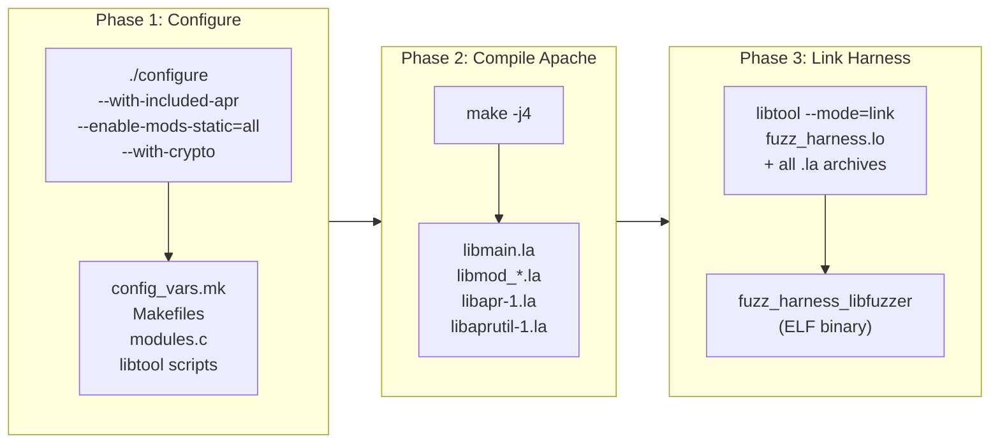

**Phase 1 (Configure)** probes the system for compilers, libraries, and platform capabilities, then generates all the Makefiles, a `config_vars.mk` file containing every build variable, a `modules.c` file listing which modules to statically link, and `libtool` scripts configured for the local platform. The configure step is where key decisions are locked in: which compiler to use (`clang` for fuzzing), which modules to build statically versus dynamically, and which optional features to enable (like `--with-crypto` for mod_session_crypto).

**Phase 2 (Compile)** runs `make` to compile all the source files into libtool archives (`.la` files). Apache's server core becomes `server/libmain.la`. Each module becomes `modules/<category>/libmod_<name>.la`. The bundled APR and APR-Util libraries become `srclib/apr/libapr-1.la` and `srclib/apr-util/libaprutil-1.la`. At this point Apache's normal build would also link the `httpd` binary, but we do not need it - we will link our own binary in Phase 3.

**Phase 3 (Link Harness)** is where the fuzzing-specific work happens. We compile the harness source and link it against all the `.la` archives from Phase 2 to produce a single binary that contains the entire Apache server plus the fuzzing entry point. For protobuf-based harnesses, this phase also compiles `.proto` schemas with `protoc`, builds the generated C++ sources, and links against libprotobuf-mutator for structure-aware mutation. This phase is managed by the {class}`~apatchy.core.harness.HarnessBuilder` class rather than Apache's own Makefile.

### Key Configure Options

The {meth}`~apatchy.managers.build_manager.BuildManager.configure_httpd` method assembles these flags automatically - see its docstring for a detailed explanation of each flag. {class}`~apatchy.managers.config_manager.ConfigManager` generates the `CFLAGS`/`LDFLAGS` based on the selected sanitizer options, while the {mod}`~apatchy.compat` module adds version-specific compatibility flags for the detected HTTPD version.

## Static vs Dynamic Modules

Apache supports two ways of including modules: statically linked into the binary, or dynamically loaded at runtime as shared objects (`.so` files). This choice has significant implications for fuzzing.

`````{tab-set}

````{tab-item} Dynamic Modules (DSO)

In a production deployment, most modules are built as Dynamic Shared Objects and loaded at runtime through `LoadModule` directives:

```apache
LoadModule rewrite_module modules/mod_rewrite.so
LoadModule ssl_module modules/mod_ssl.so
```

This approach is flexible - you can enable or disable modules by editing the config file, and you can upgrade individual modules without rebuilding the entire server. Apache's `apxs` tool exists specifically to build third-party modules this way:

```bash
# Compile, install, and activate a module
apxs -c -i -a mod_example.c

# Compile with external library dependencies
apxs -c -I/usr/include/libxml2 -lxml2 mod_example.c helper.c
```
````

````{tab-item} Static Modules

Static modules are compiled directly into the binary. Configure generates a `modules.c` file that lists every statically linked module in two arrays:

```c
// modules.c (auto-generated by configure)
module *ap_prelinked_modules[] = {
    &core_module,
    &http_module,
    &rewrite_module,
    &ssl_module,
    &session_module,
    &session_crypto_module,
    // ... 60+ modules when --enable-mods-static=all
    NULL
};
```

Apache walks this array during startup to register each module's hooks, directives, and configuration handlers. No `LoadModule` directives are needed.
````

`````

### Why Static Linking is Better for Fuzzing

The fuzzing harness uses `--enable-mods-static=all` for three reasons that are each independently sufficient:

1. **Consistent SanCov instrumentation.** LibFuzzer relies on SanCov callbacks inserted at compile time. Static linking lets the compiler instrument the harness, Apache core, and all modules in a single pass. Dynamic modules would need separate compilation with identical flags.

2. **No wrapper scripts.** With shared APR libraries, libtool generates shell wrapper scripts instead of ELF binaries. `--disable-shared` produces the binary directly.

3. **Single binary.** One self-contained ELF - no `LD_LIBRARY_PATH`, no `modules/` directory, trivial crash reproduction on any machine.


## Understanding Libtool

Libtool is an abstraction layer over platform-specific shared library tooling. On Linux you might use `gcc -shared -o libfoo.so`, on macOS it is `libtool -dynamic -o libfoo.dylib`, and on older systems the flags are entirely different. Libtool provides a uniform interface and generates intermediate files that track dependencies between libraries. Apache uses libtool pervasively, and the fuzzing harness must use the same libtool instance (found at `srclib/apr/libtool`) to link correctly.

### .lo Files (Libtool Objects)

When libtool compiles a source file, it produces a `.lo` file rather than a plain `.o` file. The `.lo` file is a small text file that points to the actual compiled objects:

```
# fuzz_harness.lo
pic_object='.libs/fuzz_harness.o'    # Position-independent (for shared libraries)
non_pic_object='fuzz_harness.o'       # Non-PIC (for static archives)
```

Libtool compiles the source file twice - once with `-fPIC` for use in shared libraries, once without for static archives - and the `.lo` file records both results. When you later tell libtool to link, it picks the appropriate object based on whether it is building a shared library or a static executable.

### .la Files (Libtool Archives)

A `.la` file describes a library and its dependencies. It is also a text file, not a binary:

```
# server/libmain.la
dlname='libmain.so.0'
library_names='libmain.so.0.0.0 libmain.so.0 libmain.so'
old_library='libmain.a'
dependency_libs=' -L/usr/lib -lpthread -ldl -lpcre2-8'
libdir='/usr/local/apache2/lib'
```

The critical field is `dependency_libs`: it lists every library that `libmain.la` depends on. When you link against `libmain.la`, libtool reads this field and transitively pulls in all the dependencies. This is what makes libtool linking "just work" in the common case - you specify the top-level `.la` file and libtool figures out the full dependency chain.

For the fuzzing harness, this transitive dependency resolution is essential. Apache's module libraries depend on Apache's core library, which depends on APR-Util, which depends on APR, which depends on system libraries. Specifying the `.la` files (rather than raw `.a` or `.so` files) lets libtool sort out the full chain.

### Binary Output Location

Because APR and APR-Util are built as static-only libraries (`--disable-shared`), libtool places the harness binary directly in the working directory - no wrapper scripts, no `.libs/` indirection:

```bash
$ file fuzz_harness_libfuzzer
fuzz_harness_libfuzzer: ELF 64-bit LSB executable, x86-64, dynamically linked...
```

You can run the binary directly:

```bash
./fuzz_harness_libfuzzer corpus/
```

The `apatchy fuzz` command handles this automatically.

```{note}
If you see a libtool wrapper script instead of an ELF binary (e.g. after building with shared APR), the real binary will be inside `.libs/`. The `apatchy` CLI checks both locations automatically.
```

## Linking the Fuzzing Harness Against Apache

Linking the fuzzing harness is the most involved part of the build. The harness must link against Apache's server core, every statically-built module, APR-Util, APR, and various system libraries - and the order in which these are specified matters.

### The Compile Step

Each source file is compiled through Apache's own libtool instance to ensure consistent flags and object formats. For non-proto harnesses (`.c` files), the pipeline compiles three source files:

```bash
LIBTOOL=../httpd-2.4.62/srclib/apr/libtool

# Compile the harness
$LIBTOOL --mode=compile clang -c \
    -I../httpd-2.4.62/include \
    -I../httpd-2.4.62/srclib/apr/include \
    -I../httpd-2.4.62/srclib/apr-util/include \
    -I../httpd-2.4.62/os/unix \
    -I../httpd-2.4.62/server \
    mod_fuzzy.c -o fuzz_harness.lo

# Compile fuzz_common.c (shared initialization, hooks, filters)
$LIBTOOL --mode=compile clang -c \
    fuzz_common.c -o fuzz_common.lo

# Compile buildmark.c (provides ap_get_server_built() symbol)
$LIBTOOL --mode=compile clang -c \
    ../httpd-2.4.62/server/buildmark.c -o buildmark.lo

# Compile modules.c (provides ap_prelinked_modules array)
$LIBTOOL --mode=compile clang -c \
    ../httpd-2.4.62/modules.c -o modules.lo
```

- **mod_fuzzy.c** (or any harness `.c`/`.cc`) - the harness entry point
- **fuzz_common.c** - shared infrastructure (Apache initialization, I/O filters, fake MPM, socketless operation)
- **buildmark.c** - a small Apache source file that provides the `ap_get_server_built()` function, which Apache's core calls during startup
- **modules.c** - the auto-generated file listing all statically linked modules

Proto harnesses (`.cc` files) have a more complexity in their compile step - see [](#protobuf-harness-compilation) for details.

### Include Paths

The harness needs headers from four separate directory trees:

```bash
-I../httpd-2.4.62/include            # Apache core headers (httpd.h, http_config.h, etc.)
-I../httpd-2.4.62/srclib/apr/include  # APR headers (apr.h, apr_pools.h, etc.)
-I../httpd-2.4.62/srclib/apr-util/include  # APR-Util headers (apr_buckets.h, etc.)
-I../httpd-2.4.62/os/unix            # Platform-specific headers (os.h, unixd.h)
-I../httpd-2.4.62/server             # Server internal headers (mpm_common.h)
```

### The Link Step and Dependency Order

The order of which we link the objects matters. Below is a sample command that demonstrates it: 

```bash
$LIBTOOL --mode=link clang \
    -Wl,-z,muldefs \
    -Wl,-u,ap_cookie_write \
    -Wl,-u,ap_cookie_read \
    -Wl,-u,ap_cookie_check_string \
    -Wl,-u,ap_rxplus_compile \
    -Wl,-u,ap_rxplus_exec \
    -o fuzz_harness_libfuzzer \
    fuzz_harness.lo fuzz_common.lo buildmark.lo modules.lo \
    -export-dynamic \
    ../server/libmain.la \                # (1) Server core - first pass
    ../os/unix/libos.la \
    ../server/mpm/event/libevent.la \
    ../modules/http/libmod_http.la \      # (2) All module libraries
    ../modules/ssl/libmod_ssl.la \
    ../modules/proxy/libmod_proxy.la \
    ... (60+ module libraries) ...
    ../server/libmain.la \                # (3) Server core - second pass
    ../os/unix/libos.la \
    ../srclib/apr-util/libaprutil-1.la \  # (4) APR-Util
    ../srclib/apr/libapr-1.la \           # (5) APR (foundational)
    -lssl -lcrypto -lz -lpcre2-8 \       # (6) System libraries
    -luuid -lcrypt -lpthread
```

There is a lot going on in this link command. Let's break it down.

### Why Link Order Matters

When the linker processes a static archive (`.a` file), it does not include every object in the archive. It scans the archive and only pulls in object files that resolve currently-undefined symbols. Once it finishes scanning, it moves on and never comes back. This means that if Library A depends on Library B, **B must come after A** on the command line -otherwise the linker will scan B before it knows that any of B's symbols are needed, skip everything, and then fail with undefined references when it reaches A.

This is a fundamental property of the Unix static linker and is the source of most "undefined reference" errors when linking against Apache.

### Why Circular Dependencies Happen in Apache

Apache's architecture creates genuine circular dependencies between its libraries. The `libmain.la` archive contains the server core: configuration parsing, hook dispatch, pool management wrappers, and various utility functions. Module libraries (like `libmod_session.la`) depend on `libmain.la` for functions like `ap_hook_*`, {httpd}`ap_get_module_config()`, and {httpd}`ap_log_rerror()`.

But the dependency runs the other direction too. Module archives reference utility functions that live inside `libmain.a` - for example, `mod_session` calls `ap_cookie_write()`, which is defined in `util_cookies.o` (one of the many `.o` files packed into `libmain.a`). The problem: when the linker scans `libmain.a` on the first pass, no one has asked for `ap_cookie_write` yet, so the linker skips `util_cookies.o` entirely. Later, when the module archives create the undefined reference, the linker has already moved past `libmain.a`.

The solution has two parts:

1. **List `libmain.la` twice** - once before the module libraries (so modules can resolve their core dependencies) and once after (so the linker gets a second chance to pull utility functions that modules referenced).

2. **Force-pull specific symbols** with `-Wl,-u,<symbol>` - this marks symbols as undefined from the start, guaranteeing they get pulled from the archive even if no object file has referenced them yet. The five symbols currently forced are `ap_cookie_write`, `ap_cookie_read`, `ap_cookie_check_string`, `ap_rxplus_compile`, and `ap_rxplus_exec`.

```{note}
The number of `-Wl,-u` entries depends on how many Apache functions the harness references. The harness and `fuzz_common.c` drive the first pass of `libmain.a` - every function they call pulls in `.o` files, and each pulled `.o` may transitively pull in others. A minimal harness that only calls `ap_process_connection()` would leave many more symbols unresolved than one that also calls config parsing, filter registration, etc.

In practice, `fuzz_common.c` is heavy enough to pull in most of `libmain.a` through transitive references. The five `-Wl,-u` symbols are the stragglers that nothing in the harness's transitive chain touches. If a new module causes an "undefined reference" at link time for a function inside `libmain.a`, adding another `-Wl,-u` to the `muldefs_flags` list in {class}`~apatchy.core.harness.HarnessBuilder` is the fix.
```

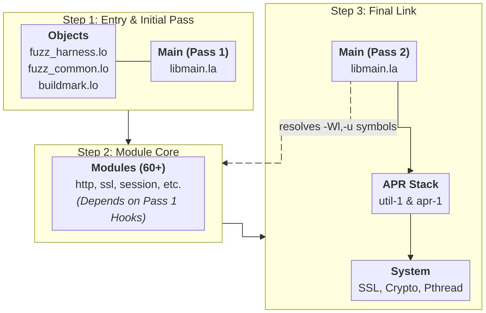

- **The `-Wl,-z,muldefs` flag** - Both the harness and `libmain.la` define `main()`. This flag tells the linker to use the first definition it encounters (the harness's `main()` via `fuzz_harness.lo`) and silently ignore Apache's `main()` in `libmain.a`.

- **The `-export-dynamic` flag** - Some Apache modules use `dlsym()` to look up symbols in the main executable at runtime. This flag adds all symbols to the dynamic symbol table so that `dlsym(RTLD_DEFAULT, ...)` calls succeed.

### System Library Dependencies

The system libraries at the end of the link line come from two sources:

1. **Apache's `config_vars.mk`** - during configure, Apache probes for system libraries and records which modules need what. The build script parses all `MOD_*_LDADD` variables from this file to collect flags like `-lssl`, `-lcrypto`, `-lz`, `-lxml2`, etc.

2. **Always-needed libraries** -`-lpthread` (threading), `-ldl` (dynamic loading), `-lcrypt` (crypt functions), and `-luuid` (UUID generation) are required regardless of which modules are enabled.

(protobuf-harness-compilation)=
### Protobuf Harness Compilation

Proto harnesses (`.cc` files) use libprotobuf-mutator for structure-aware fuzzing and have a more involved compile pipeline than plain C harnesses. Each proto harness declares its dependencies via `@protos` and `@converters` tags in its header comment:

```cpp
/*
 * @description: proto harness - mod_session_crypto fuzzing
 * @protos: http_request, session_crypto
 * @converters: http, session_crypto
 */
```

The {class}`~apatchy.core.harness.HarnessBuilder` parses these tags and only compiles the needed files. The full pipeline:

1. **protoc** generates `.pb.h`/`.pb.cc` from all `.proto` schemas (protoc needs all files to resolve imports, but only the declared protos are compiled)
2. **Compile `.pb.cc`** - only the protos listed in `@protos` are compiled with `clang++`
3. **Compile harness `.cc`** - via libtool with `clang++` (needs Apache includes + proto gen dir + LPM includes)
4. **Compile proto converters** - only the converters listed in `@converters` from the `proto_converters/` directory
5. **Compile C files** -`fuzz_common.c`, `fuzz_backend.c`, `buildmark.c`, `modules.c` via libtool with `clang`
6. **Link with `clang++`** - adds libprotobuf-mutator (`-lprotobuf-mutator-libfuzzer -lprotobuf-mutator`), protobuf runtime (`-lprotobuf`), and all Apache `.la` archives


## Alternate Build Trees

The fuzzer needs multiple copies of Apache compiled with different flags. The vanilla root tree is built with `clang -g -O0` for debugging, but LibFuzzer and coverage branches each need their own instrumentation flags (`-fsanitize=fuzzer-no-link` and `-fprofile-instr-generate` respectively). These cannot coexist in the same binary.

Rather than re-running `configure` (which would regenerate `modules.c` and destroy the build state), the {class}`~apatchy.utils.build_tree.AlternateBuildTree` utility creates a full copy of the source tree, rewrites all the hardcoded absolute paths in Makefiles and `.la` files to point at the copy, patches the compiler and flag variables, and rebuilds. The result is a parallel tree like `httpd-2.4.62-lf/` that can be used for LibFuzzer-instrumented linking without disturbing the root.

```mermaid
%%{
  init: {
    'flowchart': {
      'nodeSpacing': 28,
      'rankSpacing': 18,
      'diagramPadding': 15
    }
  }
}%%
flowchart TB
    subgraph primary["httpd-2.4.62 (Primary build)"]
        P1["CC = clang"]
        P2["-O2 -fno-omit-frame-pointer"]
        P3["Base tree for alternate builds"]
    end

    subgraph libfuzzer["httpd-2.4.62-lf (LibFuzzer build)"]
        L1["CC = clang"]
        L2["-fsanitize=fuzzer-no-link<br />-O0 -g"]
        L3["Used by: fuzz_harness_libfuzzer"]
    end

    subgraph coverage["httpd-2.4.62-cov (Coverage build)"]
        C1["CC = clang"]
        C2["-fprofile-instr-generate<br />-fcoverage-mapping"]
        C3["Used by: fuzz_harness_coverage"]
    end
```

This design means you can fuzz with LibFuzzer in one terminal and generate coverage reports in another without either operation interfering with the other.

### Why Hot-Patching Is Necessary

Apache's `configure` script bakes absolute paths, compiler names, and compiler flags into dozens of files scattered across the build tree. When you run `./configure CC=clang CFLAGS="-O2 -fsanitize=address ..."`, those values are written verbatim into:

- **`config_vars.mk`** and other `.mk` files (`apr_rules.mk`, `rules.mk`) - the central repositories for `CC`, `CPP`, `CFLAGS`, `LDFLAGS`, `NOTEST_CFLAGS`, and `EXTRA_CFLAGS`
- **`libtool` scripts** (one per library subtree: top-level, `srclib/apr/`, `srclib/apr-util/`) - contain their own `CC`, `LTCC`, and `LTCFLAGS` variables
- **`Makefile` files** - reference `CPP` and other variables directly
- **`.la` files** - contain hardcoded `libdir` paths and `dependency_libs` with absolute paths
- **`config.status`**, **`config.nice`**, **`config.log`** - record the original configure invocation with full paths

There is no `configure` option to change the compiler after the fact. Re-running `configure` would regenerate `modules.c`, potentially change which modules are enabled, and destroy the carefully tuned build state. The only viable approach is to copy the tree and surgically patch the build files in place - hence the name *apatchy*.

### The Two-Phase Patching Strategy

The {class}`~apatchy.utils.build_tree.AlternateBuildTree` class manages this with two distinct patching passes, implemented as {meth}`~apatchy.utils.build_tree.AlternateBuildTree.rewrite_paths` and {meth}`~apatchy.utils.build_tree.AlternateBuildTree.patch_build_flags`.

**Phase 1: Path Rewriting** ({meth}`~apatchy.utils.build_tree.AlternateBuildTree.rewrite_paths`) - After the copy, every build file still contains hardcoded paths pointing at the original tree. A string replacement rewrites these across all Makefiles, `.mk` files, `config.status`, `config.nice`, `config.log`, `libtool` scripts, and `.la` files. Without this, `make` in the copy would read/write objects in the original tree.

**Phase 2: Flag Patching** ({meth}`~apatchy.utils.build_tree.AlternateBuildTree.patch_build_flags`) - With paths fixed, the compiler and flags still reference the root's settings. Regex substitution patches `CC`, `CFLAGS`, `LDFLAGS` across libtool scripts, `.mk` config files, and Makefiles. It also clears `NOTEST_CFLAGS`/`EXTRA_CFLAGS` which carry `-Werror` flags that may clash with different instrumentation options.

```{note}
`LDFLAGS` is only patched in config files, never passed on the `make` command line. Command-line `LDFLAGS` would clobber the Makefile variable globally, breaking libtool's transitive dependency resolution - support utilities would lose `-lcrypt`, `-lm`, and other system libraries they need.
```

## Compiler and Linker Flags Reference

Flags vary by tree type. The vanilla root and coverage branch use debug flags; the libfuzzer branch uses optimized flags with SanCov instrumentation.

````{dropdown} CFLAGS
```bash
# Vanilla root (apatchy configure)
-g                          # Debug symbols
-O0                         # No optimization (readable stack traces)
-fno-omit-frame-pointer     # Complete stack traces in ASan reports
-Wno-error=format           # Suppress format warnings from clang

# LibFuzzer branch (apatchy make --tree lf)
-fsanitize=fuzzer-no-link   # SanCov instrumentation for coverage-guided fuzzing
-Wno-error                  # Suppress all -Werror from configure

# Coverage branch (apatchy make --tree cov)
-fprofile-instr-generate    # LLVM coverage instrumentation
-fcoverage-mapping          # Source-level coverage mapping

# Harness-level (added by HarnessBuilder during link)
-DLIBFUZZER                 # Compile harness with LLVMFuzzerTestOneInput entry point
-fsanitize=fuzzer           # Link LibFuzzer runtime into the binary

# Platform defines (set by configure)
-DLINUX -D_GNU_SOURCE -D_REENTRANT -DHAVE_CONFIG_H

# Sanitizer flags (orthogonal, combined with any tree)
-fsanitize=address          # AddressSanitizer (heap/stack overflow, use-after-free)
-fsanitize=undefined        # UndefinedBehaviorSanitizer
-fsanitize-recover=all      # Continue after UBSan reports (ASan still aborts)
-fno-sanitize-trap          # Emit runtime report instead of trap instruction
```
````

````{dropdown} LDFLAGS
```bash
# Sanitizer flags (must match CFLAGS)
-fsanitize=address
-fsanitize=undefined

# All trees
-no-pie                     # Avoid R_X86_64_32S relocation errors from SanCov

# Harness-specific
-Wl,-z,muldefs              # Allow duplicate main() definitions
-Wl,-u,ap_cookie_write      # Force-pull symbols from libmain.a
-Wl,-u,ap_cookie_read
-Wl,-u,ap_cookie_check_string
-Wl,-u,ap_rxplus_compile
-Wl,-u,ap_rxplus_exec
-export-dynamic              # Export symbols for dlsym() lookups

# Coverage branch
-fprofile-instr-generate    # Must also be in LDFLAGS for coverage
```
````

````{dropdown} System Libraries
```bash
-lpthread       # POSIX threads (APR threading)
-ldl            # Dynamic loading (mod_so, dlopen)
-lcrypt         # crypt() function
-luuid          # UUID generation
-lssl -lcrypto  # OpenSSL (mod_ssl, mod_session_crypto)
-lz             # zlib (mod_deflate)
-lpcre2-8       # PCRE2 (regex in RewriteRule, LocationMatch, etc.)
-lxml2          # libxml2 (mod_proxy_html, mod_xml2enc)
-llua5.4        # Lua (mod_lua)
```
````

## `docs/architecture/contributing-proto-harness.md`

[View original document](https://github.com/0xbigshaq/apatchy/blob/8301d701975187ef0e4ae339ddca04e6eaad61ec/docs/architecture/contributing-proto-harness.md)

# Contributing a Proto Harness

This guide walks through creating a new proto harness from scratch. By the end, you will have a working structure-aware fuzzing target for an Apache module. For background on the harness internals and filter architecture, see [Harness Design](https://github.com/0xbigshaq/apatchy/blob/8301d701975187ef0e4ae339ddca04e6eaad61ec/docs/architecture/harness-design.md). For the fuzzing engine and LPM integration, see [Fuzzing Engines](https://github.com/0xbigshaq/apatchy/blob/8301d701975187ef0e4ae339ddca04e6eaad61ec/docs/architecture/fuzzing-engines.md).

## Prerequisites

- A working `apatchy` build environment (Apache compiled with `--enable-mods-static=all`)
- LibFuzzer and libprotobuf-mutator installed (see [Building and Linking](https://github.com/0xbigshaq/apatchy/blob/8301d701975187ef0e4ae339ddca04e6eaad61ec/docs/architecture/building-linking.md))
- Familiarity with the Apache module you want to fuzz -- which hooks it registers, what input it processes, and what config directives it needs

## Overview

A proto harness has four components:

```
proto schema (.proto)  -->  converter (.cc)  -->  harness (.cc)  -->  Apache config (.conf)
       |                        |                      |
  defines the             converts proto          calls the converter
  mutation space          to raw HTTP/binary       and feeds result to
                                                   fuzz_one_input()
```

Each component lives in its own directory:

| Component | Directory | Naming convention |
|-----------|-----------|-------------------|
| Proto schema | `protos/` | `<feature>.proto` |
| Converter | `harnesses/proto_converters/` | `<feature>.cc` |
| Harness | `harnesses/` | `mod_fuzzy_proto_<feature>.cc` |
| Apache config | `configs/` | `<feature>.conf` |
| Seed corpus | `fuzz-seeds/<feature>/` | Binary protobuf or `.textproto` files |

## Step 1: Define the Proto Schema

Create a `.proto` file in `protos/` that describes the input space for your target module. This is where you define what LPM can mutate.

Most harnesses import the base `http_request.proto` and add module-specific fields on top. For example, if you were fuzzing a caching module:

```protobuf
// protos/cache_request.proto
syntax = "proto2";

import "http_request.proto";

enum CacheControl {
  NO_CACHE = 0;
  NO_STORE = 1;
  MAX_AGE = 2;
  PUBLIC = 3;
  PRIVATE = 4;
}

message CacheRequest {
  required HttpRequest http = 1;
  optional CacheControl control = 2;
  optional int32 max_age = 3;
  optional string etag = 4;
}
```

**Design tips:**

- Use `required` for fields the module always needs (like the HTTP request itself)
- Use `optional` for fields that trigger different code paths when present vs. absent
- Use `enum` to constrain values to meaningful choices (LPM will cycle through all variants)
- Use `repeated` for variable-length lists (headers, query params, etc.)
- Keep the schema focused on what the *module* cares about -- do not model the entire HTTP spec

The base `HttpRequest` message already covers method, URI, HTTP version, headers, and body. You only need to add fields for module-specific input that is not part of a normal HTTP request (encrypted cookies, binary protocol frames, multipart boundaries, etc.).

## Step 2: Write the Converter

Create a converter in `harnesses/proto_converters/` that translates your protobuf message into whatever raw input the module expects.

**If your module processes standard HTTP requests** (just with specific headers or URI patterns), you might not need a custom converter at all -- use `BuildHttpRequest()` directly and apply your module-specific transforms on the resulting string.

**If your module processes a binary protocol or needs complex encoding**, write a dedicated `Build*()` function:

```cpp
// harnesses/proto_converters/cache.cc
#include "converters.h"
#include "cache_request.pb.h"

static const char *CacheControlToString(CacheControl cc)
{
    switch (cc) {
    case NO_CACHE:  return "no-cache";
    case NO_STORE:  return "no-store";
    case MAX_AGE:   return "max-age";
    case PUBLIC:    return "public";
    case PRIVATE:   return "private";
    default:        return "no-cache";
    }
}

void ApplyCache(const CacheRequest &req, std::string &request)
{
    std::string val = CacheControlToString(req.control());
    if (req.control() == MAX_AGE && req.has_max_age())
        val += "=" + std::to_string(req.max_age());

    // Inject Cache-Control header before the blank line
    size_t pos = request.find("\r\n\r\n");
    if (pos != std::string::npos) {
        std::string hdr = "Cache-Control: " + val + "\r\n";
        if (req.has_etag())
            hdr += "If-None-Match: " + req.etag() + "\r\n";
        request.insert(pos + 2, hdr);
    }
}
```

Then declare the function in `converters.h`:

```cpp
class CacheRequest;
void ApplyCache(const CacheRequest &req, std::string &request);
```

**Converter patterns:**

There are two common patterns depending on what your module needs:

1. **Apply-style** (`void Apply*(const Proto &, std::string &request)`) -- modifies an existing HTTP request string by injecting headers, rewriting the URI, or appending encoded data. Used when the module processes standard HTTP with extra data (session cookies, rewrite rules, multipart bodies).

2. **Build-style** (`std::string Build*(const Proto &)`) -- constructs a complete raw input from scratch. Used when the module speaks a non-HTTP protocol (AJP binary frames, HTTP/2, uWSGI).

## Step 3: Write the Harness

Create the harness `.cc` file in `harnesses/`. This is the entry point that ties everything together.

```cpp
/*
 * @description: proto harness - mod_cache fuzzing via libprotobuf-mutator
 * @protos: http_request, cache_request
 * @converters: http, cache
 *
 * Structure-aware libFuzzer harness for mod_cache.
 * LPM mutates both the HTTP request and cache control fields independently.
 *
 * Build: apatchy link libfuzzer --harness mod_fuzzy_proto_cache
 * Run:   apatchy fuzz --engine libfuzzer --config configs/cache.conf
 */

#include "proto_converters/converters.h"
#include "proto_harness_common.h"
#include "cache_request.pb.h"
#include "src/libfuzzer/libfuzzer_macro.h"

DEFINE_PROTO_FUZZER(const CacheRequest &request)
{
    if (!proto_harness_init())
        return;

    std::string raw = BuildHttpRequest(request.http());
    ApplyCache(request, raw);
    fuzz_one_input(raw.data(), raw.size());
}
```

### Metadata tags

The comment header contains metadata tags that the build system parses to determine what to compile and link. These are required:

| Tag | Required | Description |
|-----|----------|-------------|
| `@description:` | Yes | One-line description, shown by `apatchy harness list` |
| `@protos:` | Yes | Comma-separated list of `.proto` file names (without extension) |
| `@converters:` | Yes | Comma-separated list of converter files from `proto_converters/` (without extension) |
| `@extras:` | No | Additional C source files to compile and link (without `.c` extension) |
| `@ldflags:` | No | Extra linker flags (e.g. `-Wl,--wrap=some_function`) |

### Required includes

Every proto harness needs these four includes:

```cpp
#include "proto_converters/converters.h"   // converter function declarations
#include "proto_harness_common.h"          // proto_harness_init()
#include "<your_proto>.pb.h"               // generated protobuf header
#include "src/libfuzzer/libfuzzer_macro.h" // DEFINE_PROTO_FUZZER macro
```

### Entry point structure

The `DEFINE_PROTO_FUZZER` body always follows the same pattern:

1. Call `proto_harness_init()` -- initializes Apache once per process (config parsing, module hooks, memory pools). Returns `false` on failure.
2. Convert the protobuf to raw input using your converter.
3. Call `fuzz_one_input(data, size)` to run the input through Apache's full request pipeline.

### Fuzzing proxy modules

If your target is a proxy module (mod_proxy_uwsgi, mod_proxy_ajp, etc.), you need to mock the backend server response. Add `fuzz_backend` to `@extras:` and set up the backend buffer before calling `fuzz_one_input()`:

```cpp
/*
 * @extras: fuzz_backend
 * @ldflags: -Wl,--wrap=ap_proxy_connect_backend
 */

extern "C" {
#include "fuzz_backend.h"
}

DEFINE_PROTO_FUZZER(const MyProxyRequest &req)
{
    if (!proto_harness_init())
        return;

    g_backend_enabled = 1;

    std::string response = BuildMyResponse(req.resp());
    g_backend_buf = response.data();
    g_backend_size = response.size();

    std::string raw = BuildHttpRequest(req.http());
    fuzz_one_input(raw.data(), raw.size());
}
```

The `--wrap=ap_proxy_connect_backend` linker flag redirects Apache's backend connection function to the mock in `fuzz_backend.c`, which serves `g_backend_buf` through a socketpair instead of connecting to a real upstream.

## Step 4: Write the Apache Config

Create a config in `configs/` that enables and configures the module you want to fuzz. The config should exercise as many code paths as possible.

Start with this base and add module-specific directives:

```apache
# configs/cache.conf
ServerName localhost:80
HttpProtocolOptions Unsafe
DocumentRoot "/tmp/htdocs"
ErrorLog "/dev/stdout"
LogLevel emerg
TypesConfig conf/mime.types

<Directory "/">
    Require all granted
</Directory>

LimitRequestFieldSize 100000
LimitRequestLine 100000
```

Key directives to keep:

- **`HttpProtocolOptions Unsafe`** -- relaxes strict HTTP parsing so fuzz inputs reach module code instead of being rejected by the protocol parser
- **`Require all granted`** -- disables auth checks so requests reach your module
- **`LogLevel emerg`** -- minimizes logging overhead during fuzzing
- **`LimitRequestFieldSize`/`LimitRequestLine`** -- allows large fuzz inputs through

Then add your module's config. Use multiple `<Location>` blocks to hit different code paths:

```apache
CacheEnable disk /a
CacheRoot "/tmp/cache"
CacheDefaultExpire 300

<Location "/b">
    CacheDisable on
</Location>
```

## Step 5: Add Seed Corpus

Create a directory in `fuzz-seeds/` for your harness seeds:

```
fuzz-seeds/<feature>/
```

LPM accepts seeds in text protobuf format (`.textproto`), which is human-readable:

```protobuf
# fuzz-seeds/cache/basic.textproto
http {
  method: GET
  uri: "/a/index.html"
  headers { name: "Host" value: "localhost" }
}
control: MAX_AGE
max_age: 300
etag: "abc123"
```

You only need a few valid seeds -- LPM handles mutation from there. Focus seeds on:

- A minimal valid request that reaches your module
- One seed per major code path or `<Location>` block in your config
- Edge cases specific to your module (empty values, boundary conditions)

## Step 6: Build and Run

Build the harness:

```bash
apatchy link libfuzzer --harness mod_fuzzy_proto_<feature>
```

Run the fuzzer:

```bash
FUZZ_CONF=configs/<feature>.conf apatchy fuzz --engine libfuzzer --corpus fuzz-seeds/<feature>/
```

Verify it starts without crashing and is finding new coverage. If Apache fails to initialize, check the config -- missing modules or bad directives are the most common cause.

## Checklist

Before submitting:

- [ ] Proto schema in `protos/` -- imports `http_request.proto` if applicable
- [ ] Converter in `harnesses/proto_converters/` -- declared in `converters.h`
- [ ] Harness `.cc` in `harnesses/` -- correct `@protos`, `@converters`, `@extras`, `@ldflags` tags
- [ ] Apache config in `configs/` -- module enabled, multiple routes for coverage
- [ ] Seed corpus in `fuzz-seeds/` -- at least one valid seed per route
- [ ] Builds with `apatchy link libfuzzer --harness <name>`
- [ ] Runs without initialization errors
- [ ] Reaches target module code (check with a coverage build)

## Reference: Existing Harnesses

| Harness | Module | Key technique |
|---------|--------|---------------|
| `mod_fuzzy_proto` | Core HTTP | Base case -- just `BuildHttpRequest()` |
| `mod_fuzzy_proto_session` | mod_session_crypto | `ApplySessionCrypto()` injects encrypted cookies |
| `mod_fuzzy_proto_multipart` | mod_mime | `ApplyMultipart()` builds multipart/form-data bodies |
| `mod_fuzzy_proto_rewrite` | mod_rewrite | `ApplyRewrite()` replaces URI with rewrite-targeted patterns |
| `mod_fuzzy_proto_uwsgi` | mod_proxy_uwsgi | Backend mocking via `fuzz_backend` + `--wrap` |
| `mod_fuzzy_proto_ajp` | mod_proxy_ajp | Binary AJP protocol + backend mocking |

Read these for patterns to follow when building your own harness.

## `docs/architecture/fuzzing-engines.md`

[View original document](https://github.com/0xbigshaq/apatchy/blob/8301d701975187ef0e4ae339ddca04e6eaad61ec/docs/architecture/fuzzing-engines.md)

# Fuzzing Engine Integration

This page covers how the harness integrates with each supported fuzzing engine. For the harness internals (filter replacement, fake connections, input handling), see [Harness Design](https://github.com/0xbigshaq/apatchy/blob/8301d701975187ef0e4ae339ddca04e6eaad61ec/docs/architecture/harness-design.md).

## LibFuzzer with libprotobuf-mutator

The framework uses LibFuzzer with [libprotobuf-mutator](https://github.com/google/libprotobuf-mutator) (LPM) for structure-aware fuzzing. Instead of mutating raw bytes, LPM mutates protobuf messages that describe HTTP requests, then a converter translates each message into raw HTTP bytes before feeding it to Apache.

### Why protobuf?

Raw byte mutation is bad at producing valid HTTP requests. Most mutations break the request line or headers, and Apache rejects them before reaching any module code. Protobuf-based mutation operates on structured fields (method, URI, headers, body) independently, producing syntactically valid requests that exercise deeper code paths.

### Architecture

Each proto harness has three layers:

```
LibFuzzer -> LPM (mutates protobuf message) -> Converter (proto -> raw HTTP) -> fuzz_one_input()
```

```mermaid
%%{init: {"flowchart": { "nodeSpacing": 20, "rankSpacing": 30}}}%%
flowchart TD
    Start["LibFuzzer starts harness"] --> Init["proto_harness_init()<br/>Apache initialization<br/>(once per process)"]
    Init --> Loop["DEFINE_PROTO_FUZZER()<br/>called with mutated protobuf"]
    Loop e1@==> Convert["Converter<br/>BuildHttpRequest() +<br/>module-specific transforms"]
    Convert e2@==> Process["fuzz_one_input()<br/>inject into Apache pipeline"]
    Process e3@==> Loop

    
    e1@{ animate: true }
    e2@{ animate: true }
    e3@{ animate: true }
```

### The proto harness entry point

LPM provides the `DEFINE_PROTO_FUZZER` macro which replaces LibFuzzer's `LLVMFuzzerTestOneInput`. It automatically handles deserialization and structure-aware mutation:

```cpp
DEFINE_PROTO_FUZZER(const SessionCryptoRequest &request)
{
    if (!proto_harness_init())
        return;

    std::string raw = BuildHttpRequest(request.http());
    ApplySessionCrypto(request.cookie(), request.route(), raw);
    fuzz_one_input(raw.data(), raw.size());
}
```

1. **`proto_harness_init()`** - initializes Apache once (config parsing, module hooks, memory pools). Reads `FUZZ_CONF` and `FUZZ_ROOT` environment variables.
2. **`BuildHttpRequest()`** - converts the protobuf `HttpRequest` message into a raw HTTP request string (method line, headers, body).
3. **Module-specific transforms** (e.g. `ApplySessionCrypto()`) - apply module-specific mutations like encrypting session cookies, constructing multipart boundaries, or injecting rewrite-targeted URIs.
4. **`fuzz_one_input()`** - injects the raw bytes into Apache's bucket brigade and runs the full request pipeline.

### Proto schemas

Each harness declares its proto dependencies via `@protos` and `@converters` tags (see [](#protobuf-harness-compilation) in the building chapter). Available schemas:

| Proto | Message | Used by |
|-------|---------|---------|
| `http_request` | `HttpRequest` | All harnesses (base HTTP fields) |
| `session_crypto` | `SessionCryptoRequest` | `mod_fuzzy_proto_session` |
| `multipart_request` | `MultipartRequest` | `mod_fuzzy_proto_multipart` |
| `pwn_request` | `PwnRequest` | `mod_fuzzy_proto_pwn` |
| `rewrite_request` | `RewriteRequest` | `mod_fuzzy_proto_rewrite` |
| `uwsgi_req_res` | `UwsgiRequest` | `mod_fuzzy_proto_uwsgi` |

### Seeds

LPM accepts seeds in `.textproto` (human-readable) or binary protobuf format. Text seeds are easier to write and review:

```protobuf
# fuzz-seeds/basic.textproto
http {
  method: "GET"
  uri: "/"
  headers { key: "Host" value: "localhost" }
}
```

### Binaries

The build produces two binaries:

- **`fuzz_harness_libfuzzer`** - linked against the `-lf` tree with SanCov instrumentation. Used for fuzzing.
- **`fuzz_harness_coverage`** - linked against the `-cov` tree with LLVM coverage instrumentation. Used for crash triage and coverage reports.

``````{dropdown} AFL++ (deprecated - removed in v0.2.0-alpha)
```{important}
AFL++ support was removed in `v0.2.0-alpha`. The section below is kept for reference but is not functional. AFL++ support may be re-added in a future release.
```

The harness used AFL++'s **persistent mode** for maximum throughput:

1. **Process startup**: Apache initialization (config parsing, module hooks, memory pools) - expensive, happens once.
2. **Fork server**: `__AFL_INIT()` establishes the fork server. AFL++ uses the initialized process as a template.
3. **Persistent loop**: `__AFL_LOOP(10000)` reuses the same forked process for 10,000 inputs before exiting and forking fresh.

The implementation used shared-memory test cases to eliminate file I/O overhead:

```c
#ifdef __AFL_HAVE_MANUAL_CONTROL
    __AFL_INIT();
    unsigned char *buf = __AFL_FUZZ_TESTCASE_BUF;
    while (__AFL_LOOP(10000)) {
        int len = __AFL_FUZZ_TESTCASE_LEN;
        fuzz_one_input((const char *)buf, len);
    }
#endif
```
``````

## Configuration

The harness loads Apache configuration using the same mechanism as regular httpd:

1. **Server root** (`FUZZ_ROOT` env var or `-d` flag): Base directory for relative paths in the config
2. **Config file** (`FUZZ_CONF` env var or `-f` flag): The Apache configuration to load
3. **Static modules**: All modules are compiled into the binary, so no `LoadModule` directives are needed for built-in modules

Minimal fuzzing config:

```apache
ServerName localhost:80
HttpProtocolOptions Unsafe           # Relax strict HTTP parsing for fuzz input
RequestReadTimeout handshake=0 header=0 body=0  # No timeouts (no real socket)
DocumentRoot "/tmp/htdocs"
<Directory "/">
    Require all granted              # No authentication checks
</Directory>
```

`HttpProtocolOptions Unsafe` is important - without it, Apache's strict HTTP parser rejects many fuzz inputs before they reach any module code. Since we're fuzzing for memory safety bugs (not protocol compliance), relaxing the parser maximizes code coverage.

## ASan Integration

When built with AddressSanitizer, the harness needs special handling:

- **Signal handler restoration**: ASan installs its own signal handlers (SIGSEGV, SIGBUS, etc.) but Apache overwrites them during initialization. The harness saves and restores ASan's handlers after Apache init so crashes are properly reported.
- **Pool debug mode**: `--enable-pool-debug=yes` makes `apr_palloc()` use direct `malloc()` so ASan can track individual allocations. See the [memory pools](https://github.com/0xbigshaq/apatchy/blob/8301d701975187ef0e4ae339ddca04e6eaad61ec/docs/apache-internals/03-memory-pools.md) chapter for details.
- **Coverage flush**: `fuzz_exit()` calls `__llvm_profile_write_file()` before `_exit()` to flush coverage data, since Apache's `mod_watchdog` threads can deadlock during normal `atexit` cleanup.

## `docs/architecture/harness-design.md`

[View original document](https://github.com/0xbigshaq/apatchy/blob/8301d701975187ef0e4ae339ddca04e6eaad61ec/docs/architecture/harness-design.md)

# Harness Design

This document explains how the fuzzing harness works - the design decisions behind replacing Apache's network I/O layer with in-memory filters. For Apache internals background, see the [Apache Internals](https://github.com/0xbigshaq/apatchy/blob/8301d701975187ef0e4ae339ddca04e6eaad61ec/docs/apache-internals/README.md) guide. For the fuzzing engine and protobuf integration, see [Fuzzing Engines](https://github.com/0xbigshaq/apatchy/blob/8301d701975187ef0e4ae339ddca04e6eaad61ec/docs/architecture/fuzzing-engines.md).

## Goal

Feed arbitrary bytes to Apache's full request processing pipeline - HTTP parsing, hook phases, module handlers, filter chains - without network I/O. The harness needs to be fast enough for coverage-guided fuzzing (thousands of executions per second) while running the exact same code paths as a production Apache server.

## Where the Harness Fits in Apache's Filter Stack

Apache processes all I/O through **filters** - composable functions arranged in a chain, each assigned a **type** that determines its position. Types range from {httpd}`AP_FTYPE_RESOURCE` (content generation, at the top) down to {httpd}`AP_FTYPE_NETWORK` (raw socket I/O, at the bottom). Data flows down through the chain for responses and up for requests. For a full explanation of filter types, bucket brigades, and how to write filters, see [Chapter 7: Filters and Bucket Brigades](https://github.com/0xbigshaq/apatchy/blob/8301d701975187ef0e4ae339ddca04e6eaad61ec/docs/apache-internals/07-filters-buckets.md).

We only replace the bottom of the stack - where Apache would normally read from and write to a socket. Everything above that (SSL, HTTP protocol framing, content compression, module-specific processing) runs exactly as it would in production:

```mermaid
%%{init: {'flowchart': {'nodeSpacing': 5, 'rankSpacing': 3, 'padding': 1, 'diagramPadding': 5}}}%%
flowchart TB
    subgraph out["Output Filter Chain (response)"]
        direction TB
        _s(( )):::hidden ~~~ H
        H["Handler output"] --> CS["mod_deflate, mod_include, ...<br />(AP_FTYPE_CONTENT_SET)"]
        CS --> PR["HTTP headers, chunked encoding<br />(AP_FTYPE_PROTOCOL)"]
        PR --> CN["mod_ssl<br />(AP_FTYPE_CONNECTION)"]
        CN --> NW["FUZZ_OUTPUT<br />(AP_FTYPE_NETWORK - 1)"]
    end

    classDef hidden fill:none,stroke:none,color:none
    style NW fill:#f96,stroke:#333,color:#333
```

`FUZZ_INPUT` is registered at {httpd}`AP_FTYPE_NETWORK` and `FUZZ_OUTPUT` at `AP_FTYPE_NETWORK - 1`. From the perspective of every other filter in the chain, the data source and sink look identical to a real socket.

## Architecture Overview

The following diagram shows how fuzz input flows from LibFuzzer through the proto converter, into Apache's request pipeline, and back:

```{image} /_static/images/fuzzer-architecture.drawio.svg
```

The harness does a few things that are non-obvious:

1. **Replaces network I/O** with custom filters and a bucket injection hook
2. **Discriminates connections** - fuzz client connections get in-memory I/O, proxy backend connections use real sockets
3. **Provides a fake MPM** so Apache thinks it's running inside the event MPM
4. **Manages the connection lifecycle** - creates a `conn_rec`, runs the pipeline, destroys the pool, repeat

All of this lives in `fuzz_common.c`. The proto harnesses (`.cc` files) and converters sit on top and just call `fuzz_one_input()` with raw HTTP bytes.

## Key Design Decisions

### 1. Filter Registration

During `fuzz_init()`, we register two filters and two hooks:

```c
fuzz_input_filter_handle =
    ap_register_input_filter("FUZZ_INPUT", fuzz_input_filter, NULL, AP_FTYPE_NETWORK);

fuzz_output_filter_handle =
    ap_register_output_filter("FUZZ_OUTPUT", fuzz_output_filter, NULL, AP_FTYPE_NETWORK - 1);

ap_hook_pre_connection(fuzz_pre_connection, NULL, NULL, APR_HOOK_REALLY_FIRST);
ap_hook_insert_network_bucket(fuzz_insert_network_bucket, NULL, NULL, APR_HOOK_FIRST);
```

We store the filter handles and add them to each connection in `pre_connection` - not at registration time. The `insert_network_bucket` hook is how we inject fuzz data into the bucket brigade instead of reading from a socket.

### 2. Connection Discrimination

Not all connections in the harness are fuzz targets. When fuzzing proxy modules (`mod_proxy_uwsgi`, etc.), Apache creates backend connections to the upstream server. We need those to use real socket I/O (or our backend mock), not the fuzz input buffer.

The solution: we tag fuzz client connections with a note in `fuzz_one_input()`:

```c
apr_table_setn(c->notes, "fuzz_client", "1");
```

Then both `fuzz_pre_connection` and `fuzz_insert_network_bucket` check for this note. If it's missing, they return `DECLINED` and let the normal socket path handle it.

### 3. Pre-Connection Hook

`fuzz_pre_connection` runs at `APR_HOOK_REALLY_FIRST` and does the actual I/O replacement for tagged connections:

```c
static int fuzz_pre_connection(conn_rec *c, void *csd)
{
    if (!apr_table_get(c->notes, "fuzz_client"))
        return DECLINED;

    fuzz_net_rec *net = apr_pcalloc(c->pool, sizeof(*net));
    net->c = c;
    net->bb = apr_brigade_create(c->pool, c->bucket_alloc);

    ap_set_core_module_config(c->conn_config, g_dummy_socket);
    ap_add_input_filter_handle(fuzz_input_filter_handle, net, NULL, c);
    ap_add_output_filter_handle(fuzz_output_filter_handle, NULL, NULL, c);

    c->master = c;
    return OK;
}
```

A few things to note:

- **`g_dummy_socket`** is created once in `fuzz_init()` and reused for every connection. `core_pre_connection` calls `apr_socket_opt_set(csd, ...)` which would crash on NULL, so we need a real (but unconnected) socket.
- **`c->master = c`** makes `core_pre_connection` think this is a secondary connection (like an HTTP/2 stream) and skip its own socket filter registration. Without this, core would try to read socket metadata from our dummy socket and fail. This trick is a cursed CTF tactic, but it works! :D
- **Returns `OK`**, not `DONE`. This is important - returning `DONE` would stop the hook chain and prevent other modules (mod_remoteip, mod_logio, etc.) from running their `pre_connection` hooks.

### 4. The `fuzz_one_input()` Lifecycle

This is the function that proto converters call after building the raw HTTP bytes. Each call creates a fresh connection, runs it through Apache, and tears it down:

```c
int fuzz_one_input(const char *data, size_t size)
{
    // Set global input buffer (read by the input filter)
    g_input_data = (char *)data;
    g_input_size = size;

    // Create a transaction pool (destroyed after this request)
    apr_pool_create(&ptrans, g_pconf);

    // Build a conn_rec with fake loopback addresses
    c = apr_pcalloc(ptrans, sizeof(*c));
    c->local_addr = create_fake_sockaddr(ptrans, "127.0.0.1", 80);
    c->client_addr = create_fake_sockaddr(ptrans, "127.0.0.1", 12345);

    // Tag as fuzz client so our hooks intercept it
    apr_table_setn(c->notes, "fuzz_client", "1");

    // Run the full Apache pipeline
    ap_process_connection(c, g_dummy_socket);

    // Cleanup
    apr_pool_destroy(ptrans);
    g_input_data = NULL;
    return 0;
}
```

The transaction pool (`ptrans`) is key to performance - destroying it frees all memory allocated during the request in one shot, including bucket allocators, filter contexts, and request data. No individual `free()` calls needed.

(harness-input-filter)=
### 5. Input Filter: Handling Apache's Read Modes

The input filter is the most complex part because Apache's HTTP parser uses multiple read modes. The parser calls {httpd}`ap_get_brigade` with different {httpd}`ap_input_mode_t` flags depending on what it's reading:

```mermaid
flowchart TD
    Parser["Apache HTTP Parser"] -->|"AP_MODE_GETLINE<br />(read headers line-by-line)"| GetLine
    Parser -->|"AP_MODE_READBYTES<br />(read N bytes of body)"| ReadBytes
    Parser -->|"AP_MODE_SPECULATIVE<br />(peek without consuming)"| Speculative
    Parser -->|"AP_MODE_EXHAUSTIVE<br />(drain everything)"| Exhaustive

    GetLine["apr_brigade_split_line()<br/>split at newline boundaries"]
    ReadBytes["apr_brigade_partition()<br/>move exactly N bytes"]
    Speculative["Copy buckets without<br/>removing from internal brigade"]
    Exhaustive["Concat entire brigade"]
```

`AP_MODE_GETLINE` is the tricky one - Apache reads headers one line at a time by requesting data up to the next `\n`. If the input filter returns the entire buffer at once, the parser fails with "Invalid whitespace in request" errors. We use `apr_brigade_split_line` to split correctly at line boundaries.

On first read, the filter populates its internal brigade from the global `g_input_data` buffer and appends an EOS bucket. Subsequent reads consume from this internal brigade until it's empty.

(harness-output-filter)=
### 6. Output Filter

The output filter iterates over the response bucket brigade. In `LIBFUZZER` mode, output is discarded (we're looking for crashes, not checking responses). In non-libfuzzer builds, it writes to stdout for debugging:

```c
rv = apr_bucket_read(b, &data, &len, APR_BLOCK_READ);
#if !defined(LIBFUZZER)
if (rv == APR_SUCCESS && len > 0)
    fwrite(data, 1, len, stdout);
#endif
```

### 7. Backend Mocking (fuzz_backend.c)

For harnesses that fuzz proxy modules (like `mod_fuzzy_proto_uwsgi`), we need to mock the backend server response. `fuzz_backend.c` provides this - it hooks `pre_connection` for non-fuzz-client connections (the proxy backend side) and serves a pre-prepared response buffer instead of connecting to a real upstream.

The harness enables this by setting `fuzz_extra_hooks` to register the backend hooks:

```c
fuzz_extra_hooks = apatchy_register_backend_hooks;
```

### 8. Coverage-Safe Exit

`fuzz_exit()` handles a subtle problem: LLVM coverage data (`.profraw` files) is normally written via `atexit` handlers, but we use `_exit()` instead of `exit()` to avoid deadlocking on `mod_watchdog` threads that Apache spawns. So we manually call `__llvm_profile_write_file()` before `_exit()`:

```c
void fuzz_exit(int status)
{
    fflush(stdout);
    if (__llvm_profile_write_file)
        __llvm_profile_write_file();
    _exit(status);
}
```

The `__llvm_profile_write_file` symbol is a weak reference - it resolves to the real function in coverage builds and stays NULL otherwise.

## `docs/index.rst`

[View original document](https://github.com/0xbigshaq/apatchy/blob/8301d701975187ef0e4ae339ddca04e6eaad61ec/docs/index.rst)

Index
=========

.. image:: apatchy-logo-transparent-w-text.png
   :alt: apatchy
   :align: center
   :width: 400px

.. raw:: html

   <p style="text-align: center;"><em>Making Apache Server A-Patchy Server, One Fuzz at a Time :D</em></p>

.. toctree::
   :maxdepth: 1
   :titlesonly:
   :caption: Architecture

   architecture/building-linking
   architecture/fuzzing-engines
   architecture/harness-design
   architecture/contributing-proto-harness

.. toctree::
   :maxdepth: 1
   :caption: Apache Internals

   apache-internals/README
   apache-internals/01-introduction
   apache-internals/02-apr
   apache-internals/03-memory-pools
   apache-internals/04-configuration
   apache-internals/05-mpm
   apache-internals/06-hooks
   apache-internals/07-filters-buckets
   apache-internals/08-request-pipeline
   apache-internals/09-module-anatomy

.. toctree::
   :maxdepth: 2
   :caption: API Reference

   api
