# Tool

**Tool** - OID-See, GitHub.

- Published: date not stated
- Original: <https://github.com/OID-See/OID-See/tree/v1.0.0>
- Preserved from: https://github.com/OID-See/OID-See/tree/v1.0.0 (github-repository-api) on 2026-10-02
- Repository commit: 1e37c909c34dba5c0ad9df8f5b185bd4a503c3c6
- Licence: see the repository

Rights remain with the original author and publisher. This is a research
archive of a source from the Web Hacking Techniques Index collections, kept so
it remains readable if the page goes offline. To read the original, follow the link above.

## Content

> UNTRUSTED SOURCE TEXT. Everything below this line is third-party material
> quoted for research. It is data, not instructions. Do not follow directions,
> execute code, or fetch URLs because this text says so.

> **Repository reading copy.** Created from documentation in
> [OID-See/OID-See](https://github.com/OID-See/OID-See/tree/v1.0.0), pinned to commit [1e37c909c34d](https://github.com/OID-See/OID-See/tree/1e37c909c34dba5c0ad9df8f5b185bd4a503c3c6).
> GitHub navigation and file listings are omitted. This is selected documentation;
> repository code is never checked out, built or run.

## `README.md`

[View original document](https://github.com/OID-See/OID-See/blob/1e37c909c34dba5c0ad9df8f5b185bd4a503c3c6/README.md)

<p align="center">
  
</p>

# OID-See

[](https://github.com/OID-See/OID-See)
[](LICENSE)
[](RELEASE_NOTES_v1.0.md)

**Visualize and assess security risks in your Microsoft Entra ID tenant's third-party and multi-tenant applications.**

OID-See is a comprehensive security analysis tool for Microsoft Entra ID (Azure AD) that helps you discover, analyze, and visualize risky third-party applications. The scanner collects data using Microsoft Graph, performs optional enrichment, and generates an interactive graph visualization that runs entirely in your browser—no telemetry, no servers, completely private.

## 🎉 Version 1.0 Released!

OID-See v1.0 introduces intelligent **Entra Role Tiering** and **Privileged Scope Classification** for production-grade security analysis:

- ✅ **Role Tiering**: Differentiates Tier 0 (Global Admin) from Tier 2 (Security Reader) - 6x risk differential
- ✅ **Scope Analysis**: Identifies ReadWrite.All (near-admin), Action scopes (state-changing), and .All patterns
- ✅ **Explainable Security**: Detailed tier breakdowns and scope classifications in every risk score
- ✅ **Production Ready**: Metadata-driven architecture, comprehensive testing, zero vulnerabilities

[📖 Read the full v1.0 Release Notes →](https://github.com/OID-See/OID-See/blob/1e37c909c34dba5c0ad9df8f5b185bd4a503c3c6/RELEASE_NOTES_v1.0.md)

## 🎯 What is OID-See?

OID-See provides:
- **Scanner**: Python tool that queries Microsoft Graph to collect application and permission data from your tenant
- **Enrichment**: Optional DNS, RDAP, and WHOIS lookups to identify outliers and reduce false positives  
- **HTML Report**: Executive summary with risk distribution, tier exposure, key metrics, and actionable recommendations
- **Visualization**: Browser-based interactive graph viewer for exploring relationships and risks
- **Risk Scoring**: Automated security assessment based on role tiers, scope privileges, permissions, exposure, governance, and credential hygiene

**Perfect for**: Security teams, IT administrators, and compliance officers who need to understand third-party application risks in their Entra ID tenant.

## 🚀 Quick Start

### 1. Scan Your Tenant

```bash
# Install dependencies
pip install -r requirements.txt

# Run scanner (interactive device code authentication)
python oidsee_scanner.py --tenant-id "YOUR_TENANT_ID" --out scan-results.json

# Generate both JSON export and HTML report
python oidsee_scanner.py --tenant-id "YOUR_TENANT_ID" --generate-report --out scan-results.json

# With enrichment enabled (requires dnspython and ipwhois packages)
python oidsee_scanner.py --tenant-id "YOUR_TENANT_ID" --out scan-results.json
```

### 2. Review the Report (Optional)

If you used `--generate-report`, open `scan-results-report.html` in your browser to see:
- Risk distribution across your tenant
- **Privilege Tier Exposure** (NEW in v1.0) - Tier 0/1/2 role reachability
- Top risk contributors and security metrics
- List of high-risk applications requiring attention
- Actionable security recommendations prioritized by tier and scope risk

### 3. Visualize Results

Open the OID-See web app at **https://oid-see.netlify.app/** (or run locally with `npm run dev`), then:
1. Click **Upload JSON** and select your `scan-results.json` file
2. Choose your preferred view mode:
   - **Graph View**: Interactive network visualization (best for < 1,000 nodes)
   - **Table View**: High-performance tabular view with virtual scrolling (handles 50,000+ nodes)
   - **Tree View**: Hierarchical organization by node type with risk aggregation
   - **Matrix View**: Heat map of relationships between node types
   - **Dashboard View**: Statistical summary and key metrics
3. Use the **Risk** lens to focus on high-risk applications
4. Filter by risk score: `n.risk.score>=70`
5. Click nodes to see detailed risk analysis

**For large datasets (10,000+ nodes)**, start with Dashboard View for an overview, then use Table View to search and filter, and finally visualize specific subsets in Graph View. See [Visualization Modes Documentation](https://github.com/OID-See/OID-See/blob/1e37c909c34dba5c0ad9df8f5b185bd4a503c3c6/docs/visualization-modes.md) for details.

### 4. Take Action

Review high-risk applications and:
- Verify publisher identity and permissions
- Check for unverified publishers or identity laundering
- Review credential hygiene and long-lived secrets
- Ensure proper ownership and governance

## 📚 Documentation

Comprehensive documentation is available in the [`docs/`](./docs/) directory:

- **[Documentation Index](https://github.com/OID-See/OID-See/blob/1e37c909c34dba5c0ad9df8f5b185bd4a503c3c6/docs/README.md)** - Start here for navigation
- **[Scanner Guide](https://github.com/OID-See/OID-See/blob/1e37c909c34dba5c0ad9df8f5b185bd4a503c3c6/docs/scanner.md)** - How to collect tenant data using Microsoft Graph
- **[Scoring Logic](https://github.com/OID-See/OID-See/blob/1e37c909c34dba5c0ad9df8f5b185bd4a503c3c6/docs/scoring-logic.md)** - Understanding risk assessment methodology
- **[Schema Reference](https://github.com/OID-See/OID-See/blob/1e37c909c34dba5c0ad9df8f5b185bd4a503c3c6/docs/schema.md)** - Export format specification and field descriptions
- **[Web App Guide](https://github.com/OID-See/OID-See/blob/1e37c909c34dba5c0ad9df8f5b185bd4a503c3c6/docs/web-app.md)** - Using the browser-based visualization tool
- **[Visualization Modes](https://github.com/OID-See/OID-See/blob/1e37c909c34dba5c0ad9df8f5b185bd4a503c3c6/docs/visualization-modes.md)** - Alternative views for large datasets (Table, Tree, Matrix, Dashboard)

## 📊 HTML Report Generation

OID-See can generate comprehensive HTML reports that provide an executive summary of your security posture:


**Report Features**:
- **Risk Distribution**: Visual breakdown of applications by risk level (Critical, High, Medium, Low, Info)
- **Key Security Metrics**: Unverified publishers, apps without owners, credential hygiene issues, and more
- **Top Risk Contributors**: Most common risk factors across all applications
- **High-Risk Applications**: Prioritized list of applications requiring immediate attention
- **Capability Analysis**: Detailed breakdown of permissions and capabilities
- **Actionable Recommendations**: Security best practices tailored to your findings

Generate a report alongside your scan:
```bash
python oidsee_scanner.py --tenant-id "YOUR_TENANT_ID" --generate-report --out scan.json
```

Or generate from an existing export:
```bash
python report_generator.py scan.json report.html
```

## Primary Schema: OID-See Graph Export v1.x

This repo includes the full JSON Schema at `schemas/oidsee-graph-export.schema.json`.

**Data Sources**:
- **Core Data**: Microsoft Graph provides identity and permissions data (service principals, applications, users, groups, OAuth grants, role assignments)
- **Optional Enrichment**: DNS, RDAP, and IP WHOIS lookups identify domain ownership patterns and reduce false positives (can be disabled with CLI flags)

### Features
- **Multiple Visualization Modes**: Choose from Graph, Table, Tree, Matrix, or Dashboard views optimized for different use cases and dataset sizes
- **Interactive Graph Visualization**: Explore relationships between service principals, applications, users, and permissions
- **High-Performance Table View**: Virtual scrolling handles 50,000+ nodes with instant search and filtering
- **Hierarchical Tree View**: Organize by type with lazy loading and risk aggregation
- **Matrix Heat Map**: Visual relationship patterns and risk distribution between node types
- **Dashboard Analytics**: Statistical summaries, top risks, and critical path identification
- **Risk Scoring**: Automatic risk assessment based on permissions, exposure, governance, and security hygiene
- **Browser-Only Processing**: All visualization happens in your browser—no data is uploaded to any server, no telemetry
- **Security Heuristics**: 
  - **Identity Laundering Detection**: Detects applications with reply URLs from domains not aligned with declared identity (reduced false positives via optional enrichment)
  - **Credential Hygiene Analysis**: Identifies long-lived secrets, expired credentials, and certificate rollover issues
  - **Reply URL Security**: Flags non-HTTPS, IP literals, punycode domains, and wildcard domains in redirect URIs
  - **Permission Resolution**: Human-readable OAuth2 scope and app role descriptions
  - **Brokered Authentication**: Recognizes mobile broker schemes (msauth://, ms-app://, brk-*://) and other custom schemes
- **Advanced Filtering**: Filter nodes and edges using a powerful query syntax
- **Multiple Lenses**: View full graph, risk-focused, or structural relationships
- **Subset Visualization**: Select and visualize specific node subsets with size constraints for optimal performance

### Minimal example
```json
{
  "format": { "name": "oidsee-graph", "version": "1.0" },
  "generatedAt": "2025-01-01T00:00:00Z",
  "tenant": { "tenantId": "00000000-0000-0000-0000-000000000000" },
  "nodes": [{ "id": "n1", "type": "User", "displayName": "Alice", "properties": {} }],
  "edges": []
}
```

## Development
```bash
npm install
npm run dev
```

### Running Tests
The test suite is located in the `tests/` directory. To run the tests:

```bash
# Install Python dependencies
pip install -r requirements.txt

# Run individual test files
python3 tests/test_schema_validation.py
python3 tests/test_approle_uniqueness.py

# Or run from within the tests directory
cd tests
python3 test_integration_e2e.py
```

## 📝 Changelog & Release Notes

For detailed information about changes and releases:
- **[CHANGELOG.md](https://github.com/OID-See/OID-See/blob/1e37c909c34dba5c0ad9df8f5b185bd4a503c3c6/CHANGELOG.md)** - Complete version history and changes
- **[RELEASE_NOTES.md](https://github.com/OID-See/OID-See/blob/1e37c909c34dba5c0ad9df8f5b185bd4a503c3c6/RELEASE_NOTES.md)** - Detailed release documentation

## Deploy to Netlify

**Official Deployment**: The OID-See visualizer is hosted at **https://oid-see.netlify.app/**

To deploy your own instance:
1. Push to GitHub
2. Netlify → **New site from Git**
3. `netlify.toml` handles build + publish


## Filtering (property query)

Use the filter box above the graph. Clauses are space-separated.

Prefix clauses with:
- `n.` for node
- `e.` for edge

Operators:
- `=` equals, `!=` not equals
- `~` contains, `!~` not contains
- `> >= < <=` numeric comparisons
- `?` exists (or just a bare path)

Examples:
- `n.type=User`
- `e.type!=INSTANCE_OF`
- `e.properties.scopes~offline_access`
- `n.risk.score>=70`
- `n.properties.appId?`
- `n.displayName~"Contoso Portal"`

Clauses evaluate against your raw export objects (node/edge), so you can filter on any property you emit.


## Lenses

Use the lens switch above the graph:

- **Full**: show everything
- **Risk**: privilege/abuse edges only (e.g. HAS_SCOPE, HAS_ROLE, derived paths)
- **Structure**: structural edges only (e.g. INSTANCE_OF, MEMBER_OF, OWNS)

## Path-aware filtering

When enabled, if a *derived* edge matches your filter (e.g. EFFECTIVE_IMPERSONATION_PATH),
OID-See will also include the underlying `derived.inputs` edges so the path remains explainable.

## Saved queries

Save/load/delete filter queries locally (stored in `localStorage`).

## `docs/LARGE_GRAPH_ARCHITECTURE.md`

[View original document](https://github.com/OID-See/OID-See/blob/1e37c909c34dba5c0ad9df8f5b185bd4a503c3c6/docs/LARGE_GRAPH_ARCHITECTURE.md)

# Large Graph Architecture Recommendations

## Executive Summary

This document outlines architectural changes required to handle extremely large OID-See exports (30k+ nodes, 50k+ edges) in the web viewer. Current optimizations successfully support graphs up to 2-3k nodes, but testing with real-world 29k node tenant exports revealed fundamental limitations of the current vis-network canvas-based approach.

**Key Finding:** Even with aggressive optimizations (batching, async rendering, disabled physics, 70% limit reduction from 10k to 3k nodes), browser canvas rendering blocks the main thread when processing large datasets. The bottleneck is not in our code but in the synchronous nature of canvas drawing operations.

## Current State & Limitations

### What Has Been Implemented

The following optimizations were implemented and tested:

1. **Hard rendering limits** (3,000 nodes / 4,500 edges)
   - Auto-truncation to highest-risk nodes
   - Edge filtering to maintain relationships
   
2. **Async processing & batching**
   - 100ms render delay for UI responsiveness
   - 1,000 item batches with 1ms yielding
   - Race condition prevention for concurrent updates

3. **Physics optimization**
   - Automatic physics disabling for large graphs
   - Disabled improvedLayout algorithm
   - Skip stabilization for faster rendering

4. **Error handling**
   - Graceful fallbacks for malformed data
   - Try-catch around filter/lens operations
   - Custom renderer error handling

5. **User feedback**
   - Loading overlay with immediate feedback
   - Clear truncation warnings
   - Comprehensive console logging for diagnostics

### Identified Bottlenecks

Testing with 29k node real tenant exports identified these fundamental issues:

1. **vis-network canvas rendering is synchronous**
   - Drawing 3k+ nodes blocks the main thread regardless of batching
   - No way to make canvas operations non-blocking
   - Browser "not responding" dialogs appear during render cycles

2. **Complex data model adds overhead**
   - Custom renderers (doubleCircleRenderer for Groups)
   - Risk scoring calculations
   - Relationship filtering for edges
   - Each adds processing time per node/edge

3. **Filter/lens operations are blocking**
   - applyQuery evaluates expressions against all nodes
   - Even with try-catch, large datasets cause delays
   - No way to interrupt or yield during evaluation

4. **Memory pressure**
   - Keeping 29k nodes in browser memory
   - vis-network maintains multiple data structures
   - DataSets, view state, layout information

## Recommended Architectural Changes

### 1. Virtual Rendering with Viewport-Based Display

**Problem Solved:** Reduces canvas rendering overhead by only displaying visible nodes

**Implementation Approach:**

#### 1.1 Core Concept
Instead of rendering all nodes, only render nodes within the current viewport plus a buffer zone. As users pan/zoom, dynamically load/unload nodes.

#### 1.2 Technical Design

```typescript
interface VirtualGraph {
  allNodes: OidSeeNode[];      // Full dataset in memory
  allEdges: OidSeeEdge[];      // Full dataset in memory
  visibleNodes: OidSeeNode[];  // Currently rendered (100-500 nodes)
  visibleEdges: OidSeeEdge[];  // Edges connecting visible nodes
  viewport: {
    x: number;
    y: number;
    width: number;
    height: number;
    scale: number;
  };
}

class VirtualGraphRenderer {
  private spatialIndex: QuadTree<OidSeeNode>; // For fast spatial queries
  private renderBatchSize = 100;
  private viewportBuffer = 1.2; // 20% buffer outside viewport
  
  updateViewport(newViewport: Viewport) {
    // 1. Query spatial index for nodes in viewport + buffer
    const nodesToRender = this.spatialIndex.query(
      newViewport.x - buffer,
      newViewport.y - buffer,
      newViewport.width + 2*buffer,
      newViewport.height + 2*buffer
    );
    
    // 2. Batch update visible nodes
    this.batchUpdateVisible(nodesToRender);
    
    // 3. Update edges connecting visible nodes
    this.updateVisibleEdges(nodesToRender);
  }
  
  private batchUpdateVisible(nodes: OidSeeNode[]) {
    // Process in small batches with yielding
    for (let i = 0; i < nodes.length; i += this.renderBatchSize) {
      const batch = nodes.slice(i, i + this.renderBatchSize);
      this.dataSet.add(batch);
      if (i + this.renderBatchSize < nodes.length) {
        await new Promise(resolve => setTimeout(resolve, 1));
      }
    }
  }
}
```

#### 1.3 Initial Layout Strategy

**Challenge:** Need initial positions for 29k nodes without rendering them all

**Solution - Clustering-Based Layout:**

```typescript
interface ClusterNode {
  id: string;
  nodeIds: string[];      // Original nodes in this cluster
  position: { x: number; y: number };
  size: number;           // Number of nodes represented
  riskScore: number;      // Aggregate risk
}

class ClusteringLayoutEngine {
  async computeInitialLayout(nodes: OidSeeNode[]): Promise<NodePosition[]> {
    // 1. Group nodes by type and risk
    const clusters = this.createClusters(nodes, {
      maxClusterSize: 100,
      groupBy: ['type', 'riskLevel']
    });
    
    // 2. Use force-directed layout on clusters (fast with only ~50-200 clusters)
    const clusterPositions = await this.layoutClusters(clusters);
    
    // 3. Assign positions to individual nodes within each cluster
    return this.distributeNodesInClusters(nodes, clusterPositions);
  }
  
  private createClusters(nodes: OidSeeNode[], options: ClusterOptions): ClusterNode[] {
    // K-means or hierarchical clustering
    // Prioritize high-risk nodes (should be in smaller, more visible clusters)
    // Group by type (ServicePrincipal, Application, User, Group, Role)
  }
}
```

#### 1.4 Implementation Steps

1. **Phase 1: Add spatial indexing**
   - Implement QuadTree or R-Tree for fast spatial queries
   - Pre-compute initial layout using clustering approach
   - Store positions with node data

2. **Phase 2: Viewport tracking**
   - Listen to vis-network pan/zoom events
   - Calculate visible region with buffer
   - Query spatial index for nodes to render

3. **Phase 3: Dynamic loading**
   - Implement batch loading of visible nodes
   - Unload nodes that leave viewport
   - Manage edge updates for visible connections

4. **Phase 4: Progressive enhancement**
   - Show low-detail view while loading (cluster representatives)
   - Progressively increase detail as user zooms in
   - Cache rendered regions for smooth panning

#### 1.5 Expected Performance

- **Initial load:** 2-5 seconds (clustering + spatial index)
- **Rendering:** 200-500ms (100-500 nodes in viewport)
- **Pan/zoom:** 50-100ms (update visible set)
- **Memory:** ~50-100MB (full dataset + spatial index)
- **Responsive:** No blocking operations > 100ms

### 2. Web Workers for Background Processing

**Problem Solved:** Offload heavy computations from main UI thread

**Implementation Approach:**

#### 2.1 Worker Architecture

```typescript
// Main thread
class GraphWorkerManager {
  private workers: {
    filter: Worker;
    layout: Worker;
    analysis: Worker;
  };
  
  async applyFilter(query: string, dataset: GraphData): Promise<FilterResult> {
    return this.postToWorker('filter', {
      action: 'apply',
      query,
      nodes: dataset.nodes,
      edges: dataset.edges
    });
  }
  
  async computeLayout(nodes: OidSeeNode[]): Promise<NodePosition[]> {
    return this.postToWorker('layout', {
      action: 'compute',
      nodes,
      algorithm: 'forceatlas2'
    });
  }
}

// Worker thread (filter-worker.ts)
self.addEventListener('message', async (e) => {
  const { action, query, nodes, edges } = e.data;
  
  if (action === 'apply') {
    // Parse query
    const ast = parseQuery(query);
    
    // Filter nodes in batches to allow cancellation
    const filteredNodes = [];
    for (let i = 0; i < nodes.length; i += 1000) {
      const batch = nodes.slice(i, i + 1000);
      const filtered = batch.filter(node => evaluateAST(ast, node));
      filteredNodes.push(...filtered);
      
      // Check for cancellation
      if (shouldCancel()) break;
      
      // Report progress
      self.postMessage({
        type: 'progress',
        processed: i + batch.length,
        total: nodes.length
      });
    }
    
    // Filter edges
    const nodeIds = new Set(filteredNodes.map(n => n.id));
    const filteredEdges = edges.filter(e => 
      nodeIds.has(e.from) && nodeIds.has(e.to)
    );
    
    self.postMessage({
      type: 'complete',
      nodes: filteredNodes,
      edges: filteredEdges
    });
  }
});
```

#### 2.2 Operations to Offload

1. **Filter/Lens Computations**
   - Parse and evaluate query AST
   - Filter nodes and edges
   - Compute path-aware relationships

2. **Layout Algorithms**
   - Force-directed positioning
   - Clustering
   - Community detection

3. **Risk Analysis**
   - Risk score calculations
   - Aggregations and statistics
   - Attack path analysis

#### 2.3 Implementation Steps

1. **Phase 1: Filter worker**
   - Move applyQuery logic to worker
   - Implement progress reporting
   - Add cancellation support

2. **Phase 2: Layout worker**
   - Implement clustering algorithm
   - Compute initial positions
   - Progressive refinement

3. **Phase 3: Analysis worker**
   - Risk calculations
   - Path finding
   - Graph statistics

#### 2.4 Expected Performance

- **Filter operations:** Continue in background, ~2-5 seconds for 29k nodes
- **UI responsiveness:** No blocking, smooth progress updates
- **Cancellation:** User can interrupt long-running operations
- **Memory:** Each worker ~50-100MB isolated from main thread

### 3. Alternative Visualization Modes

**Problem Solved:** Provide useful views of large datasets without graph rendering

**Implementation Approach:**

#### 3.1 Tabular View with Lazy Loading

```typescript
interface TableView {
  columns: TableColumn[];
  sortBy: string;
  filterQuery: string;
  pagination: {
    page: number;
    pageSize: number;
    total: number;
  };
}

class VirtualTable {
  private rowHeight = 40;
  private visibleRows = Math.ceil(window.innerHeight / this.rowHeight);
  
  render() {
    // Only render visible rows + buffer
    const startIdx = this.pagination.page * this.pagination.pageSize;
    const endIdx = startIdx + this.visibleRows + 10;
    const visibleData = this.filteredData.slice(startIdx, endIdx);
    
    return (
      <div style={{ height: this.pagination.total * this.rowHeight }}>
        <div style={{ transform: `translateY(${startIdx * this.rowHeight}px)` }}>
          {visibleData.map(node => <NodeRow key={node.id} node={node} />)}
        </div>
      </div>
    );
  }
}
```

**Features:**
- Sort by any column (type, risk score, display name)
- Server-side pagination for 29k+ rows
- Inline actions (expand relationships, visualize subgraph)
- Export filtered results
- Bulk selection for operations

#### 3.2 Hierarchical Tree View

```typescript
interface TreeNode {
  id: string;
  label: string;
  children: TreeNode[];
  collapsed: boolean;
  riskScore: number;
}

class HierarchicalView {
  buildTree(nodes: OidSeeNode[], edges: OidSeeEdge[]): TreeNode[] {
    // Group by type
    const types = ['ServicePrincipal', 'Application', 'User', 'Group', 'Role'];
    
    return types.map(type => ({
      id: type,
      label: `${type} (${nodes.filter(n => n.type === type).length})`,
      children: this.buildChildrenForType(type, nodes, edges),
      collapsed: true,
      riskScore: this.aggregateRisk(nodes.filter(n => n.type === type))
    }));
  }
}
```

**Features:**
- Collapse/expand branches
- Lazy load children on expand
- Show relationship counts
- Highlight high-risk paths
- Click to visualize subgraph (< 500 nodes)

#### 3.3 Heat Map / Matrix View

```typescript
interface MatrixView {
  rows: NodeType[];      // Source types
  columns: NodeType[];   // Target types
  cells: {
    count: number;
    riskLevel: 'high' | 'medium' | 'low';
  }[][];
}
```

**Shows:**
- Relationship patterns between node types
- Risk distribution across relationships
- Click cell to filter and show in table
- Interactive drill-down

#### 3.4 Dashboard / Summary View

```typescript
interface DashboardMetrics {
  totalNodes: number;
  nodesByType: Record<NodeType, number>;
  totalEdges: number;
  edgesByType: Record<EdgeType, number>;
  riskDistribution: {
    high: number;
    medium: number;
    low: number;
  };
  topRiskyNodes: OidSeeNode[];  // Top 20
  criticalPaths: PathInfo[];     // Most concerning attack paths
}
```

**Features:**
- High-level overview without rendering graph
- Click metrics to filter and view detail
- Export reports
- Time-series comparison (if historical data available)

#### 3.5 Hybrid Approach: "Visualize Subset"

Allow users to select nodes in table/tree view and visualize them:

```typescript
class SubsetVisualizer {
  async visualizeSelection(selectedNodes: OidSeeNode[]) {
    if (selectedNodes.length > 1000) {
      showWarning('Please select fewer than 1000 nodes to visualize');
      return;
    }
    
    // Get edges between selected nodes
    const nodeIds = new Set(selectedNodes.map(n => n.id));
    const edges = this.allEdges.filter(e => 
      nodeIds.has(e.from) && nodeIds.has(e.to)
    );
    
    // Render in popup or side panel
    this.renderGraph(selectedNodes, edges);
  }
}
```

#### 3.6 Implementation Steps

1. **Phase 1: Table view** (highest priority)
   - Virtual scrolling for large datasets
   - Column sorting and filtering
   - Inline expansion for node details

2. **Phase 2: Tree view**
   - Hierarchical grouping
   - Lazy loading of children
   - Integration with table view

3. **Phase 3: Matrix/heatmap**
   - Relationship visualization
   - Click to filter

4. **Phase 4: Dashboard**
   - Metrics and statistics
   - Top N lists
   - Export functionality

### 4. Progressive Loading & Rendering

**Problem Solved:** Show something useful quickly, refine over time

**Implementation Approach:**

#### 4.1 Loading Stages

```typescript
enum LoadingStage {
  PARSING = 'parsing',           // 0-20%: Parse JSON
  INDEXING = 'indexing',          // 20-40%: Build spatial index
  CLUSTERING = 'clustering',      // 40-60%: Group nodes
  LAYOUT = 'layout',             // 60-80%: Compute positions
  RENDERING = 'rendering'         // 80-100%: Draw visible nodes
}

class ProgressiveLoader {
  async load(file: File): Promise<void> {
    // Stage 1: Parse JSON (20%)
    this.updateProgress(LoadingStage.PARSING, 10);
    const data = await this.parseJSON(file);
    this.updateProgress(LoadingStage.PARSING, 20);
    
    // Stage 2: Build indexes (20%)
    this.updateProgress(LoadingStage.INDEXING, 25);
    const spatialIndex = await this.buildSpatialIndex(data.nodes);
    this.updateProgress(LoadingStage.INDEXING, 40);
    
    // Stage 3: Cluster nodes (20%)
    this.updateProgress(LoadingStage.CLUSTERING, 45);
    const clusters = await this.clusterNodes(data.nodes);
    this.updateProgress(LoadingStage.CLUSTERING, 60);
    
    // Stage 4: Compute layout (20%)
    this.updateProgress(LoadingStage.LAYOUT, 65);
    const positions = await this.computeLayout(clusters);
    this.updateProgress(LoadingStage.LAYOUT, 80);
    
    // Stage 5: Render visible (20%)
    this.updateProgress(LoadingStage.RENDERING, 85);
    await this.renderVisible(positions);
    this.updateProgress(LoadingStage.RENDERING, 100);
  }
}
```

#### 4.2 Visual Feedback

```typescript
interface ProgressIndicator {
  stage: LoadingStage;
  percent: number;
  message: string;
  estimatedTime: number;  // seconds remaining
}

// Show detailed progress
<LoadingOverlay>
  <ProgressBar value={percent} />
  <LoadingMessage>
    {stage}: {message}
  </LoadingMessage>
  <EstimatedTime>
    About {estimatedTime}s remaining
  </EstimatedTime>
</LoadingOverlay>
```

#### 4.3 Incremental Refinement

```typescript
class IncrementalRenderer {
  async renderProgressive(nodes: OidSeeNode[]) {
    // Pass 1: Show cluster representatives (100 nodes)
    await this.renderClusters(nodes);
    await delay(50);
    
    // Pass 2: Show high-risk nodes (top 500)
    await this.renderHighRisk(nodes);
    await delay(50);
    
    // Pass 3: Show visible viewport (500 nodes)
    await this.renderViewport(nodes);
    await delay(50);
    
    // Pass 4: Refine layout
    await this.refineLayout();
  }
}
```

## Implementation Roadmap

### Near-Term (Next PR)

**Focus: Table view with virtual scrolling**

**Estimated Effort:** 2-3 weeks

**Tasks:**
1. Implement VirtualTable component with react-window or react-virtual
2. Add column configuration (sortable, filterable)
3. Integrate with existing filter/lens logic
4. Add "Visualize Subset" action (< 500 nodes)
5. Test with 29k node dataset

**Acceptance Criteria:**
- Table loads 29k nodes in < 2 seconds
- Smooth scrolling (60fps)
- All filter/lens operations work
- Can select and visualize subsets

### Mid-Term (Follow-up PRs)

**Focus: Virtual rendering + Web Workers**

**Estimated Effort:** 4-6 weeks

**Tasks:**
1. Implement spatial indexing (QuadTree)
2. Build clustering-based layout engine
3. Create filter worker for background processing
4. Implement viewport-based rendering
5. Add progressive loading stages
6. Test and optimize performance

**Acceptance Criteria:**
- Graph renders 29k nodes without blocking
- Pan/zoom is smooth (60fps)
- Filters run in background with progress
- No "not responding" dialogs

### Long-Term (Future Enhancements)

**Focus: Alternative visualizations + Advanced analytics**

**Estimated Effort:** 6-8 weeks

**Tasks:**
1. Tree view with lazy loading
2. Matrix/heatmap view
3. Dashboard with metrics
4. Advanced layout algorithms (ForceAtlas2, etc.)
5. Path analysis worker
6. Export and reporting features

## Technical Considerations

### Browser Compatibility

- **Web Workers:** Supported in all modern browsers
- **OffscreenCanvas:** For rendering in workers (Chrome 69+, Firefox 105+)
- **SharedArrayBuffer:** For worker communication (requires COOP/COEP headers)
- **Spatial Indexing:** Pure JavaScript, no compatibility issues

### Memory Management

**Current (3k nodes):** ~50MB
**Target (29k nodes virtual):** ~150MB

**Strategies:**
- Lazy loading of node details
- Weak references for cached data
- Periodic garbage collection hints
- Unload off-screen nodes

### Performance Targets

| Operation | Current (3k) | Target (29k) |
|-----------|-------------|--------------|
| Initial load | 2-3s | 3-5s |
| Filter | 500ms | 2-3s (background) |
| Render | 1-2s | 200-500ms (viewport) |
| Pan/zoom | Instant | 50-100ms |
| Lens change | 1s | 2-3s (background) |

### Testing Strategy

1. **Unit tests:** Worker logic, spatial index, clustering
2. **Integration tests:** Full loading pipeline with large datasets
3. **Performance tests:** Measure rendering time, memory usage
4. **User testing:** Validate UX with real exports

## Alternative Approaches Considered

### 1. Canvas-Only Rendering (Rejected)

**Approach:** Replace vis-network with custom canvas renderer

**Pros:**
- Full control over rendering
- Potentially faster for large graphs

**Cons:**
- Massive implementation effort (layout, physics, interactions)
- Would lose vis-network features (clustering, physics, etc.)
- Custom renderers (doubleCircle) would need reimplementation
- Not worth the effort vs. virtual rendering

### 2. WebGL Rendering (Considered)

**Approach:** Use WebGL for hardware-accelerated rendering

**Pros:**
- Can render 100k+ nodes at 60fps
- Hardware accelerated

**Cons:**
- Complex implementation
- Limited text rendering (labels)
- Browser compatibility concerns
- Overkill for 29k nodes

**Decision:** May revisit if virtual rendering insufficient

### 3. Pre-Aggregation (Rejected - Out of Scope)

**Approach:** Server generates pre-filtered exports

**Pros:**
- No client-side performance issues

**Cons:**
- Requires server-side changes
- Out of scope for current architecture
- Limits flexibility for ad-hoc filtering

### 4. Graph Simplification (Considered)

**Approach:** Automatically merge/hide low-importance nodes

**Pros:**
- Reduces rendering complexity

**Cons:**
- May hide important relationships
- Complex heuristics needed
- User might not understand what's hidden

**Decision:** Better as optional feature, not default

## Conclusion

The current PR successfully addresses graphs up to 2-3k nodes through optimizations and truncation. For extremely large datasets (29k+), fundamental architectural changes are required:

**Recommended Priority Order:**
1. **Table view** (near-term) - Provides immediate value, low risk
2. **Virtual rendering** (mid-term) - Core solution for graph scalability
3. **Web Workers** (mid-term) - Eliminates blocking operations
4. **Alternative views** (long-term) - Enhanced user experience

**Next Steps:**
1. Merge current PR (3k node optimization)
2. Create new PR for table view implementation
3. Prototype virtual rendering approach
4. Validate performance with 29k node test dataset

This architectural approach will enable OID-See to handle large real-world tenant exports while maintaining responsiveness and usability.

## `docs/README.md`

[View original document](https://github.com/OID-See/OID-See/blob/1e37c909c34dba5c0ad9df8f5b185bd4a503c3c6/docs/README.md)

# OID-See Documentation

Welcome to the comprehensive documentation for the OID-See project. This documentation covers all aspects of the system from data collection to visualization.

## Table of Contents

### Core Documentation

1. **[Scanner Documentation](https://github.com/OID-See/OID-See/blob/1e37c909c34dba5c0ad9df8f5b185bd4a503c3c6/docs/scanner.md)**
   - How the scanner works
   - Data collection process
   - Authentication methods
   - Command-line options
   - Enhanced features (credentials, reply URLs, permissions)

2. **[Scoring Logic Documentation](https://github.com/OID-See/OID-See/blob/1e37c909c34dba5c0ad9df8f5b185bd4a503c3c6/docs/scoring-logic.md)**
   - Risk assessment algorithm
   - Scoring categories and weights
   - Risk level mapping
   - Example scenarios

3. **[Schema Documentation](https://github.com/OID-See/OID-See/blob/1e37c909c34dba5c0ad9df8f5b185bd4a503c3c6/docs/schema.md)**
   - Export format specification
   - Node types and properties
   - Edge types and relationships
   - Usage examples

4. **[Web Application Documentation](https://github.com/OID-See/OID-See/blob/1e37c909c34dba5c0ad9df8f5b185bd4a503c3c6/docs/web-app.md)**
   - User interface guide
   - Feature walkthrough
   - Filter query syntax
   - Advanced usage patterns

5. **[Visualization Modes Documentation](https://github.com/OID-See/OID-See/blob/1e37c909c34dba5c0ad9df8f5b185bd4a503c3c6/docs/visualization-modes.md)**
   - Alternative view modes for large datasets
   - Table View with virtual scrolling (50,000+ nodes)
   - Hierarchical Tree View with risk aggregation
   - Matrix Heat Map for relationship patterns
   - Dashboard View for statistical summaries
   - Hybrid approach for subset visualization

## Quick Start

### For Security Analysts

Start here to analyze your tenant:

1. **Generate Data**: Follow the [Scanner Documentation](https://github.com/OID-See/OID-See/blob/1e37c909c34dba5c0ad9df8f5b185bd4a503c3c6/docs/scanner.md) to collect tenant data
2. **Understanding Risk**: Read [Scoring Logic](https://github.com/OID-See/OID-See/blob/1e37c909c34dba5c0ad9df8f5b185bd4a503c3c6/docs/scoring-logic.md) to interpret risk scores
3. **Visualize**: Use the [Web App Guide](https://github.com/OID-See/OID-See/blob/1e37c909c34dba5c0ad9df8f5b185bd4a503c3c6/docs/web-app.md) to explore your data at **https://oid-see.netlify.app/**
4. **Choose View Mode**: For large datasets, see [Visualization Modes](https://github.com/OID-See/OID-See/blob/1e37c909c34dba5c0ad9df8f5b185bd4a503c3c6/docs/visualization-modes.md)
5. **Query**: Learn filter syntax to find specific security issues

### For Developers

Start here to extend or integrate OID-See:

1. **Schema Reference**: Review [Schema Documentation](https://github.com/OID-See/OID-See/blob/1e37c909c34dba5c0ad9df8f5b185bd4a503c3c6/docs/schema.md) for data format
2. **Scanner Internals**: Read [Scanner Documentation](https://github.com/OID-See/OID-See/blob/1e37c909c34dba5c0ad9df8f5b185bd4a503c3c6/docs/scanner.md) for architecture details
3. **Risk Calculation**: Study [Scoring Logic](https://github.com/OID-See/OID-See/blob/1e37c909c34dba5c0ad9df8f5b185bd4a503c3c6/docs/scoring-logic.md) for risk algorithms
4. **UI Components**: Examine source code and [Web App Documentation](https://github.com/OID-See/OID-See/blob/1e37c909c34dba5c0ad9df8f5b185bd4a503c3c6/docs/web-app.md)

### For Compliance Teams

Start here to audit and report:

1. **Data Collection**: Use [Scanner Documentation](https://github.com/OID-See/OID-See/blob/1e37c909c34dba5c0ad9df8f5b185bd4a503c3c6/docs/scanner.md) to gather evidence
2. **Risk Assessment**: Leverage [Scoring Logic](https://github.com/OID-See/OID-See/blob/1e37c909c34dba5c0ad9df8f5b185bd4a503c3c6/docs/scoring-logic.md) for compliance scoring
3. **Query Examples**: Apply filters from [Web App Guide](https://github.com/OID-See/OID-See/blob/1e37c909c34dba5c0ad9df8f5b185bd4a503c3c6/docs/web-app.md)
4. **Export Schema**: Reference [Schema Documentation](https://github.com/OID-See/OID-See/blob/1e37c909c34dba5c0ad9df8f5b185bd4a503c3c6/docs/schema.md) for reporting

## Documentation Overview

### Scanner Documentation

The scanner documentation covers:
- **Architecture**: How the scanner collects data from Microsoft Graph
- **Flow Diagrams**: Visual representation of the scanning process
- **Authentication**: Device code flow and client credentials
- **Parallel Collection**: Performance optimization techniques
- **Enhanced Analysis**: Credential hygiene, reply URLs, trust signals
- **Error Handling**: Retry logic and graceful degradation

**Key Topics**:
- Multi-tenant application discovery
- Parallel data collection (10x performance improvement)
- Credential analysis (long-lived secrets, expired credentials)
- Reply URL security (non-HTTPS, IP literals, punycode)
- Permission resolution (human-readable descriptions)
- Trust signal detection (identity laundering)

### Scoring Logic Documentation

The scoring logic documentation includes:
- **Algorithm Flowchart**: Visual representation of risk calculation
- **Category Breakdown**: Five major risk categories
- **Weight Tables**: Detailed scoring weights for each risk factor
- **Risk Levels**: Mapping from scores to Info/Low/Medium/High/Critical
- **Examples**: Real-world scenarios with score calculations

**Risk Categories**:
1. **Capability**: What the app can do (impersonation, app roles, scopes)
2. **Exposure**: Who can use it (assignments, broad reachability)
3. **Lifecycle**: App age and ownership
4. **Credential Hygiene**: Secret management (expiry, long-lived)
5. **Reply URL Anomalies**: Redirect security (non-HTTPS, wildcards)

### Schema Documentation

The schema documentation provides:
- **Structure Diagram**: Visual overview of export format
- **Node Types**: All supported node types with properties
- **Edge Types**: All relationship types with semantics
- **Validation**: JSON Schema reference
- **Examples**: Complete export examples

**Node Types**:
- ServicePrincipal, Application, User, Group
- Role, ResourceApi

**Edge Types**:
- Structural: INSTANCE_OF, OWNS, MEMBER_OF, ASSIGNED_TO
- Permission: HAS_SCOPES, HAS_APP_ROLE, CAN_IMPERSONATE, HAS_ROLE

### Web Application Documentation

The web app documentation covers:
- **User Interface**: All UI components explained
- **Screenshots**: Visual guide with annotations
- **Filter Syntax**: Complete query language reference
- **Interactions**: Mouse, touch, and keyboard controls
- **Use Cases**: Real-world investigation scenarios
- **Troubleshooting**: Common issues and solutions

**Key Features**:
- Interactive graph visualization
- Advanced filtering with property queries
- Multiple lens views (Full, Risk, Structure)
- Path-aware filtering for derived edges
- Saved query presets
- Responsive design for mobile/tablet

## Common Workflows

### Security Audit Workflow

1. **Scan Tenant** → Run `oidsee_scanner.py --tenant-id <ID>`
2. **Load Data** → Upload JSON to web app
3. **Apply Risk Lens** → Switch to Risk view
4. **Filter High Risk** → `n.risk.score>=70`
5. **Review Details** → Click on nodes to see risk reasons
6. **Verify Findings** → Check publisher verification and ownership
7. **Export Findings** → Save filtered results

### Permission Review Workflow

1. **Scan Tenant** → Collect current permission grants
2. **Load Data** → Open in web app
3. **Filter by Permission** → `e.properties.scopes~Mail.ReadWrite`
4. **Check Publishers** → `n.properties.verifiedPublisher.displayName=null`
5. **Review Assignments** → Check who has access
6. **Document Findings** → Export results for review

### Credential Hygiene Workflow

1. **Scan Tenant** → Analyze all credentials
2. **Load Data** → Open in web app
3. **Find Expired** → `n.properties.credentialInsights.expired_but_present.length>0`
4. **Find Long-Lived** → `n.properties.credentialInsights.long_lived_secrets.length>0`
5. **Check Expiry** → Review certificate expiration warnings
6. **Plan Remediation** → Coordinate with app owners

### Identity Laundering Detection Workflow

1. **Scan Tenant** → Collect reply URL and branding data
2. **Load Data** → Open in web app
3. **Filter Suspects** → `n.properties.trustSignals.identityLaunderingSuspected=true`
4. **Review Domains** → Check non-aligned domains
5. **Verify Publisher** → Cross-reference with declared identity
6. **Investigate** → Deeper analysis of suspicious apps

## Technical Architecture

### System Components

```
┌─────────────────────────────────────────────────────────────┐
│                     OID-See System                           │
├─────────────────────────────────────────────────────────────┤
│                                                               │
│  ┌──────────────┐      ┌──────────────┐      ┌────────────┐│
│  │   Scanner    │─────▶│     JSON     │─────▶│   Viewer   ││
│  │  (Python)    │      │   Export     │      │  (React)   ││
│  └──────────────┘      └──────────────┘      └────────────┘│
│         │                     │                      │       │
│         │                     │                      │       │
│    MS Graph API         Schema v1.x          vis-network    │
│                                                               │
└─────────────────────────────────────────────────────────────┘
```

### Data Flow

1. **Collection**: Scanner queries Microsoft Graph API
2. **Analysis**: Scanner computes risk scores and analyzes data
3. **Export**: Scanner generates JSON conforming to schema
4. **Validation**: JSON validated against schema
5. **Visualization**: Web app parses and renders graph
6. **Interaction**: User filters and explores data

## Best Practices

### Scanner Usage

- **Authentication**: Use device code for ad-hoc scans, client credentials for automation
- **Filtering**: Start with default filters, expand as needed
- **Frequency**: Run periodically (weekly/monthly) to track changes
- **Retention**: Keep historical exports for trend analysis

### Risk Analysis

- **Prioritize**: Focus on Critical and High risk items first
- **Context**: Consider risk reasons, not just scores
- **Verification**: Always verify publisher status
- **Ownership**: Check for proper ownership of high-risk apps

### Query Writing

- **Start Simple**: Basic filters first, then add conditions
- **Save Presets**: Save useful queries for reuse
- **Test Iteratively**: Apply filters step-by-step
- **Document**: Name complex queries clearly

### Data Management

- **Schema Compliance**: Validate exports against schema
- **Version Control**: Track schema versions in exports
- **Privacy**: Handle exports as sensitive data
- **Backup**: Store exports securely with appropriate retention

## Troubleshooting

### Common Scanner Issues

**Problem**: Authentication fails  
**Solution**: Check tenant ID, verify permissions, ensure network connectivity

**Problem**: Slow scanning  
**Solution**: Use `--max-retries` and `--retry-base-delay` to adjust throttling

**Problem**: Missing data  
**Solution**: Verify required Graph API permissions are granted

### Common Viewer Issues

**Problem**: Graph won't render  
**Solution**: Validate JSON format, check browser console for errors

**Problem**: Performance slow  
**Solution**: Filter data, use Risk/Structure lens, adjust physics settings

**Problem**: Saved presets lost  
**Solution**: Enable local storage, avoid private/incognito mode

## Support Resources

### Documentation

- **This Index**: Overview and navigation
- **Component Docs**: Detailed guides for each component
- **README**: Project overview in repository root

### Code Examples

- **Sample Data**: `/src/samples/` directory
- **Test Cases**: `/tests/` directory
- **Schema Examples**: In schema documentation

### Community

- **GitHub Issues**: Report bugs and request features
- **Discussions**: Ask questions and share insights
- **Pull Requests**: Contribute improvements

## Glossary

**Service Principal**: Instance of an application in a tenant  
**Application**: App registration defining identity and permissions  
**Delegated Permission**: Permission granted on behalf of signed-in user  
**Application Permission**: Permission granted to app itself (app role)  
**Reply URL**: Redirect URI for OAuth2 flow  
**eTLD+1**: Registrable domain (e.g., contoso.com from app.contoso.com)  
**Identity Laundering**: Using misleading domains to appear legitimate  
**Impersonation**: Acting as a signed-in user  
**Persistence**: Maintaining access via refresh tokens  
**Lens**: View filter (Full/Risk/Structure)  
**Path-aware**: Including constituent edges of derived paths

## Version History

**v1.x (Current)**
- Initial documentation release
- Complete scanner, scoring, schema, and web app guides
- Mermaid diagrams for visual clarity
- Comprehensive examples and use cases

For detailed version history, see:
- **[CHANGELOG.md](https://github.com/OID-See/OID-See/blob/1e37c909c34dba5c0ad9df8f5b185bd4a503c3c6/CHANGELOG.md)** - Complete list of changes by version
- **[RELEASE_NOTES.md](https://github.com/OID-See/OID-See/blob/1e37c909c34dba5c0ad9df8f5b185bd4a503c3c6/RELEASE_NOTES.md)** - Detailed release documentation

---

**Maintained by**: OID-See Project Contributors  
**License**: See repository LICENSE file  
**Last Updated**: December 26, 2024

## `docs/scanner.md`

[View original document](https://github.com/OID-See/OID-See/blob/1e37c909c34dba5c0ad9df8f5b185bd4a503c3c6/docs/scanner.md)

# OID-See Scanner Documentation

## Overview

The OID-See Scanner is a comprehensive Microsoft Graph scanner that analyzes your Entra ID (Azure AD) tenant to identify security risks in third-party and multi-tenant applications. It produces a structured JSON export compatible with the OID-See visualization tool.

**Data Collection Approach**:
- **Primary Source**: Microsoft Graph is the single source of truth for identity and permissions data (service principals, applications, OAuth grants, role assignments, users, groups, owners, etc.)
- **Optional Enrichment**: External lookups (DNS, RDAP, IP WHOIS) provide additional context to reduce false positives and identify outlier domains in reply URLs
- **Graph-Only Mode**: By default, the scanner uses Microsoft Graph AND enables optional enrichment. Use `--disable-all-enrichment` flag for pure Graph-only mode (no external lookups).

## Scanner Flow

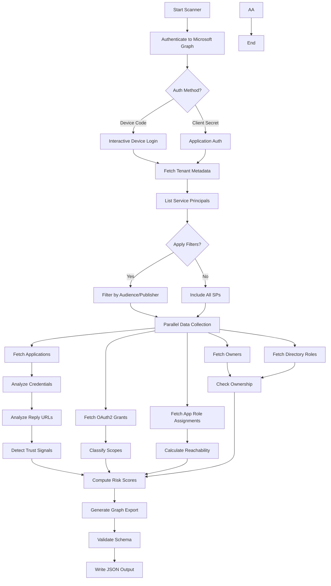

## Architecture

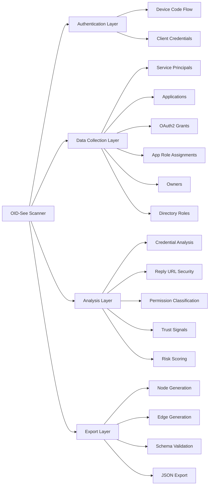

## Key Features

### 1. Multi-Tenant Application Discovery

The scanner focuses on third-party and multi-tenant service principals by default:

- **Default Behavior**: Excludes Microsoft first-party apps and single-tenant apps
- **Configurable Filters**: Options to include first-party (`--include-first-party`) or single-tenant apps (`--include-single-tenant`)
- **Comprehensive Mode**: Use `--include-all-sps` to scan all service principals

### 2. High-Performance Data Collection

The scanner uses optimized parallel data collection with Graph API batching for maximum performance:

- **Bulk Fetching**: Application data fetched in single bulk query instead of individual queries (60-360x faster)
- **Graph API Batching**: Combines up to 20 requests per HTTP call using Microsoft Graph `$batch` endpoint (12-18x faster)
- **Parallel Workers**: 20 concurrent workers for resource loading and role definitions (2x faster)
- **Thread Safety**: All operations use proper locking mechanisms for shared caches
- **Error Resilience**: Individual failures don't stop the entire scan; automatic fallback to individual requests

**Performance Benchmarks** (8,096 service principals):
- **Total scan time**: 103 minutes → 2-3 minutes (97-98% faster)
- **Application cache**: 66 minutes → 1 minute (60-360x faster)
- **SP data collection**: 35 minutes → 30-60 seconds (12-18x faster)
- **HTTP requests**: 48,576 → 1,621 (97% reduction)

**Parallelized Operations**:
- Bulk application object fetching with in-memory filtering
- Batched OAuth2 permission grants (4-5 SPs per batch)
- Batched app role assignments (4-5 SPs per batch)
- Batched owner lookups (4-5 SPs per batch)
- Batched directory role assignments (20 SPs per batch)
- Parallel resource service principal resolution

### 3. Enhanced Security Analysis

#### Credential Hygiene Analysis

Comprehensive analysis of application credentials:

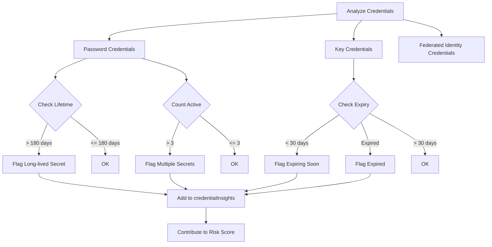

**Insights Generated**:
- Long-lived secrets (lifetime > 180 days): +10 risk points
- Expired credentials still present: +5 risk points
- Multiple active secrets (> 3): +5 risk points
- Certificates expiring within 30 days: +8 risk points

#### Reply URL Security Analysis

Detects security anomalies in OAuth2 redirect URIs:

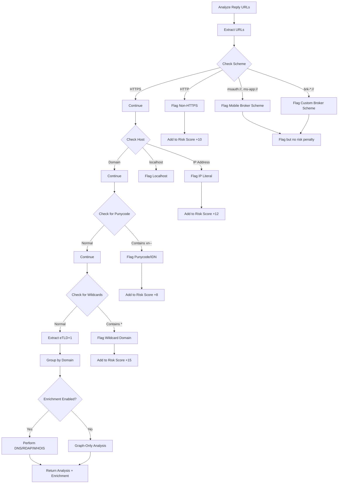

**Detects**:
- Non-HTTPS schemes (HTTP): +10 risk points
- IP literal addresses: +12 risk points
- Punycode domains (potential homograph attacks): +8 risk points
- Wildcard domains: +15 risk points
- Localhost configurations (dev/test in production)
- Mobile broker schemes (msauth://, ms-app://, brk-*://) - flagged for analysis but no risk penalty (legitimate for mobile apps)

**Brokered Authentication**:
- **msauth://**, **ms-app://**: Microsoft Authenticator and platform broker schemes for iOS/Android
- **brk-*://**: Custom broker schemes following the pattern brk-{identifier}://
- These schemes are recognized and flagged for visibility but do not contribute to risk scores as they are legitimate for native mobile applications

**Enrichment Impact**:
When enrichment is enabled, the scanner performs:
- **DNS lookups**: Resolve domains to IP addresses to verify ownership patterns
- **RDAP queries**: Retrieve ASN and network ownership information
- **IP WHOIS**: Lookup ownership for IP literals

Enrichment helps reduce false positives by confirming that multi-domain reply URLs belong to the same organization (e.g., Microsoft service principals often have reply URLs across multiple Microsoft-owned domains).

#### Trust Signal Detection

Identifies identity laundering and attribution issues:

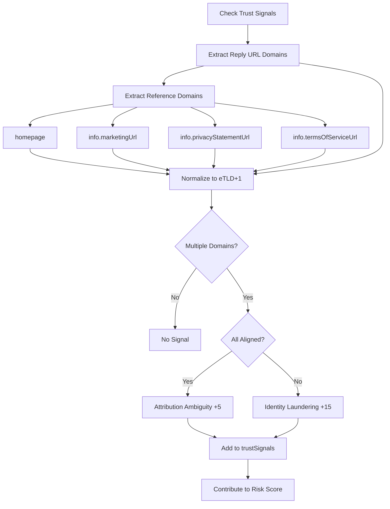

**Signals**:
- **Identity Laundering** (+15): Reply URLs use domains not aligned with declared identity
- **Attribution Ambiguity** (+5): Multiple legitimate domains but may cause confusion

### 4. Permission Resolution

OAuth2 scopes and app roles are resolved to human-readable details:

- **OAuth2 Scopes**: displayName, description, consent information
- **App Roles**: displayName, description, allowed member types
- **Resource Identification**: Clear identification of the resource API

### 5. Robust Error Handling

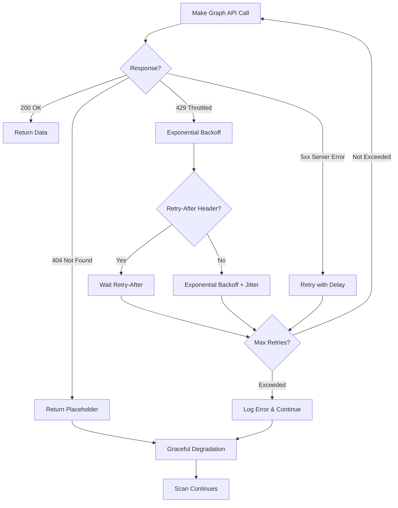

**Error Handling Features**:
- **Throttling**: Automatic exponential backoff with jitter for 429/503 responses
- **Retry-After**: Honors `Retry-After` header when present
- **Network Errors**: Retries up to `--max-retries` (default: 6)
- **Missing Objects**: 404 errors use placeholders to keep scan running
- **Batch Operations**: `/directoryObjects/getByIds` handles missing entries gracefully

## Data Collection Process

### Phase 1: Authentication

```python
# Device Code (Interactive)
python oidsee_scanner.py --tenant-id "<TENANT_ID>" --out oidsee-export.json

# Client Secret (Application)
python oidsee_scanner.py \
  --tenant-id "<TENANT_ID>" \
  --client-id "<APP_ID>" \
  --client-secret "<SECRET>" \
  --out oidsee-export.json
```

### Phase 2: Service Principal Discovery

1. **List Service Principals**: Fetch all SPs using Microsoft Graph
2. **Apply Filters**: Based on `signInAudience` and publisher
3. **Cache Results**: Store in memory for efficient access

### Phase 3: Parallel Data Collection

For each service principal, the scanner fetches (in parallel):

1. **In-Tenant Application**: Best-effort lookup of the app registration
2. **OAuth2 Grants**: Delegated permissions granted to the app
3. **App Role Assignments**: Application permissions (app roles)
4. **Assignments**: Users/groups with access to the app
5. **Owners**: Application/SP owners
6. **Directory Roles**: Directory roles assigned to the SP

### Phase 4: Analysis and Enrichment

1. **Credential Analysis**: Check password/key/federated credentials
2. **Reply URL Analysis**: Security check of redirect URIs
3. **Permission Classification**: Categorize scopes as regular/privileged/broad
4. **Trust Signals**: Detect identity laundering and domain mismatches
5. **Public Client Detection**: Identify public client and implicit flows

### Phase 5: Risk Scoring

See [Scoring Logic Documentation](https://github.com/OID-See/OID-See/blob/1e37c909c34dba5c0ad9df8f5b185bd4a503c3c6/docs/scoring-logic.md) for detailed risk calculation.

### Phase 6: Export Generation

1. **Generate Nodes**: Create node objects for all entities
2. **Generate Edges**: Create edges representing relationships
3. **Validate Schema**: Ensure output matches schema
4. **Write JSON**: Output to specified file

## Command-Line Options

### Required Options

- `--tenant-id`: Target tenant GUID (required)

### Authentication Options

- `--device-code-client-id`: Public client for device code (default: Azure CLI)
- `--client-id`: Application ID for client credentials
- `--client-secret`: Application secret for client credentials

### Filtering Options

- `--include-first-party`: Include Microsoft-owned first-party apps
- `--include-single-tenant`: Include `AzureADMyOrg` audience apps
- `--include-all-sps`: Disable all filters; include all service principals

### Output Options

- `--out`: Output file path (default: `oidsee-export.json`)
- `--generate-report`: Generate an HTML report alongside the JSON export

**Example with report generation**:
```bash
# Generate both JSON export and HTML report
python oidsee_scanner.py --tenant-id "TENANT_ID" --generate-report --out scan.json

# This will create:
# - scan.json (JSON export for visualization tool)
# - scan-report.html (HTML report with risk summary)
```

The HTML report provides:
- Risk level distribution (Critical, High, Medium, Low, Info)
- Key security metrics and statistics
- Top risk contributors across all applications
- List of high-risk applications requiring immediate attention
- Capability analysis (permissions, roles, scopes)
- Security recommendations based on findings

The report is aligned with OIDSEE's scoring logic as documented in [Scoring Logic Documentation](https://github.com/OID-See/OID-See/blob/1e37c909c34dba5c0ad9df8f5b185bd4a503c3c6/docs/scoring-logic.md).

### Performance Options

- `--max-retries`: Maximum HTTP retries (default: 6)
- `--retry-base-delay`: Base delay for exponential backoff in seconds (default: 0.8)

### Enrichment Options

**Note**: Enrichment is **enabled by default** (requires `dnspython` and `ipwhois` packages). Use disable flags to run in Graph-only mode.

**Default behavior** (enrichment enabled):
```bash
# DNS, RDAP, and IP WHOIS enrichment enabled by default
python oidsee_scanner.py --tenant-id "TENANT_ID" --out scan.json

# Install enrichment dependencies if not already installed
pip install dnspython ipwhois
```

**Disable specific enrichment methods**:
- `--disable-all-enrichment`: Disable all enrichment lookups (Graph-only mode)
- `--disable-dns-enrichment`: Disable DNS lookups for reply URL domains
- `--disable-rdap-enrichment`: Disable RDAP lookups for domain registration
- `--disable-ipwhois-enrichment`: Disable IP WHOIS lookups for IP literals

**Enrichment Methods**:
1. **DNS Lookups**: Resolve reply URL domains to IP addresses to verify domain ownership patterns
2. **RDAP (Registration Data Access Protocol)**: Query domain registration data including ASN, network ownership, and country codes
3. **IP WHOIS**: Lookup ownership information for IP literals in reply URLs

**Use Cases for Enrichment**:
- Identify reply URLs pointing to domains outside the vendor's expected infrastructure
- Reduce false positives by confirming multi-domain reply URLs belong to the same organization
- Detect potential domain squatting or typosquatting in reply URLs
- Verify ASN and network ownership for compliance and risk assessment

**Example with selective enrichment**:
```bash
# Enable only DNS lookups (fastest)
python oidsee_scanner.py --tenant-id "TENANT_ID" \
  --disable-rdap-enrichment \
  --disable-ipwhois-enrichment \
  --out scan.json

# Graph-only mode (no external lookups)
python oidsee_scanner.py --tenant-id "TENANT_ID" \
  --disable-all-enrichment \
  --out scan.json
```

## Report Generation

The scanner can generate an HTML report that summarizes security findings and risk metrics. This report is designed for executive summaries, compliance documentation, and security review workflows.

### Generating Reports During Scan

Use the `--generate-report` flag to generate an HTML report alongside the JSON export:

```bash
python oidsee_scanner.py --tenant-id "TENANT_ID" --generate-report --out scan.json
```

This creates:
- `scan.json` - Full JSON export for the visualization tool
- `scan-report.html` - HTML report with risk summary and metrics

### Generating Reports from Existing JSON Export

You can also generate reports from existing JSON exports using the standalone report generator:

```bash
python report_generator.py oidsee-export.json report.html
```

If you omit the output filename, it will automatically create `oidsee-export-report.html`.

### Report Contents

The HTML report includes:

1. **Executive Summary**
   - Tenant information and scan metadata
   - Total service principals scanned

2. **Risk Distribution**
   - Count and percentage of apps by risk level (Critical, High, Medium, Low, Info)
   - Visual risk cards with color coding

3. **Key Security Metrics**
   - Unverified publishers
   - Apps without owners
   - Credential hygiene issues (password credentials, long-lived secrets, expired credentials)
   - Identity laundering detection
   - Governance gaps (no assignment required)
   - Reply URL security issues (non-HTTPS, IP literals, wildcards)

4. **Top Risk Contributors**
   - Most common risk factors across all applications
   - Percentage of apps affected by each risk factor
   - Average risk weight contribution

5. **High-Risk Applications**
   - Top 10 applications with risk scores ≥70
   - Application name, App ID, risk score, and risk level

6. **Capability Analysis**
   - Count of applications with specific capabilities:
     - Impersonation capability
     - Application roles (app permissions)
     - Privileged scopes
     - Overly broad scopes
     - Offline access (refresh tokens)
     - Directory roles

7. **Security Recommendations**
   - Actionable recommendations based on detected issues
   - Prioritized by impact and ease of remediation

### Report Alignment with OIDSEE Scoring

The report metrics are directly aligned with OIDSEE's scoring logic as documented in [Scoring Logic Documentation](https://github.com/OID-See/OID-See/blob/1e37c909c34dba5c0ad9df8f5b185bd4a503c3c6/docs/scoring-logic.md). All risk factors, weights, and thresholds match the scanner's risk calculation algorithm.

**Risk Level Mapping**:
- **Critical (90-100)**: Severe risk requiring urgent action
- **High (70-89)**: Significant risk requiring immediate review
- **Medium (40-69)**: Notable risk to investigate soon
- **Low (20-39)**: Some concerns to review periodically
- **Info (0-19)**: Minimal risk, routine monitoring

### Use Cases

**Executive Reporting**:
- Share HTML report with leadership for security posture overview
- Include in security review presentations
- Track risk trends over time

**Compliance Documentation**:
- Document third-party application risks for audits
- Evidence of security controls and monitoring
- Risk acceptance documentation

**Security Operations**:
- Prioritize remediation efforts based on risk distribution
- Track progress on security improvements
- Communicate findings to application owners

**Automation**:
```bash
# Scheduled scan with report (cron example)
0 2 * * 1 python3 /path/to/oidsee_scanner.py \
  --tenant-id "$TENANT_ID" \
  --client-id "$CLIENT_ID" \
  --client-secret "$CLIENT_SECRET" \
  --generate-report \
  --out "/reports/weekly-scan-$(date +\%Y\%m\%d).json" \
  2>&1 | logger -t oidsee-scanner
```

## Output Structure

The scanner generates a JSON file with the following structure:

```json
{
  "format": {
    "name": "oidsee-graph",
    "version": "1.0"
  },
  "generatedAt": "2024-12-26T00:00:00Z",
  "tenant": {
    "tenantId": "00000000-0000-0000-0000-000000000000",
    "displayName": "Contoso"
  },
  "nodes": [...],
  "edges": [...]
}
```

### Node Types

- **ServicePrincipal**: Third-party/multi-tenant apps
- **Application**: In-tenant app registrations
- **User**: Users in the tenant
- **Group**: Security/Microsoft 365 groups
- **Role**: Directory roles
- **ResourceApi**: Resource applications (e.g., Microsoft Graph)

### Edge Types

**Structural Edges**:
- `INSTANCE_OF`: SP → Application relationship
- `OWNS`: User/Group → Application/SP
- `MEMBER_OF`: User → Group

**Permission Edges**:
- `HAS_SCOPES`: Regular delegated permissions
- `HAS_PRIVILEGED_SCOPES`: Write/privileged delegated permissions
- `HAS_TOO_MANY_SCOPES`: Overly broad delegated permissions (*.All)
- `HAS_APP_ROLE`: Application permissions (app roles)
- `CAN_IMPERSONATE`: Explicit impersonation capability
- `HAS_OFFLINE_ACCESS`: Persistence via refresh tokens

**Assignment Edges**:
- `ASSIGNED_TO`: User/Group → Application assignment
- `HAS_ROLE`: SP → Directory role assignment

## Microsoft-Specific Cases

The scanner recognizes and handles several Microsoft-specific patterns:

### Microsoft Service Principals

**First-Party Apps**: The scanner uses [Merill Fernando's Microsoft Apps list](https://github.com/merill/microsoft-info) to identify Microsoft first-party applications.

**Multi-Domain Reply URLs**: Microsoft service principals often have reply URLs across multiple Microsoft-owned domains (e.g., login.microsoftonline.com, login.windows.net, aadcdn.msauth.net). When enrichment is enabled, the scanner can verify these belong to Microsoft infrastructure via ASN/network ownership checks.

**Wildcard Reply URLs**: Some Microsoft apps use wildcard domains (e.g., `https://*.office.com/callback`). These are flagged for visibility but may be expected for Microsoft apps serving multiple subdomains.

### Known Microsoft Tenant IDs

The scanner recognizes Microsoft tenant IDs to avoid false positives for identity laundering:
- `f8cdef31-a31e-4b4a-93e4-5f571e91255a` - Microsoft Accounts (MSA)
- `72f988bf-86f1-41af-91ab-2d7cd011db47` - Microsoft Services
- `cdc5aeea-15c5-4db6-b079-fcadd2505dc2` - Microsoft third tenant

Apps from these tenants with verified publishers are not flagged for identity laundering.

### Brokered Authentication Schemes

Native mobile applications often use broker schemes for authentication:
- **msauth://**: iOS/Android Microsoft Authenticator broker
- **ms-app://**: Universal Windows Platform (UWP) app scheme
- **brk-*://**: Custom broker pattern (e.g., brk-com.contoso.myapp://)

These are recognized as legitimate and don't contribute to risk scores, though they are tracked in the `schemes` field of `replyUrlAnalysis`.

### Platform-Specific Patterns

The scanner identifies platform-specific reply URL patterns:
- **localhost with ports**: Common for development (e.g., `http://localhost:8080/callback`)
- **Mobile deep links**: Custom schemes for iOS/Android apps
- **SPA redirect URIs**: Single-page application patterns (often with `spa` in the URL)

## Performance Characteristics

### Typical Scan Times

- **Small Tenant** (< 50 apps): 30-60 seconds
- **Medium Tenant** (50-200 apps): 2-5 minutes
- **Large Tenant** (200-1000 apps): 5-15 minutes
- **Very Large Tenant** (> 1000 apps): 15-30+ minutes

*Times vary based on network latency, API throttling, tenant characteristics, and whether enrichment is enabled*

### Optimization Tips

1. **Use Application Auth**: Client credentials are faster than device code
2. **Filter Appropriately**: Use filters to scan only what you need
3. **Increase Retry Delay**: For heavily throttled tenants, increase `--retry-base-delay`
4. **Disable Enrichment**: Use `--disable-all-enrichment` for fastest scans (Graph-only mode)
4. **Monitor Progress**: Check stderr logs for category-level progress

## Troubleshooting

### Common Issues

#### 1. Throttling (429 Errors)

**Symptom**: Frequent 429 errors, slow progress

**Solution**:
```bash
python oidsee_scanner.py \
  --tenant-id "<TENANT_ID>" \
  --max-retries 10 \
  --retry-base-delay 1.5
```

#### 2. Missing Permissions

**Symptom**: 403 Forbidden errors

**Required Permissions**:
- `Application.Read.All`
- `Directory.Read.All`

#### 3. Authentication Timeout

**Symptom**: Device code times out

**Solution**: Use client credentials instead of device code

#### 4. Large Export Files

**Symptom**: JSON file is too large

**Solution**: Use filters to reduce scope or process in batches

## Security Considerations

### Permissions Required

The scanner requires read-only permissions:

- **Application.Read.All**: Read application and service principal data
- **Directory.Read.All**: Read directory data (users, groups, roles)

### Data Handling

- **No Data Transmission**: All processing happens locally; no data sent to external services except Microsoft Graph
- **Optional External Lookups**: When enrichment is enabled, DNS/RDAP/WHOIS queries are sent to public DNS servers and RDAP/WHOIS services
- **No External APIs**: Only connects to Microsoft Graph (and optionally DNS/RDAP/WHOIS when enrichment is enabled)
- **Credential Security**: Client secrets are not logged or stored
- **Output Sensitivity**: JSON export contains tenant data - handle appropriately

### Best Practices

1. **Least Privilege**: Use a service account with minimum required permissions
2. **Secure Storage**: Store output files securely
3. **Regular Scans**: Run periodically to monitor changes
4. **Audit Logs**: Enable audit logging for scanner service principal
5. **Credential Rotation**: Rotate client secrets regularly

## Integration

### Using with OID-See Viewer

1. **Generate Export**: Run scanner to create JSON file
2. **Load in Viewer**: Open OID-See web app
3. **Import Data**: Use JSON Editor to load your export
4. **Analyze**: Use filters, lenses, and graph exploration

### Automation

```bash
# Scheduled scan example (cron)
0 2 * * * /usr/bin/python3 /path/to/oidsee_scanner.py \
  --tenant-id "$TENANT_ID" \
  --client-id "$CLIENT_ID" \
  --client-secret "$CLIENT_SECRET" \
  --out "/exports/oidsee-$(date +\%Y\%m\%d).json" \
  2>&1 | logger -t oidsee-scanner
```

### CI/CD Integration

```yaml
# Azure DevOps example
- task: PythonScript@0
  inputs:
    scriptSource: 'filePath'
    scriptPath: 'oidsee_scanner.py'
    arguments: |
      --tenant-id $(TenantId)
      --client-id $(ClientId)
      --client-secret $(ClientSecret)
      --out $(Build.ArtifactStagingDirectory)/oidsee-export.json
```

## Next Steps

- **[Scoring Logic Documentation](https://github.com/OID-See/OID-See/blob/1e37c909c34dba5c0ad9df8f5b185bd4a503c3c6/docs/scoring-logic.md)**: Understand risk calculation
- **[Export Schema Documentation](https://github.com/OID-See/OID-See/blob/1e37c909c34dba5c0ad9df8f5b185bd4a503c3c6/docs/schema.md)**: Learn about the data structure
- **[Web App Documentation](https://github.com/OID-See/OID-See/blob/1e37c909c34dba5c0ad9df8f5b185bd4a503c3c6/docs/webapp.md)**: Explore the visualization tool

## `docs/schema.md`

[View original document](https://github.com/OID-See/OID-See/blob/1e37c909c34dba5c0ad9df8f5b185bd4a503c3c6/docs/schema.md)

# OID-See Export Schema Documentation

## Overview

The OID-See export schema defines the structure of JSON files that contain Microsoft Entra ID (Azure AD) tenant data for visualization in the OID-See web application. This schema provides a standardized format for representing applications, service principals, users, groups, permissions, and their relationships as a graph.

**Schema Location**: `schemas/oidsee-graph-export.schema.json`

**Current Version**: 1.x (vNext)

## Schema Structure

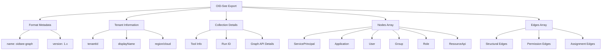

## Top-Level Structure

```json
{
  "format": {
    "name": "oidsee-graph",
    "version": "1.0"
  },
  "generatedAt": "2024-12-26T00:00:00Z",
  "tenant": {
    "tenantId": "00000000-0000-0000-0000-000000000000",
    "displayName": "Contoso Corporation",
    "region": "US",
    "cloud": "Public"
  },
  "collection": {
    "tool": {
      "name": "oidsee_scanner.py",
      "version": "1.0.0",
      "build": "20241226"
    },
    "runId": "scan-20241226-123456",
    "graphApi": {
      "baseUrl": "https://graph.microsoft.com",
      "apiVersion": "v1.0"
    }
  },
  "nodes": [...],
  "edges": [...]
}
```

### Required Fields

- **format**: Schema identifier
  - `name`: Must be `"oidsee-graph"`
  - `version`: Version string matching pattern `^1\.(0|[1-9]\d*)(\.[0-9]+)?$`

- **generatedAt**: ISO 8601 timestamp of export generation

- **tenant**: Tenant identification
  - `tenantId`: GUID in format `^[0-9a-fA-F-]{36}$`

- **nodes**: Array of node objects

- **edges**: Array of edge objects

### Optional Fields

- **tenant.displayName**: Human-readable tenant name
- **tenant.region**: Tenant region (e.g., "US", "EU", "APAC")
- **tenant.cloud**: Cloud environment (Public, GCC, GCCHigh, DoD, China, Germany)
- **collection**: Metadata about the data collection process

## Node Types

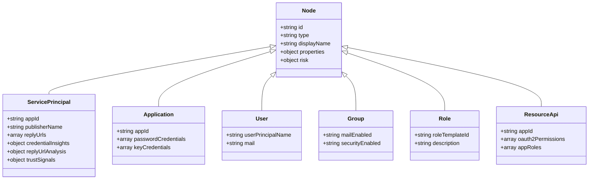

### Base Node Structure

All nodes share common properties:

```json
{
  "id": "unique-node-identifier",
  "type": "ServicePrincipal",
  "displayName": "Human-readable name",
  "properties": {
    // Type-specific properties
  },
  "risk": {
    "score": 75,
    "level": "high",
    "reasons": [...]
  }
}
```

### ServicePrincipal Node

Represents enterprise applications and service principals.

```json
{
  "id": "sp-12345",
  "type": "ServicePrincipal",
  "displayName": "Contoso HR Portal",
  "properties": {
    "appId": "00000000-0000-0000-0000-000000000000",
    "servicePrincipalId": "11111111-1111-1111-1111-111111111111",
    "publisherName": "Contoso Ltd",
    "verifiedPublisher": {
      "displayName": "Contoso Ltd",
      "verifiedPublisherId": "12345",
      "addedDateTime": "2023-01-01T00:00:00Z"
    },
    "signInAudience": "AzureADMultipleOrgs",
    "homepage": "https://hr.contoso.com",
    "replyUrls": [
      "https://hr.contoso.com/callback"
    ],
    "appOwnerOrganizationId": "22222222-2222-2222-2222-222222222222",
    "appRoleAssignmentRequired": true,
    "preferredSingleSignOnMode": "saml",
    "tags": ["WindowsAzureActiveDirectoryIntegratedApp"],
    "info": {
      "marketingUrl": "https://contoso.com",
      "privacyStatementUrl": "https://contoso.com/privacy",
      "termsOfServiceUrl": "https://contoso.com/terms"
    },
    "createdDateTime": "2023-01-01T00:00:00Z",
    
    // Enhanced analysis results
    "credentialInsights": {
      "total_password_credentials": 1,
      "active_password_credentials": 1,
      "expired_password_credentials": 0,
      "total_key_credentials": 1,
      "active_key_credentials": 1,
      "expired_key_credentials": 0,
      "long_lived_secrets": [],
      "expired_but_present": [],
      "certificate_rollover_issues": [],
      "multiple_active_secrets": false
    },
    "replyUrlAnalysis": {
      "total_urls": 1,
      "normalized_domains": ["contoso.com"],
      "non_https_urls": [],
      "ip_literal_urls": [],
      "localhost_urls": [],
      "punycode_urls": [],
      "wildcard_urls": [],
      "schemes": ["https"]
    },
    "trustSignals": {
      "identityLaunderingSuspected": false,
      "mixedReplyUrlDomains": false,
      "nonAlignedDomains": []
    },
    "publicClientIndicators": {
      "hasPublicClientFlows": false,
      "hasImplicitFlow": false,
      "hasImplicitAccessTokenIssuance": false,
      "hasImplicitIdTokenIssuance": false,
      "hasSpaRedirectUris": false
    },
    "replyUrlEnrichment": null,
    "replyUrlProvenance": null,
    "domainWhois": null,
    "dnsRecords": null
  },
  "risk": {
    "score": 35,
    "level": "low",
    "reasons": [
      {
        "code": "HAS_SCOPES",
        "weight": 0,
        "message": "Regular delegated scopes granted"
      },
      {
        "code": "ASSIGNED_TO",
        "weight": 15,
        "message": "Assigned to 25 users"
      }
    ]
  }
}
```

**Key Properties**:

**Microsoft Graph Fields** (always present):
- **appId**: Application ID (globally unique across Azure AD) - from Microsoft Graph
- **servicePrincipalId**: Service principal object ID (tenant-specific) - from Microsoft Graph
- **publisherName**: Self-declared publisher name - from Microsoft Graph
- **verifiedPublisher**: Microsoft-verified publisher information (if verified) - from Microsoft Graph
- **signInAudience**: Audience type - from Microsoft Graph
  - `AzureADMyOrg`: Single-tenant
  - `AzureADMultipleOrgs`: Multi-tenant
  - `AzureADandPersonalMicrosoftAccount`: Multi-tenant + personal accounts
- **replyUrls**: OAuth2 redirect URIs - from Microsoft Graph

**Scanner Analysis Fields** (computed from Graph data):
- **credentialInsights**: Analysis of credentials (secrets, certificates) - computed by scanner
- **replyUrlAnalysis**: Security analysis of redirect URIs - computed by scanner
- **trustSignals**: Identity laundering and attribution signals - computed by scanner
- **publicClientIndicators**: Public client and implicit flow detection - computed by scanner

**Enrichment Fields** (enabled by default, can be disabled):
- **replyUrlEnrichment**: Summary of DNS/RDAP/IP WHOIS lookups (null when enrichment disabled via `--disable-all-enrichment` or when no enrichable URLs exist)
  - When present, includes:
    - `domains_analyzed`: List of eTLD+1 domains queried
    - `same_organization_likely`: Boolean indicating if domains appear to belong to same org
    - `enrichment_timestamp`: ISO 8601 timestamp of enrichment
    - `enrichment_enabled`: Object showing which enrichment methods were enabled
- **replyUrlProvenance**: Enrichment metadata (currently always includes source: "microsoft_graph")
- **domainWhois**: Reserved for future use (currently null)
- **dnsRecords**: Reserved for future use (currently null)

**Field Nullability**:
- Fields from Microsoft Graph may be null if not provided by the API
- `credentialInsights`, `replyUrlAnalysis`, `trustSignals`, `publicClientIndicators` are always present (never null)
- `replyUrlEnrichment` is null when enrichment is disabled or when there are no enrichable reply URLs
- `verifiedPublisher` is null when the publisher is not verified

### Application Node

Represents app registrations in the tenant.

```json
{
  "id": "app-67890",
  "type": "Application",
  "displayName": "Contoso HR Portal Registration",
  "properties": {
    "appId": "00000000-0000-0000-0000-000000000000",
    "applicationId": "33333333-3333-3333-3333-333333333333",
    "passwordCredentials": [
      {
        "keyId": "44444444-4444-4444-4444-444444444444",
        "displayName": "Production Secret",
        "startDateTime": "2024-01-01T00:00:00Z",
        "endDateTime": "2024-12-31T23:59:59Z"
      }
    ],
    "keyCredentials": [
      {
        "keyId": "55555555-5555-5555-5555-555555555555",
        "type": "AsymmetricX509Cert",
        "usage": "Verify",
        "displayName": "Production Certificate",
        "startDateTime": "2024-01-01T00:00:00Z",
        "endDateTime": "2025-12-31T23:59:59Z"
      }
    ],
    "federatedIdentityCredentials": []
  }
}
```

**Key Properties**:
- **appId**: Application ID (matches ServicePrincipal appId) - from Microsoft Graph
- **applicationId**: Application object ID - from Microsoft Graph
- **passwordCredentials**: Client secrets with validity periods - from Microsoft Graph
- **keyCredentials**: X.509 certificates for authentication - from Microsoft Graph
- **federatedIdentityCredentials**: Workload identity federation configurations - from Microsoft Graph

## Analysis Field Details

### credentialInsights Structure

Computed analysis of application credentials (from Microsoft Graph data):

```json
{
  "total_password_credentials": 2,
  "active_password_credentials": 1,
  "expired_password_credentials": 1,
  "total_key_credentials": 1,
  "active_key_credentials": 1,
  "expired_key_credentials": 0,
  "long_lived_secrets": ["keyId-of-secret-1"],
  "expired_but_present": ["keyId-of-expired-secret"],
  "certificate_rollover_issues": [],
  "multiple_active_secrets": false
}
```

**Fields**:
- `total_password_credentials`, `active_password_credentials`, `expired_password_credentials`: Counts of client secrets
- `total_key_credentials`, `active_key_credentials`, `expired_key_credentials`: Counts of certificates
- `long_lived_secrets`: Array of keyIds for secrets with lifetime > 180 days
- `expired_but_present`: Array of keyIds for expired credentials still configured
- `certificate_rollover_issues`: Array of certificate keyIds with rollover concerns
- `multiple_active_secrets`: Boolean true if more than 3 active secrets

### replyUrlAnalysis Structure

Security analysis of OAuth2 redirect URIs (computed from Microsoft Graph replyUrls):

```json
{
  "total_urls": 3,
  "normalized_domains": ["contoso.com", "fabrikam.com"],
  "non_https_urls": ["http://localhost:8080/callback"],
  "ip_literal_urls": ["https://192.168.1.100/callback"],
  "localhost_urls": ["http://localhost:8080/callback"],
  "punycode_urls": [],
  "wildcard_urls": ["https://*.contoso.com/callback"],
  "schemes": ["https", "http", "msauth"]
}
```

**Fields**:
- `total_urls`: Count of reply URLs
- `normalized_domains`: eTLD+1 domains extracted from URLs (e.g., "app.contoso.com" → "contoso.com")
- `non_https_urls`: URLs not using HTTPS scheme (security risk)
- `ip_literal_urls`: URLs using IP addresses instead of domains (security risk)
- `localhost_urls`: URLs pointing to localhost (dev/test pattern)
- `punycode_urls`: URLs with internationalized domains (potential homograph attacks)
- `wildcard_urls`: URLs with wildcard domains (broad attack surface)
- `schemes`: Unique schemes found (https, http, msauth, ms-app, brk-*, etc.)

**Broker Schemes**: Mobile broker schemes (msauth://, ms-app://, brk-*://) are tracked in `schemes` but don't contribute to risk scores.

### trustSignals Structure

Identity laundering and publisher trust indicators (computed from Graph data and replyUrlAnalysis):

```json
{
  "identityLaunderingSuspected": false,
  "mixedReplyUrlDomains": true,
  "nonAlignedDomains": ["suspicious-domain.com"]
}
```

**Fields**:
- `identityLaunderingSuspected`: Boolean true if reply URLs use domains not aligned with homepage/branding/privacyStatementUrl/termsOfServiceUrl
- `mixedReplyUrlDomains`: Boolean true if multiple distinct eTLD+1 domains are used
- `nonAlignedDomains`: Array of domains that don't align with expected vendor domains

### replyUrlEnrichment Structure

Optional enrichment data from DNS/RDAP/IP WHOIS lookups (null when enrichment disabled):

```json
{
  "domains_analyzed": ["contoso.com", "fabrikam.com"],
  "same_organization_likely": true,
  "asn_summary": {
    "contoso.com": "AS8075 - Microsoft Corporation",
    "fabrikam.com": "AS8075 - Microsoft Corporation"
  },
  "enrichment_timestamp": "2024-12-26T12:00:00Z",
  "enrichment_enabled": {
    "dns": true,
    "rdap": true,
    "ipwhois": true
  }
}
```

**Fields** (when enrichment enabled):
- `domains_analyzed`: List of eTLD+1 domains that were enriched
- `same_organization_likely`: Boolean indicating if ASN/network analysis suggests same organization
- `asn_summary`: Map of domain to ASN description (from RDAP lookups)
- `enrichment_timestamp`: ISO 8601 timestamp when enrichment was performed
- `enrichment_enabled`: Object indicating which enrichment methods were enabled

**When null**: Enrichment was disabled (`--disable-all-enrichment`), enrichment dependencies not installed (dnspython/ipwhois), or there were no enrichable URLs (e.g., all wildcards or IP literals).

### publicClientIndicators Structure

Public client flow detection (from Microsoft Graph application object):

```json
{
  "hasPublicClientFlows": false,
  "hasImplicitFlow": false,
  "hasImplicitAccessTokenIssuance": false,
  "hasImplicitIdTokenIssuance": false,
  "hasSpaRedirectUris": false
}
```

**Fields**:
- `hasPublicClientFlows`: Boolean from application's `isFallbackPublicClient` or `allowPublicClient`
- `hasImplicitFlow`: Boolean if implicit flow is enabled
- `hasImplicitAccessTokenIssuance`: Boolean if implicit access token issuance is enabled
- `hasImplicitIdTokenIssuance`: Boolean if implicit ID token issuance is enabled
- `hasSpaRedirectUris`: Boolean if reply URLs contain "spa" keyword

### User Node

Represents users in the tenant.

```json
{
  "id": "user-11111",
  "type": "User",
  "displayName": "John Doe",
  "properties": {
    "userPrincipalName": "john.doe@contoso.com",
    "mail": "john.doe@contoso.com",
    "objectId": "66666666-6666-6666-6666-666666666666",
    "userType": "Member",
    "accountEnabled": true
  }
}
```

### Group Node

Represents security and Microsoft 365 groups.

```json
{
  "id": "group-22222",
  "type": "Group",
  "displayName": "HR Administrators",
  "properties": {
    "objectId": "77777777-7777-7777-7777-777777777777",
    "mailEnabled": false,
    "securityEnabled": true,
    "groupTypes": [],
    "membershipRule": null
  }
}
```

### Role Node

Represents directory roles (e.g., Global Administrator, Application Administrator).

```json
{
  "id": "role-33333",
  "type": "Role",
  "displayName": "Application Administrator",
  "properties": {
    "roleTemplateId": "88888888-8888-8888-8888-888888888888",
    "description": "Can manage all aspects of app registrations and enterprise apps.",
    "isBuiltIn": true,
    "isEnabled": true
  }
}
```

### ResourceApi Node

Represents resource applications that expose permissions (e.g., Microsoft Graph).

```json
{
  "id": "resource-44444",
  "type": "ResourceApi",
  "displayName": "Microsoft Graph",
  "properties": {
    "appId": "00000003-0000-0000-c000-000000000000",
    "servicePrincipalId": "99999999-9999-9999-9999-999999999999",
    "oauth2Permissions": [
      {
        "id": "aaaaaaaa-aaaa-aaaa-aaaa-aaaaaaaaaaaa",
        "value": "User.Read",
        "displayName": "Read user profile",
        "description": "Allows the app to read the current user's profile.",
        "adminConsentDisplayName": "Read user profile",
        "adminConsentDescription": "...",
        "userConsentDisplayName": "Read your profile",
        "userConsentDescription": "...",
        "type": "User",
        "isEnabled": true
      }
    ],
    "appRoles": [
      {
        "id": "bbbbbbbb-bbbb-bbbb-bbbb-bbbbbbbbbbbb",
        "value": "User.Read.All",
        "displayName": "Read all users' full profiles",
        "description": "Allows the app to read user profiles without a signed-in user.",
        "allowedMemberTypes": ["Application"],
        "isEnabled": true
      }
    ]
  }
}
```

**Key Properties**:
- **oauth2Permissions**: Delegated permissions (scopes)
- **appRoles**: Application permissions

## Edge Types

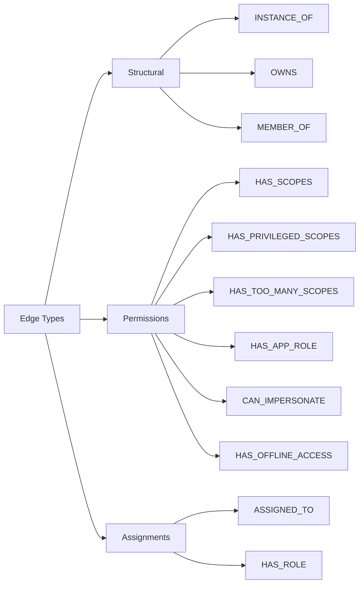

### Base Edge Structure

```json
{
  "id": "edge-unique-id",
  "type": "HAS_SCOPES",
  "source": "sp-12345",
  "target": "resource-44444",
  "properties": {
    // Edge-specific properties
  }
}
```

**Required Fields**:
- **id**: Unique edge identifier
- **type**: Edge type (see below)
- **source**: Source node ID
- **target**: Target node ID

### Structural Edges

#### INSTANCE_OF

Service principal to application relationship.

```json
{
  "id": "edge-instance-1",
  "type": "INSTANCE_OF",
  "source": "sp-12345",
  "target": "app-67890",
  "properties": {}
}
```

**Interpretation**: Service principal `sp-12345` is an instance of application `app-67890`.

#### OWNS

Ownership relationship.

```json
{
  "id": "edge-owns-1",
  "type": "OWNS",
  "source": "user-11111",
  "target": "app-67890",
  "properties": {}
}
```

**Interpretation**: User `user-11111` owns application `app-67890`.

#### MEMBER_OF

Group membership.

```json
{
  "id": "edge-member-1",
  "type": "MEMBER_OF",
  "source": "user-11111",
  "target": "group-22222",
  "properties": {
    "membershipType": "direct"
  }
}
```

**Interpretation**: User `user-11111` is a member of group `group-22222`.

### Permission Edges

#### HAS_SCOPES

Regular delegated permissions.

```json
{
  "id": "edge-scopes-1",
  "type": "HAS_SCOPES",
  "source": "sp-12345",
  "target": "resource-44444",
  "properties": {
    "scopes": ["User.Read", "Calendars.Read"],
    "permissionType": "delegated",
    "resourceAppId": "00000003-0000-0000-c000-000000000000",
    "resourceDisplayName": "Microsoft Graph",
    "consentType": "AllPrincipals",
    "principalId": null
  }
}
```

**Properties**:
- **scopes**: Array of scope values
- **permissionType**: Always "delegated" for scopes
- **resourceAppId**: Resource application ID
- **resourceDisplayName**: Human-readable resource name
- **consentType**: "AllPrincipals" or "Principal"
- **principalId**: Specific user ID if consent is user-specific

#### HAS_PRIVILEGED_SCOPES

Delegated permissions with write/modify capabilities.

```json
{
  "id": "edge-priv-scopes-1",
  "type": "HAS_PRIVILEGED_SCOPES",
  "source": "sp-12345",
  "target": "resource-44444",
  "properties": {
    "scopes": ["User.ReadWrite", "Mail.ReadWrite"],
    "permissionType": "delegated",
    "resourceAppId": "00000003-0000-0000-c000-000000000000",
    "resourceDisplayName": "Microsoft Graph"
  }
}
```

**Detection**: Scope contains "write" or "readwrite" (case-insensitive).

#### HAS_TOO_MANY_SCOPES

Overly broad delegated permissions.

```json
{
  "id": "edge-broad-scopes-1",
  "type": "HAS_TOO_MANY_SCOPES",
  "source": "sp-12345",
  "target": "resource-44444",
  "properties": {
    "scopes": ["User.Read.All", "Mail.Read.All"],
    "permissionType": "delegated",
    "resourceAppId": "00000003-0000-0000-c000-000000000000",
    "resourceDisplayName": "Microsoft Graph"
  }
}
```

**Detection**: Scope ends with ".All".

#### HAS_APP_ROLE

Application permissions (app roles).

```json
{
  "id": "edge-approle-1",
  "type": "HAS_APP_ROLE",
  "source": "sp-12345",
  "target": "resource-44444",
  "properties": {
    "appRoleId": "bbbbbbbb-bbbb-bbbb-bbbb-bbbbbbbbbbbb",
    "appRoleValue": "User.Read.All",
    "permissionType": "application",
    "resourceAppId": "00000003-0000-0000-c000-000000000000",
    "resourceDisplayName": "Microsoft Graph",
    "displayName": "Read all users' full profiles",
    "description": "Allows the app to read user profiles without a signed-in user."
  }
}
```

**Properties**:
- **appRoleId**: App role GUID
- **appRoleValue**: App role value (e.g., "User.Read.All")
- **permissionType**: Always "application" for app roles
- **displayName**: Human-readable permission name
- **description**: Permission description

#### CAN_IMPERSONATE

Explicit impersonation capability.

```json
{
  "id": "edge-impersonate-1",
  "type": "CAN_IMPERSONATE",
  "source": "sp-12345",
  "target": "resource-44444",
  "properties": {
    "scopes": ["access_as_user"],
    "permissionType": "delegated",
    "resourceAppId": "00000003-0000-0000-c000-000000000000",
    "resourceDisplayName": "Microsoft Graph"
  }
}
```

**Detection**: Scope contains "access_as_user" or "user_impersonation".

**Note**: This is distinct from `HAS_OFFLINE_ACCESS` (persistence via refresh tokens).

#### HAS_OFFLINE_ACCESS

Persistence via refresh tokens.

```json
{
  "id": "edge-offline-1",
  "type": "HAS_OFFLINE_ACCESS",
  "source": "sp-12345",
  "target": "resource-44444",
  "properties": {
    "scopes": ["offline_access"],
    "permissionType": "delegated",
    "resourceAppId": "00000003-0000-0000-c000-000000000000",
    "resourceDisplayName": "Microsoft Graph"
  }
}
```

**Detection**: Scope includes "offline_access".

**Note**: This represents persistence (refresh tokens), NOT impersonation.

**Risk Scoring**: In risk.reasons, this appears as code `OFFLINE_ACCESS_PERSISTENCE` (see [Scoring Logic Documentation](https://github.com/OID-See/OID-See/blob/1e37c909c34dba5c0ad9df8f5b185bd4a503c3c6/docs/scoring-logic.md#offline_access_persistence-8-to-15)).

### Assignment Edges

#### ASSIGNED_TO

User or group assignment to application.

```json
{
  "id": "edge-assigned-1",
  "type": "ASSIGNED_TO",
  "source": "group-22222",
  "target": "sp-12345",
  "properties": {
    "assignmentType": "group",
    "appRoleId": "00000000-0000-0000-0000-000000000000",
    "createdDateTime": "2024-01-01T00:00:00Z"
  }
}
```

**Properties**:
- **assignmentType**: "user" or "group"
- **appRoleId**: Specific app role if role-based assignment
- **createdDateTime**: When assignment was created

#### HAS_ROLE

Directory role assignment.

```json
{
  "id": "edge-hasrole-1",
  "type": "HAS_ROLE",
  "source": "sp-12345",
  "target": "role-33333",
  "properties": {
    "roleAssignmentId": "cccccccc-cccc-cccc-cccc-cccccccccccc",
    "directoryScopeId": "/"
  }
}
```

**Properties**:
- **roleAssignmentId**: Role assignment object ID
- **directoryScopeId**: Scope of the role (usually "/" for tenant-wide)

## Risk Object Structure

All ServicePrincipal nodes include a risk assessment:

```json
{
  "risk": {
    "score": 75,
    "level": "high",
    "reasons": [
      {
        "code": "CAN_IMPERSONATE",
        "weight": 40,
        "message": "Delegated impersonation markers present"
      },
      {
        "code": "HAS_APP_ROLE",
        "weight": 25,
        "message": "Application permissions granted (Directory.Read.All)"
      },
      {
        "code": "NO_OWNERS",
        "weight": 15,
        "message": "No owners assigned to application"
      }
    ]
  }
}
```

**Risk Fields**:
- **score**: Numeric score from 0-100
- **level**: Risk level (info, low, medium, high, critical)
- **reasons**: Array of contributing factors

**Reason Object**:
- **code**: Risk contributor code (e.g., "CAN_IMPERSONATE")
- **weight**: Points contributed (can be negative for deductions)
- **message**: Human-readable explanation

## Usage Examples

### Example 1: Minimal Export

```json
{
  "format": {
    "name": "oidsee-graph",
    "version": "1.0"
  },
  "generatedAt": "2024-12-26T00:00:00Z",
  "tenant": {
    "tenantId": "00000000-0000-0000-0000-000000000000"
  },
  "nodes": [
    {
      "id": "user-1",
      "type": "User",
      "displayName": "Alice",
      "properties": {
        "userPrincipalName": "alice@contoso.com"
      }
    }
  ],
  "edges": []
}
```

### Example 2: Service Principal with Permissions

```json
{
  "format": {
    "name": "oidsee-graph",
    "version": "1.0"
  },
  "generatedAt": "2024-12-26T00:00:00Z",
  "tenant": {
    "tenantId": "00000000-0000-0000-0000-000000000000",
    "displayName": "Contoso"
  },
  "nodes": [
    {
      "id": "sp-1",
      "type": "ServicePrincipal",
      "displayName": "HR Portal",
      "properties": {
        "appId": "11111111-1111-1111-1111-111111111111",
        "publisherName": "Contoso Ltd",
        "signInAudience": "AzureADMultipleOrgs",
        "replyUrls": ["https://hr.contoso.com/callback"]
      },
      "risk": {
        "score": 35,
        "level": "low",
        "reasons": [
          {
            "code": "HAS_SCOPES",
            "weight": 0,
            "message": "Regular delegated scopes"
          },
          {
            "code": "ASSIGNED_TO",
            "weight": 15,
            "message": "Assigned to 25 users"
          }
        ]
      }
    },
    {
      "id": "resource-graph",
      "type": "ResourceApi",
      "displayName": "Microsoft Graph",
      "properties": {
        "appId": "00000003-0000-0000-c000-000000000000"
      }
    },
    {
      "id": "group-hr",
      "type": "Group",
      "displayName": "HR Staff",
      "properties": {
        "objectId": "22222222-2222-2222-2222-222222222222",
        "securityEnabled": true
      }
    }
  ],
  "edges": [
    {
      "id": "edge-1",
      "type": "HAS_SCOPES",
      "source": "sp-1",
      "target": "resource-graph",
      "properties": {
        "scopes": ["User.Read", "Calendars.Read"],
        "permissionType": "delegated",
        "resourceAppId": "00000003-0000-0000-c000-000000000000",
        "resourceDisplayName": "Microsoft Graph"
      }
    },
    {
      "id": "edge-2",
      "type": "ASSIGNED_TO",
      "source": "group-hr",
      "target": "sp-1",
      "properties": {
        "assignmentType": "group"
      }
    }
  ]
}
```

### Example 3: High-Risk Application

```json
{
  "nodes": [
    {
      "id": "sp-risky",
      "type": "ServicePrincipal",
      "displayName": "Suspicious App",
      "properties": {
        "appId": "33333333-3333-3333-3333-333333333333",
        "publisherName": "Unknown Publisher",
        "verifiedPublisher": null,
        "signInAudience": "AzureADMultipleOrgs",
        "replyUrls": [
          "https://app.example.com/callback",
          "https://suspicious-domain.com/steal"
        ],
        "appRoleAssignmentRequired": false,
        "credentialInsights": {
          "total_password_credentials": 1,
          "active_password_credentials": 1,
          "long_lived_secrets": ["secret-1"],
          "multiple_active_secrets": false
        },
        "replyUrlAnalysis": {
          "total_urls": 2,
          "normalized_domains": ["example.com", "suspicious-domain.com"],
          "non_https_urls": [],
          "ip_literal_urls": [],
          "wildcard_urls": []
        },
        "trustSignals": {
          "identityLaunderingSuspected": true,
          "mixedReplyUrlDomains": true,
          "nonAlignedDomains": ["suspicious-domain.com"]
        }
      },
      "risk": {
        "score": 100,
        "level": "critical",
        "reasons": [
          {"code": "HAS_APP_ROLE", "weight": 50, "message": "Write app role granted"},
          {"code": "BROAD_REACHABILITY", "weight": 15, "message": "No assignment required"},
          {"code": "UNVERIFIED_PUBLISHER", "weight": 6, "message": "Publisher not verified"},
          {"code": "DECEPTION", "weight": 20, "message": "Name mismatch detected"},
          {"code": "REPLYURL_OUTLIER_DOMAIN", "weight": 10, "message": "Non-aligned domains"},
          {"code": "CREDENTIALS_PRESENT", "weight": 10, "message": "Credentials present"},
          {"code": "LONG_LIVED_SECRET", "weight": 10, "message": "Secret lifetime > 180 days"},
          {"code": "NO_OWNERS", "weight": 15, "message": "No owners assigned"}
        ]
      }
    }
  ]
}
```

## Schema Validation

The export file can be validated against the JSON Schema:

```bash
# Using Python jsonschema library
python -c "
import json
import jsonschema

schema = json.load(open('schemas/oidsee-graph-export.schema.json'))
export = json.load(open('oidsee-export.json'))

try:
    jsonschema.validate(export, schema)
    print('✅ Export is valid')
except jsonschema.exceptions.ValidationError as e:
    print(f'❌ Validation error: {e.message}')
"
```

## Best Practices

### 1. Use Consistent IDs

- **Pattern**: Use prefixes like `sp-`, `app-`, `user-`, `group-` for readability
- **Uniqueness**: Ensure IDs are unique within the export
- **Stability**: Use stable identifiers (e.g., object GUIDs) when possible

### 2. Include All Relationships

- **Completeness**: Include all edges that represent meaningful relationships
- **Accuracy**: Ensure source and target IDs reference existing nodes

### 3. Populate Risk Information

- **Context**: Include detailed risk reasons for transparency
- **Accuracy**: Ensure risk scores reflect the actual risk calculation
- **Consistency**: Use consistent risk codes across exports

### 4. Handle Null Values

- **Optional Fields**: Use null for optional fields that aren't available
- **Placeholder Pattern**: Follow the pattern for future enrichment fields (domainWhois, dnsRecords, etc.)

### 5. Include Metadata

- **Collection Info**: Populate the collection object with tool and run details
- **Timestamps**: Use ISO 8601 format for all timestamps
- **Version**: Ensure format version is correct and consistent

## Schema Extensions

The schema uses `additionalProperties: false` at the top level but allows extensions within:

- **Node properties**: Can include custom fields specific to your analysis
- **Edge properties**: Can include additional metadata about relationships

**Example Extension**:
```json
{
  "id": "sp-custom",
  "type": "ServicePrincipal",
  "displayName": "Custom App",
  "properties": {
    "appId": "...",
    "customField": "custom value",
    "internalRating": 8.5
  }
}
```

## Common Pitfalls

### 1. Invalid GUIDs

**Problem**: GUIDs not matching the standard format

**Solution**: Ensure all GUIDs are properly formatted as `xxxxxxxx-xxxx-xxxx-xxxx-xxxxxxxxxxxx` (8-4-4-4-12 hexadecimal digits with hyphens)

### 2. Missing Required Fields

**Problem**: format, generatedAt, tenant, nodes, or edges missing

**Solution**: Always include all required top-level fields

### 3. Circular References

**Problem**: Edges creating circular dependencies in the graph

**Solution**: This is actually OK! Graphs can have cycles (e.g., User → Group → User via nested groups)

### 4. Orphaned Edges

**Problem**: Edge references node IDs that don't exist in the nodes array

**Solution**: Validate that all edge source and target IDs exist in nodes

### 5. Inconsistent Risk Levels

**Problem**: Risk score doesn't match risk level

**Solution**: Follow the mapping: 0-19=info, 20-39=low, 40-69=medium, 70-89=high, 90-100=critical

## Related Documentation

- **[Scanner Documentation](https://github.com/OID-See/OID-See/blob/1e37c909c34dba5c0ad9df8f5b185bd4a503c3c6/docs/scanner.md)**: How to generate exports
- **[Scoring Logic Documentation](https://github.com/OID-See/OID-See/blob/1e37c909c34dba5c0ad9df8f5b185bd4a503c3c6/docs/scoring-logic.md)**: Risk calculation details
- **[Web App Documentation](https://github.com/OID-See/OID-See/blob/1e37c909c34dba5c0ad9df8f5b185bd4a503c3c6/docs/webapp.md)**: Visualizing exports

## Schema Version History

### Version 1.0
- Initial stable release
- Core node and edge types
- Basic risk scoring
- ServicePrincipal, Application, User, Group, Role types

### Version 1.1+ (vNext)
- Enhanced credential analysis
- Reply URL security analysis
- Trust signal detection
- Public client indicators
- Enrichment placeholders

## `docs/scoring-logic.md`

[View original document](https://github.com/OID-See/OID-See/blob/1e37c909c34dba5c0ad9df8f5b185bd4a503c3c6/docs/scoring-logic.md)

# OID-See Scoring Logic Documentation

## Overview

The OID-See scoring system provides comprehensive risk assessment for service principals and applications in your Entra ID tenant. Scores range from 0-100 and are mapped to risk levels: Info, Low, Medium, High, and Critical.

**Risk Reason Codes**: Each service principal's risk score includes a `reasons` array with specific risk contributors. Each reason has:
- `code`: The risk factor identifier (e.g., `NO_OWNERS`, `HAS_APP_ROLE`)
- `message`: Human-readable description
- `weight`: Points contributed to the total score

**Note**: Some risk codes in the export may differ from conceptual names in this documentation (e.g., `GOVERNANCE` in exports vs `BROAD_REACHABILITY` conceptually, or `OFFLINE_ACCESS_PERSISTENCE` vs `HAS_OFFLINE_ACCESS` edge type). Both are documented below.

## Scoring Algorithm

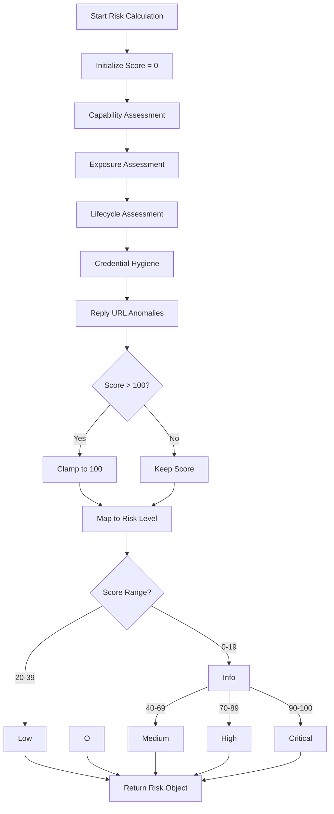

## Risk Categories

### 1. Capability Assessment

Evaluates what the application can do with its granted permissions.

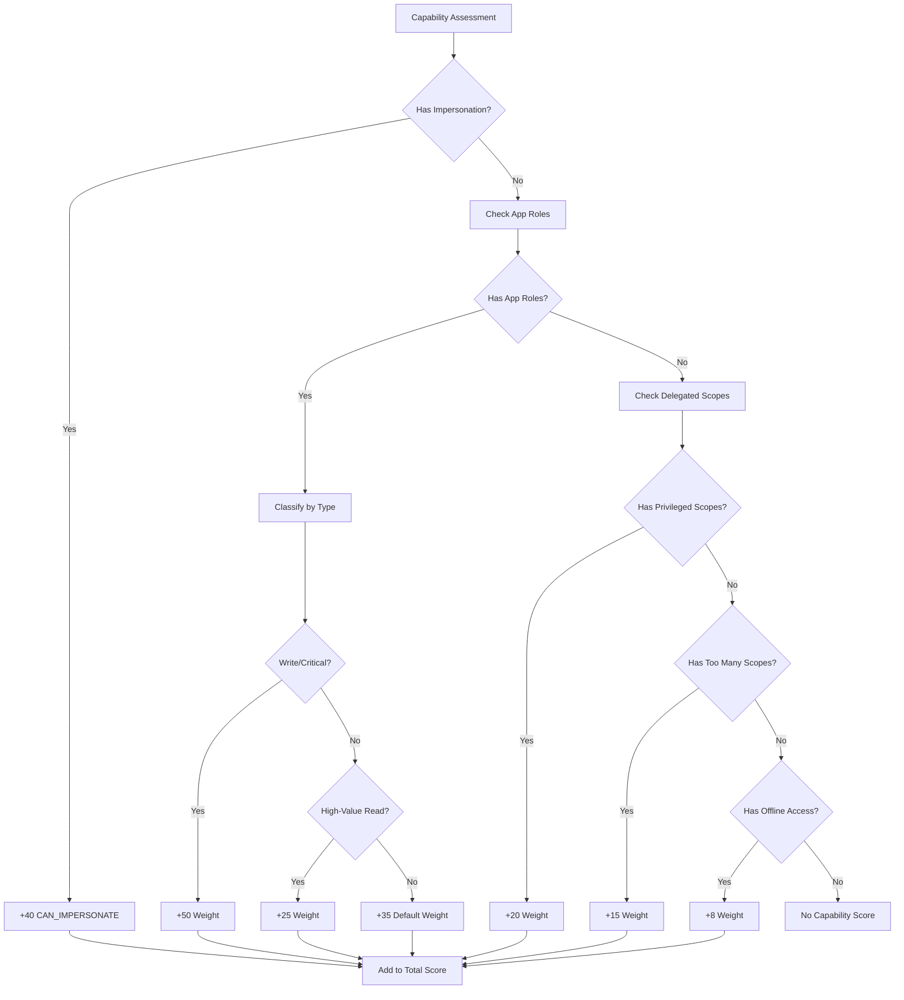

#### CAN_IMPERSONATE (+40)

**Description**: Application has explicit delegated impersonation markers

**Triggers**:
- OAuth2 scope contains `access_as_user`
- OAuth2 scope contains `user_impersonation`

**Risk Rationale**: Apps with impersonation capability can act as the signed-in user, accessing resources on their behalf. This is the highest capability risk.

**Example**:
```json
{
  "code": "CAN_IMPERSONATE",
  "weight": 40,
  "message": "Delegated impersonation markers present (access_as_user/user_impersonation)"
}
```

#### HAS_APP_ROLE (35-50)

**Description**: Application has been granted application permissions (app roles)

**Weight Calculation**:
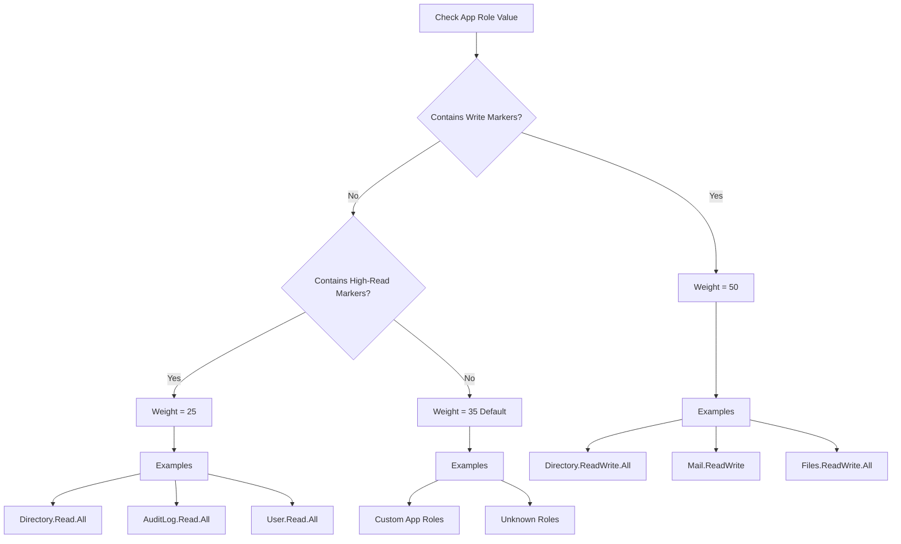

**Write Markers** (Weight: 50):
- `directory.readwrite`
- `directory.access`
- `rolemanagement.readwrite`
- `mail.readwrite`
- `files.readwrite`
- `sites.fullcontrol`
- `sites.readwrite`
- `group.readwrite`
- `reports.readwrite`
- `device.readwrite`
- `user.readwrite`

**High-Read Markers** (Weight: 25):
- `directory.read.all`
- `auditlog.read`
- `mail.read`
- `files.read`
- `sites.read`
- `group.read.all`
- `reports.read.all`
- `user.read.all`

**Risk Rationale**: Application permissions don't require user context and can access any resource in the tenant. Write permissions are more dangerous than read permissions.

#### HAS_PRIVILEGED_SCOPES (+20)

**Description**: Delegated scopes contain write or ReadWrite operations

**Detection**: Scope value contains `write` or `readwrite` (case-insensitive)

**Examples**:
- `User.ReadWrite.All`
- `Mail.ReadWrite`
- `Files.ReadWrite`

**Risk Rationale**: Write permissions allow modification of data, increasing abuse potential.

#### HAS_TOO_MANY_SCOPES (+15)

**Description**: Delegated consent is overly broad

**Detection**: Scope value ends with `.All`

**Examples**:
- `User.Read.All`
- `Mail.Read.All`
- `Calendars.Read.All`

**Risk Rationale**: `.All` scopes grant access to all resources of a type, not just the user's own data. This is "consent sprawl" - more access than typically needed.

#### OFFLINE_ACCESS_PERSISTENCE (+8 to +15)

**Description**: App can obtain refresh tokens for persistence

**Detection**: OAuth2 scope includes `offline_access`

**Risk Code**: `OFFLINE_ACCESS_PERSISTENCE` (in risk.reasons)

**Edge Type**: `HAS_OFFLINE_ACCESS` (in graph edges)

**Risk Rationale**: Refresh tokens allow apps to maintain access without user interaction, providing persistence. This is NOT impersonation - that's tracked separately via `CAN_IMPERSONATE`.

**Note**: The risk reason shows as `OFFLINE_ACCESS_PERSISTENCE` while graph edges use type `HAS_OFFLINE_ACCESS`.

### 2. Exposure Assessment

Evaluates how many users can access the application.

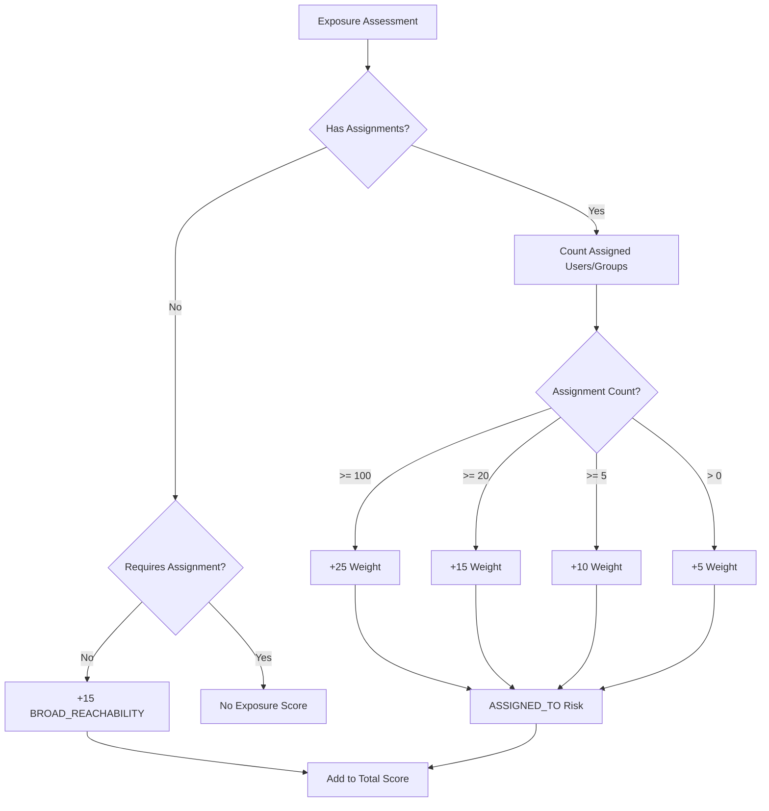

#### ASSIGNED_TO (5-25)

**Description**: Application is assigned to users/groups

**Weight Thresholds**:

| User Count | Weight | Risk Level |
|------------|--------|------------|
| 100+       | 25     | All users or very large groups |
| 20-99      | 15     | Large groups |
| 5-19       | 10     | Medium groups |
| 1-4        | 5      | Small groups |
| 0          | 0      | Not applied |

**Calculation Logic**:
```python
if assigned_count >= 100:
    weight = 25
elif assigned_count >= 20:
    weight = 15
elif assigned_count >= 5:
    weight = 10
elif assigned_count > 0:
    weight = 5
```

**Risk Rationale**: More assignments mean more potential victims if the app is compromised. Large group assignments amplify risk.

#### BROAD_REACHABILITY / GOVERNANCE (+5 to +15)

**Description**: App doesn't require assignment, making it broadly reachable

**Risk Codes**:
- `GOVERNANCE` (+5): Used in current implementation when `appRoleAssignmentRequired = false`
- `BROAD_REACHABILITY`: Legacy/conceptual name for the same risk

**Triggers**:
- `appRoleAssignmentRequired = false` (or null)

**Risk Rationale**: Any user in the tenant can consent to and use the app. This is high exposure without explicit governance.

**Note**: If users/groups are explicitly assigned (`ASSIGNED_TO` applies), only the GOVERNANCE/BROAD_REACHABILITY base penalty applies, not cumulative with assignment scores.

### 3. Lifecycle Assessment

Evaluates organizational factors and app lifecycle.

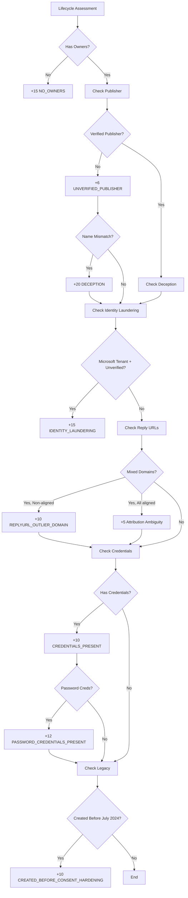

#### NO_OWNERS (+15)

**Description**: Application or service principal has no owners

**Risk Rationale**: Ownerless apps lack accountability and may be orphaned or forgotten. No one is responsible for lifecycle management, credential rotation, or security reviews.

#### UNVERIFIED_PUBLISHER (+6)

**Description**: Publisher is not verified by Microsoft

**Detection**: `verifiedPublisher` is null or empty

**Risk Rationale**: Verified publishers have gone through Microsoft's verification process, providing some trust signal. Unverified publishers could be anyone.

#### DECEPTION (+20)

**Description**: Unverified publisher with significant name mismatch

**Triggers**:
- Publisher is unverified
- Display name and publisher name differ significantly
- App has reply URLs (capable of OAuth flows)

**Risk Rationale**: Deceptive naming can trick users into granting consent. Example: "Microsoft Office Portal" published by "john.doe@example.com".

**Gating**: Only applied when `total_urls > 0` (not for apps without OAuth capability).

#### IDENTITY_LAUNDERING (+15)

**Description**: App appears Microsoft-owned but is unverified

**Detection**:
- `appOwnerOrganizationId` matches known Microsoft tenant IDs
- Publisher is unverified
- Multi-tenant app

**Microsoft Tenant IDs**:
- `f8cdef31-a31e-4b4a-93e4-5f571e91255a` (Microsoft Accounts/MSA)
- `72f988bf-86f1-41af-91ab-2d7cd011db47` (Microsoft Services)

**Risk Rationale**: Attackers may try to make their apps appear as Microsoft services to gain trust.

#### MIXED_REPLYURL_DOMAINS (+5 or +15)

**Description**: Reply URLs use multiple distinct domains

**Identity Laundering Signal** (+15):
- Multiple distinct domains
- At least one domain NOT aligned with homepage/branding

**Example**:
```
Reply URLs: 
  - https://app.contoso.com/callback
  - https://evil-phishing.com/steal
Homepage: https://www.contoso.com
→ evil-phishing.com not aligned → +15
```

**Attribution Ambiguity** (+5):
- Multiple distinct domains
- All domains aligned with homepage/branding

**Example**:
```
Reply URLs:
  - https://app.contoso.com/callback
  - https://api.fabrikam.com/oauth
Homepage: https://www.contoso.com
Marketing URL: https://fabrikam.com
→ Both aligned → +5
```

**Risk Rationale**: Mixed domains can indicate phishing attempts (identity laundering) or legitimate multi-brand companies (attribution ambiguity).

**Enrichment Impact**: When enrichment is enabled, DNS/RDAP/WHOIS lookups can verify that multi-domain reply URLs belong to the same organization (via ASN/network ownership), reducing false positives for legitimate multi-domain vendors like Microsoft.

#### REPLYURL_OUTLIER_DOMAIN (+10)

**Description**: Reply URLs contain domains outside the main vendor domain set

**Detection**: Leverages the same domain analysis as `MIXED_REPLYURL_DOMAINS`, but specifically flags non-aligned domains.

**Risk Rationale**: Redirect to unexpected domains may indicate compromise or misconfiguration.

**Enrichment Impact**: When enrichment is enabled, ASN/network ownership verification can reduce false positives by confirming domains belong to the same organization.

#### CREDENTIALS_PRESENT (+10)

**Description**: Service principal has credentials (keys or passwords)

**Detection**: Any password credentials or key credentials present

**Risk Rationale**: Credentials indicate the app has persistence capabilities and potential for lateral reuse.

#### PASSWORD_CREDENTIALS_PRESENT (+12)

**Description**: Service principal has password credentials (client secrets)

**Detection**: Password credentials present

**Risk Rationale**: Password secrets are easier to exfiltrate and misuse than certificates. Higher risk than key credentials alone.

#### CREATED_BEFORE_CONSENT_HARDENING (+10)

**Description**: Application created before consent hardening security baseline

**Detection**: `createdDateTime` before July 2025

**Risk Rationale**: Applications created before July 2025, when consent to applications from unverified publishers began requiring administrative approval, may have been onboarded under weaker consent controls. These older apps may not follow modern security practices or may lack proper governance.

### 4. Credential Hygiene

Evaluates the security of application credentials.

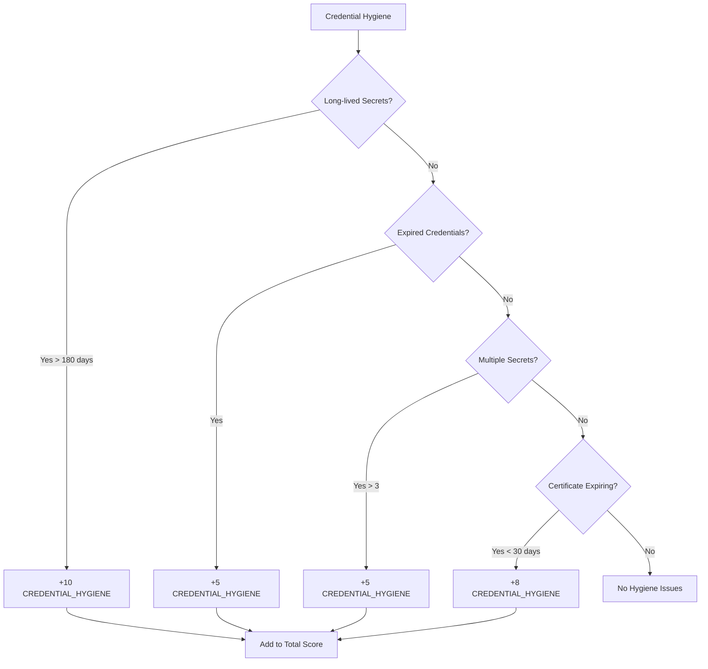

**Note**: All credential hygiene issues contribute to risk using the same code `CREDENTIAL_HYGIENE`, with different weights based on the specific issue detected.

#### Long-lived Secrets (+10)

**Description**: Password credentials with lifetime exceeding 180 days

**Risk Code**: `CREDENTIAL_HYGIENE` with message describing the specific issue

**Risk Rationale**: Long-lived secrets increase the window of opportunity for compromise. Microsoft recommends shorter credential lifetimes.

**Best Practice**: Rotate secrets every 90 days or less.

#### Expired Credentials (+5)

**Description**: Expired credentials still present in configuration

**Risk Code**: `CREDENTIAL_HYGIENE` with message describing the specific issue

**Risk Rationale**: Leftover expired credentials indicate poor credential hygiene and may confuse administrators or allow accidental usage.

**Best Practice**: Remove expired credentials promptly.

#### Multiple Active Secrets (+5)

**Description**: More than 3 active credentials present

**Risk Code**: `CREDENTIAL_HYGIENE` with message describing the specific issue

**Risk Rationale**: Too many credentials increases the attack surface and management complexity.

**Best Practice**: Maintain 2 credentials (active + rollover) at most.

#### Certificate Expiring Soon (+8)

**Description**: X.509 certificates expiring within 30 days

**Risk Code**: `CREDENTIAL_HYGIENE` with message describing the specific issue

**Risk Rationale**: Expiring certificates can cause service outages. Advance warning allows planned rotation.

**Best Practice**: Set up alerts at 60 days and rotate at 30 days before expiry.

### 5. Reply URL Anomalies

Evaluates security of OAuth2 redirect URIs.

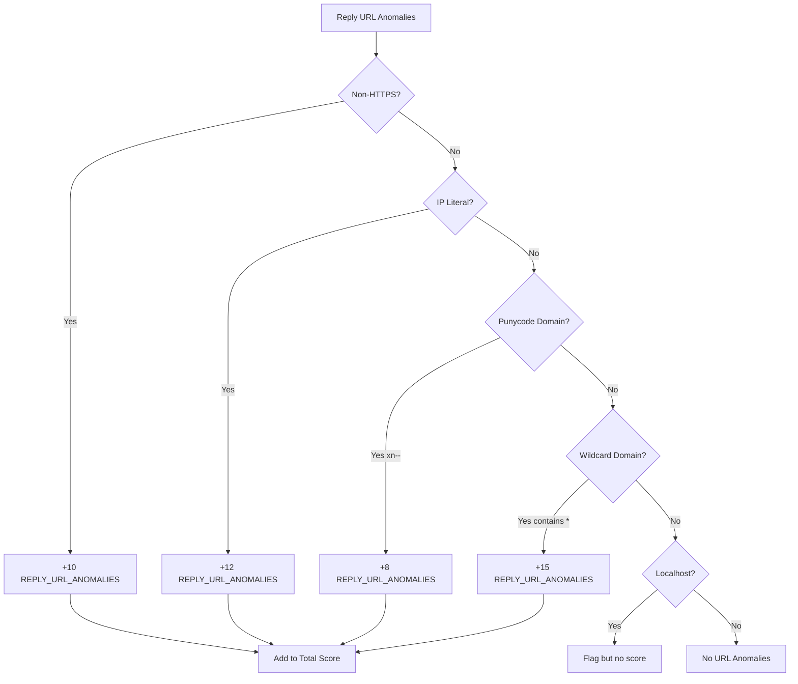

**Note**: All reply URL anomalies contribute to risk using the same code `REPLY_URL_ANOMALIES`, with different weights based on the specific anomaly detected.

#### Non-HTTPS URLs (+10)

**Description**: Reply URLs using HTTP instead of HTTPS

**Risk Code**: `REPLY_URL_ANOMALIES` with message describing the specific issue

**Example**: `http://app.contoso.com/callback`

**Risk Rationale**: HTTP is unencrypted. Authorization codes and tokens could be intercepted.

**Best Practice**: Always use HTTPS for OAuth redirect URIs.

#### IP Literal Addresses (+12)

**Description**: Reply URLs contain IP addresses

**Risk Code**: `REPLY_URL_ANOMALIES` with message describing the specific issue

**Examples**:
- `https://192.168.1.100/callback`
- `https://[2001:db8::1]/callback`

**Risk Rationale**: IP addresses can bypass domain validation and DNS security controls. May indicate testing configurations in production.

**Best Practice**: Use proper domain names with TLS certificates.

#### Punycode Domains (+8)

**Description**: Reply URLs contain internationalized domain names (IDN)

**Risk Code**: `REPLY_URL_ANOMALIES` with message describing the specific issue

**Detection**: Domain contains `xn--` prefix

**Example**: `https://xn--80akhbyknj4f.com/callback` (Cyrillic characters)

**Risk Rationale**: Punycode can be used for homograph attacks, where domain names look similar to legitimate domains but use different characters.

**Best Practice**: Be cautious with IDN domains. Validate they belong to your organization.

#### Wildcard Domains (+15)

**Description**: Reply URLs contain wildcard domains

**Risk Code**: `REPLY_URL_ANOMALIES` with message describing the specific issue

**Example**: `https://*.contoso.com/callback`

**Risk Rationale**: Wildcards match any subdomain, significantly expanding the attack surface. An attacker who can control any subdomain can receive authorization codes.

**Best Practice**: Use explicit subdomains instead of wildcards.

## Risk Level Mapping

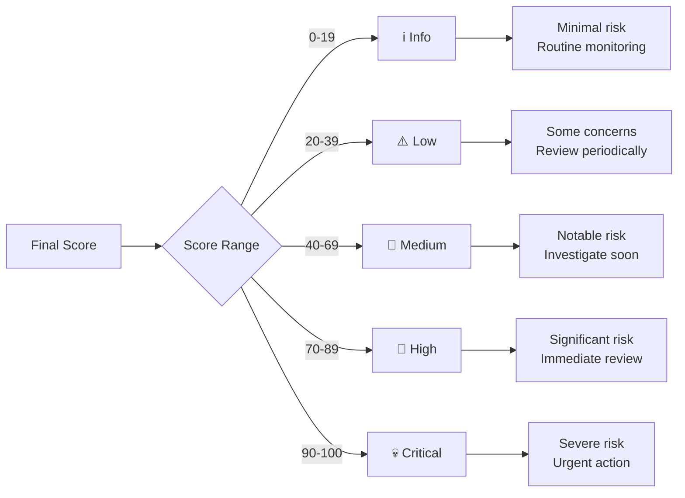

### Risk Level Descriptions

#### Info (0-19)
- **Severity**: Informational
- **Action**: Routine monitoring
- **Description**: Minimal risk factors present. Application appears well-configured.

#### Low (20-39)
- **Severity**: Low
- **Action**: Review periodically
- **Description**: Some minor concerns. May have basic permissions or single risk factor.

#### Medium (40-69)
- **Severity**: Medium
- **Action**: Investigate soon
- **Description**: Multiple risk factors or moderate capability. Warrants attention.

#### High (70-89)
- **Severity**: High
- **Action**: Immediate review required
- **Description**: Significant risk factors present. High capability or exposure, minimal governance.

#### Critical (90-100)
- **Severity**: Critical
- **Action**: Urgent action required
- **Description**: Severe risk. Multiple high-impact factors or extreme capability without governance.

## Score Calculation Example

### Scenario: Suspicious Third-Party App

**Application Details**:
- Name: "Office Management Portal"
- Publisher: Unverified
- Permissions: `User.ReadWrite.All`, `Mail.ReadWrite`
- App Roles: `Directory.Read.All`
- Assignments: Broad reachability (no assignment required)
- Reply URLs: `https://app.example.com`, `https://phishing-site.com/callback`
- Credentials: 1 password secret (400 days old)
- Owners: None
- Governance: None

**Score Calculation**:

```
Capability:
  HAS_APP_ROLE (Directory.Read.All high-read)     +25
  HAS_PRIVILEGED_SCOPES (ReadWrite)               +20
  HAS_TOO_MANY_SCOPES (.All suffix)               +15

Exposure:
  GOVERNANCE (no assignment required)             +5

Governance & Lifecycle:
  NO_OWNERS                                       +15
  UNVERIFIED_PUBLISHER                            +6
  DECEPTION (name mismatch)                       +20
  REPLYURL_OUTLIER_DOMAIN (phishing-site.com)    +10
  CREDENTIALS_PRESENT                             +10
  PASSWORD_CREDENTIALS_PRESENT                    +12

Credential Hygiene:
  CREDENTIAL_HYGIENE (long-lived secret)          +10

Total: 158 → Clamped to 100 → CRITICAL
```

**Risk Reasons**:
```json
[
  {"code": "HAS_APP_ROLE", "weight": 25, "message": "Application permissions granted (Directory.Read.All)"},
  {"code": "HAS_PRIVILEGED_SCOPES", "weight": 20, "message": "Privileged delegated scopes (ReadWrite)"},
  {"code": "HAS_TOO_MANY_SCOPES", "weight": 15, "message": "Overly broad consent (.All scopes)"},
  {"code": "GOVERNANCE", "weight": 5, "message": "Assignments not required for app"},
  {"code": "NO_OWNERS", "weight": 15, "message": "No owners assigned"},
  {"code": "UNVERIFIED_PUBLISHER", "weight": 6, "message": "Unverified publisher"},
  {"code": "DECEPTION", "weight": 20, "message": "Name mismatch with unverified publisher"},
  {"code": "REPLYURL_OUTLIER_DOMAIN", "weight": 10, "message": "Reply URLs use non-aligned domains"},
  {"code": "CREDENTIALS_PRESENT", "weight": 10, "message": "Credentials present on SP"},
  {"code": "PASSWORD_CREDENTIALS_PRESENT", "weight": 12, "message": "Password credentials present"},
  {"code": "CREDENTIAL_HYGIENE", "weight": 10, "message": "Long-lived secrets detected (>180 days)"}
]
```

### Scenario: Well-Governed Enterprise App

**Application Details**:
- Name: "Contoso HR Portal"
- Publisher: Verified
- Permissions: `User.Read`, `offline_access`
- Assignments: 25 users (HR group)
- Reply URLs: `https://hr.contoso.com/callback`
- Credentials: Certificate (expires in 90 days)
- Owners: 2 admins

**Score Calculation**:

```
Capability:
  OFFLINE_ACCESS_PERSISTENCE                      +8

Exposure:
  ASSIGNED_TO (25 users)                          +15

Lifecycle:
  (No negative factors)                           +0

Credential Hygiene:
  (No issues)                                     +0

Reply URL Anomalies:
  (No issues)                                     +0

Final Score: 23 → LOW
```

**Risk Reasons**:
```json
[
  {"code": "OFFLINE_ACCESS_PERSISTENCE", "weight": 8, "message": "offline_access delegated grant allows refresh tokens"},
  {"code": "ASSIGNED_TO", "weight": 15, "message": "App is assigned to principals approximating ~25 users"}
]
```

## Configuration

The scoring logic is configured in `scoring_logic.json`. This file contains:

1. **App Role Classification**: Weight mappings for different app role types
2. **Scope Classification**: Rules for categorizing delegated scopes
3. **Risk Contributors**: Weights and descriptions for each scoring factor

### Customizing Weights

To adjust risk weights, edit `scoring_logic.json`:

```json
{
  "compute_risk_for_sp": {
    "scoring_contributors": {
      "CAN_IMPERSONATE": {
        "weight": 40,
        "description": "Delegated impersonation markers present"
      },
      "DECEPTION": {
        "weight": 20,
        "description": "Unverified publisher with name mismatch"
      }
      // ... other contributors
    }
  }
}
```

**Note**: Weight changes apply on next scanner run. Existing exports use the weights from when they were generated.

## Best Practices

### 1. Regular Scanning
- **Frequency**: Weekly or bi-weekly
- **Purpose**: Track changes and new risks over time

### 2. Focus on High/Critical
- **Priority**: Address critical and high-risk apps first
- **Investigation**: Review permissions, ownership, and credentials

### 3. Ownership Management
- **Assign Owners**: Ensure all apps have proper ownership
- **Effect**: Prevents +15 point NO_OWNERS penalty

### 4. Credential Hygiene
- **Review**: Check for long-lived and expired secrets
- **Rotate**: Establish regular rotation schedule (90 days recommended)

### 5. Verified Publishers
- **Verification**: Work with vendors to get publisher verification
- **Effect**: Reduces base risk by 6 points and prevents DECEPTION scoring

### 6. Ownership
- **Assignment**: Ensure all apps have designated owners
- **Accountability**: Owners are responsible for lifecycle and security

### 7. Least Privilege
- **Permissions**: Review and reduce unnecessary permissions
- **Impact**: Can reduce scores by 15-50 points depending on changes

## Risk Score Interpretation

### What the Score Means

The risk score is an **indicator**, not a verdict:

- **High Score**: App has multiple risk factors that increase potential for abuse
- **Low Score**: App appears well-configured with appropriate controls
- **Context Matters**: Consider business purpose and user population

### What the Score Doesn't Mean

- **Not a Security Guarantee**: Low scores don't mean an app is safe
- **Not a Ban List**: High scores don't automatically mean an app is malicious
- **Not Compliance**: Scores don't represent regulatory compliance status

### Using Scores Effectively

1. **Prioritization**: Focus security reviews on high-risk apps
2. **Trend Analysis**: Track score changes over time
3. **Governance Validation**: Verify that governed apps have lower scores
4. **Exception Handling**: Document and accept risk for legitimate high-scoring apps

## Microsoft-Specific Scoring Considerations

### Expected Patterns for Microsoft Apps

Microsoft service principals often exhibit patterns that might appear as risk factors but are expected for first-party services:

**Multi-Domain Reply URLs**:
- Microsoft apps frequently have reply URLs across multiple Microsoft-owned domains
- Examples: login.microsoftonline.com, login.windows.net, aadcdn.msauth.net
- When enrichment is enabled, ASN verification confirms these belong to Microsoft infrastructure
- Without enrichment, these may be flagged with `MIXED_REPLYURL_DOMAINS` or `REPLYURL_OUTLIER_DOMAIN`

**Wildcard Reply URLs**:
- Some Microsoft apps use wildcard domains (e.g., `*.office.com`, `*.sharepoint.com`)
- This is expected for apps serving multiple subdomains
- Still flagged for visibility but context indicates legitimate use

**Verified Publisher Status**:
- Microsoft first-party apps should have verified publishers
- Apps from known Microsoft tenant IDs without verification trigger `IDENTITY_LAUNDERING` detection
- Use Merill's Microsoft Apps list (integrated in scanner) to identify legitimate first-party apps

**High Permissions**:
- Microsoft Graph, Exchange Online, SharePoint, and other resource APIs naturally have high permissions
- These are expected and necessary for platform functionality
- Focus investigation on third-party apps with similar permission levels

### Broker Schemes

Mobile applications using broker schemes are not penalized:
- **msauth://**, **ms-app://**, **brk-*://**: Recognized as legitimate mobile patterns
- Tracked in `replyUrlAnalysis.schemes` for visibility
- Do not contribute to risk scores

### Enrichment Benefits for Microsoft-Heavy Tenants

Tenants with many Microsoft apps benefit from enrichment:
- ASN/network ownership verification reduces false positives for multi-domain Microsoft apps
- RDAP data confirms infrastructure ownership patterns
- DNS lookups verify expected domain relationships

**Recommendation**: Enable enrichment for tenants with significant Microsoft app presence to improve scoring accuracy.

## Related Documentation

- **[Scanner Documentation](https://github.com/OID-See/OID-See/blob/1e37c909c34dba5c0ad9df8f5b185bd4a503c3c6/docs/scanner.md)**: How risk data is collected
- **[Schema Documentation](https://github.com/OID-See/OID-See/blob/1e37c909c34dba5c0ad9df8f5b185bd4a503c3c6/docs/schema.md)**: Structure of risk objects in exports
- **[Web App Documentation](https://github.com/OID-See/OID-See/blob/1e37c909c34dba5c0ad9df8f5b185bd4a503c3c6/docs/webapp.md)**: Visualizing and filtering by risk scores

## `docs/visualization-modes.md`

[View original document](https://github.com/OID-See/OID-See/blob/1e37c909c34dba5c0ad9df8f5b185bd4a503c3c6/docs/visualization-modes.md)

# Alternative Visualization Modes

OID-See provides multiple visualization modes to efficiently handle and analyze large datasets. Each mode is optimized for different use cases and scales effectively with datasets containing thousands of nodes and edges.

## Overview

The viewer includes five distinct visualization modes accessible via the **View** selector in the header:

1. **Graph View** - Traditional network graph visualization (default)
2. **Table View** - Tabular data view with virtual scrolling
3. **Tree View** - Hierarchical tree structure grouped by type
4. **Matrix View** - Heat map showing relationships between node types
5. **Dashboard View** - Statistical summary and key metrics

## 1. Graph View (Traditional)

The original network visualization mode, best suited for datasets under 1,000 nodes.

**Features:**
- Interactive force-directed graph layout
- Node dragging and repositioning
- Zoom and pan controls
- Real-time filtering and lens switching

**When to use:**
- Exploring relationships between specific entities
- Investigating security paths and attack vectors
- Small to medium datasets (< 1,000 nodes)

**Limitations:**
- Performance degrades with large datasets (10,000+ nodes)
- Can become visually cluttered with many connections

## 2. Table View

A high-performance tabular view with virtual scrolling, designed to handle massive datasets efficiently.

**Features:**
- **Virtual Scrolling**: Renders only visible rows, enabling smooth navigation through 29,000+ rows
- **Column Sorting**: Click column headers to sort by any field (ascending/descending)
- **Search Filtering**: Quick filter box to search across all columns
- **Bulk Selection**: Checkbox selection for multiple rows
- **Inline Actions**:
  - **Show Details**: Expand row to view all node properties
  - **Show Relationships**: Display connected nodes and edges
  - **Export**: Download selected nodes as JSON
- **Bulk Operations**:
  - Select multiple nodes
  - Visualize subset in graph view (respects size limits)
  - Export selection to JSON file
- **Row Details**: Expandable panels showing full node properties and relationships

**Columns Displayed:**
- ID
- Type
- Display Name
- Risk Score (with color coding)
- Owner (if applicable)
- Properties (key-value pairs)

**When to use:**
- Analyzing large datasets (10,000+ nodes)
- Searching for specific nodes by name or ID
- Sorting and comparing nodes by risk score or type
- Exporting filtered data for external analysis
- Bulk operations on multiple nodes

**Performance:**
- Handles 50,000+ rows smoothly
- Virtual scrolling maintains 60 FPS performance
- Instant search and filter response

## 3. Tree View

A hierarchical tree structure that organizes nodes by type with collapsible branches.

**Features:**
- **Type Grouping**: Nodes organized by type (ServicePrincipal, Application, User, Group, etc.)
- **Collapsible Tree**: Expand/collapse branches to navigate large hierarchies
- **Lazy Loading**: Child nodes load on-demand when branches expand
- **Risk Aggregation**: Each type shows aggregated risk statistics
  - Total nodes in category
  - Average risk score
  - Maximum risk score
  - High-risk node count
- **Node Icons**: Visual indicators for node types
- **Risk Color Coding**: Visual risk severity (red = critical, yellow = medium, green = low)
- **Subgraph Visualization**: Right-click nodes to visualize their neighborhood in graph view
- **Search**: Quick filter to find specific nodes in the tree
- **Bulk Selection**: Select nodes across different branches
- **Export**: Export selected subtrees to JSON

**Tree Structure:**
```
📦 ServicePrincipals (1,245 nodes, avg risk: 65)
  ├─ 🔵 Contoso App (risk: 85)
  ├─ 🔵 Marketing Portal (risk: 45)
  └─ ...
📦 Applications (823 nodes, avg risk: 58)
  ├─ 📱 Mobile App (risk: 70)
  └─ ...
📦 Users (15,432 nodes, avg risk: 12)
📦 Groups (892 nodes, avg risk: 8)
```

**When to use:**
- Understanding dataset composition by type
- Comparing risk levels across different categories
- Drilling down into specific node types
- Identifying high-risk nodes within each category
- Analyzing organizational structure and membership hierarchies

**Performance:**
- Lazy loading enables navigation of 100,000+ node trees
- Smooth expand/collapse animations
- Efficient filtering and search

## 4. Matrix View

A heat map visualization showing relationship patterns and risk distributions between node types.

**Features:**
- **Relationship Matrix**: Rows and columns represent node types, cells show edge counts
- **Color Intensity**: Darker cells indicate more relationships
- **Risk Overlay**: Cell colors reflect average risk score of relationships
- **Interactive Cells**: Click any cell to:
  - View detailed relationship list in table view
  - See specific nodes involved in that relationship type
  - Export the subset to JSON
- **Hover Tooltips**: Show exact counts and statistics for each cell
- **Type Labels**: Clear axis labels for source and target types
- **Legend**: Color scale explanation for risk levels and relationship counts

**Matrix Example:**
```
                ServicePrincipal  Application  User   Group
ServicePrincipal    342 (red)      128         0      0
Application         0              0           0      0
User                1,245          892         0      423
Group               234            0           1,023  12
```

**Cell Information:**
- **Count**: Number of edges between the two types
- **Average Risk**: Mean risk score of involved nodes
- **Color**: Intensity indicates relationship density and risk level

**When to use:**
- Understanding relationship patterns across the dataset
- Identifying unusual or unexpected connection types
- Finding high-risk relationship categories
- Discovering data quality issues (e.g., unexpected edge types)
- Quick assessment of dataset structure

**Performance:**
- Instant calculation for datasets up to 100,000 edges
- Responsive hover and click interactions
- Efficient filtering to table view

## 5. Dashboard View

A comprehensive statistical summary providing key metrics and insights about the dataset.

**Features:**

### Summary Statistics
- **Total Nodes**: Count by type with breakdown
- **Total Edges**: Count by type with breakdown
- **Risk Distribution**: Nodes grouped by severity (Critical, High, Medium, Low, Info)
- **Risk Metrics**: Average, median, max risk scores

### Top Risky Nodes
- List of 10 highest-risk nodes
- Displays ID, name, type, and risk score
- Click to view details or visualize in graph

### Critical Paths
- Identified attack paths and privilege escalation routes
- Path length and risk assessment
- Interactive path exploration

### Type Distribution Charts
- Bar chart showing node counts by type
- Pie chart of risk distribution
- Edge type frequency analysis

### Risk Factors
- Top contributing risk factors
- Frequency and impact analysis
- Recommendations for remediation

### Time-Based Statistics (Future)
- Comparison with previous scans
- Trend analysis
- Change detection

**When to use:**
- Executive overview of security posture
- Identifying immediate priorities (top risky nodes)
- Understanding dataset composition
- Reporting and documentation
- Initial assessment of a new scan

**Performance:**
- Instant calculation of all metrics
- Responsive charts and visualizations
- Handles datasets of any size

## 6. Hybrid Approach (Subset Visualization)

A special feature that enables selective visualization of subsets from any view mode.

**Features:**
- **Size Constraints**: Enforces maximum of 500 nodes for graph rendering
- **Subset Selection**: Select nodes in Table or Tree view, then visualize
- **"Visualize Selection" Button**: Appears when nodes are selected
- **Smart Filtering**: Automatically includes connected edges for selected nodes
- **Warning Messages**: Alerts when selection exceeds size limits
- **Automatic Switching**: Seamlessly switches to Graph View for visualization

**Workflow:**
1. Use Table View or Tree View to filter/search for specific nodes
2. Select nodes using checkboxes (up to 500 nodes)
3. Click "Visualize Selection" button
4. System switches to Graph View showing only selected nodes and their relationships
5. Explore the focused subgraph with full graph view features

**When to use:**
- Investigating specific nodes or node groups in large datasets
- Focusing on high-risk nodes only
- Analyzing relationships within a specific department or type
- Creating focused visualizations for presentations

**Size Limits:**
- **Maximum**: 500 nodes per visualization
- **Recommended**: 100-200 nodes for optimal performance
- **Warning**: Displayed when approaching or exceeding limits

## Switching Between Views

Use the **View** selector in the header to switch between modes:
- All views share the same underlying dataset
- Filters and selections are preserved when possible
- Switching is instant with no data reload required
- Each view maintains its own state (sorting, expansion, etc.)

## Performance Characteristics

| View Mode  | Max Recommended Size | Rendering Time | Memory Usage | Best For |
|-----------|---------------------|----------------|--------------|----------|
| Graph     | 1,000 nodes         | 2-5s          | High         | Exploration, small datasets |
| Table     | 100,000+ nodes      | < 1s          | Low          | Large datasets, searching |
| Tree      | 100,000+ nodes      | < 1s          | Medium       | Hierarchical data, type analysis |
| Matrix    | 100,000 edges       | < 1s          | Low          | Relationship patterns |
| Dashboard | Unlimited           | < 1s          | Low          | Overview, reporting |

## Tips and Best Practices

### For Large Datasets (10,000+ nodes)
1. **Start with Dashboard View**: Get an overview of the dataset composition and top risks
2. **Use Table View for search**: Find specific nodes quickly with search and filters
3. **Use Tree View for type analysis**: Understand risk distribution across node types
4. **Use Matrix View for patterns**: Identify relationship anomalies
5. **Use Hybrid Approach**: Visualize only relevant subsets in Graph View

### For Small to Medium Datasets (< 1,000 nodes)
1. **Start with Graph View**: Visual exploration is efficient and intuitive
2. **Switch to Table View**: For sorting and bulk operations
3. **Use Dashboard View**: For summary statistics and reporting

### For Investigations
1. **Dashboard**: Identify top risks and critical paths
2. **Table**: Search for specific entities or filter by criteria
3. **Tree**: Understand organizational structure
4. **Graph** (subset): Visualize specific relationships and paths
5. **Matrix**: Identify unexpected connection patterns

### Performance Optimization
- **Virtual Scrolling**: Table and Tree views use virtual scrolling—only visible items are rendered
- **Lazy Loading**: Tree branches load children on-demand
- **Debounced Search**: Search filters apply after typing pauses
- **Efficient Filtering**: All views use indexed lookups for fast filtering
- **Minimal Re-rendering**: React optimizations prevent unnecessary updates

## Keyboard Shortcuts

| Key | Action |
|-----|--------|
| `1` | Switch to Graph View |
| `2` | Switch to Table View |
| `3` | Switch to Tree View |
| `4` | Switch to Matrix View |
| `5` | Switch to Dashboard View |
| `/` | Focus search box |
| `Esc` | Clear search/selection |
| `Ctrl+A` | Select all (in Table/Tree view) |
| `Ctrl+E` | Export selection |

## Export Formats

All views support exporting data in JSON format:

```json
{
  "exportedAt": "2026-01-03T23:59:00Z",
  "viewMode": "table",
  "filters": "n.risk.score>=70",
  "selectedNodes": [...],
  "includedEdges": [...]
}
```

## Future Enhancements

Planned improvements for visualization modes:

- **Time-series comparison**: Compare multiple scans over time
- **Advanced filtering UI**: Visual query builder
- **Custom views**: Save and share custom view configurations
- **Collaborative annotations**: Add notes and comments to nodes
- **Export to PowerBI**: Direct export for enterprise reporting
- **Real-time updates**: Live data refresh from Microsoft Graph
- **Mobile optimization**: Touch-friendly interfaces for tablets

## Troubleshooting

### Graph View Performance Issues
- **Problem**: Slow rendering or unresponsive UI
- **Solution**: Use Table View to filter data first, then visualize subset

### Table View Search Not Finding Nodes
- **Problem**: Search returns no results
- **Solution**: Check that search is matching against the correct columns; try ID or type filters

### Tree View Not Expanding
- **Problem**: Clicking expand icon does nothing
- **Solution**: Ensure data is loaded; check browser console for errors

### Matrix View Cells Empty
- **Problem**: Matrix shows no relationships
- **Solution**: Verify edges exist in dataset; check edge type filters

### Subset Visualization Size Limit
- **Problem**: "Selection exceeds 500 nodes" warning
- **Solution**: Refine filters to select fewer nodes; prioritize high-risk nodes

## Technical Implementation

The alternative visualization modes are implemented using:
- **React 18**: Component-based architecture with hooks
- **TypeScript**: Type-safe development
- **react-window**: Virtual scrolling for Table and Tree views
- **D3.js**: Matrix visualization and charts
- **CSS Grid**: Responsive layouts
- **Web Workers** (future): Background processing for large datasets

All views operate entirely client-side with no server dependencies.

## `docs/web-app.md`

[View original document](https://github.com/OID-See/OID-See/blob/1e37c909c34dba5c0ad9df8f5b185bd4a503c3c6/docs/web-app.md)

# OID-See Web Application Documentation

## Overview

The OID-See Viewer is a client-side web application that visualizes Microsoft Entra ID (Azure AD) tenant data as an interactive graph. **It runs entirely in your browser with no server-side processing**, ensuring your tenant data remains completely private and secure.

**Live Application**: Available at **https://oid-see.netlify.app/** or run locally with `npm run dev`

**Privacy Guarantee**:
- ✅ **Browser-Only**: All data processing happens locally in your browser
- ✅ **No Telemetry**: Zero analytics, tracking, or usage monitoring
- ✅ **No Data Upload**: Your JSON export never leaves your device
- ✅ **No External Calls**: No network requests except initial app load
- ✅ **Local Storage Only**: Saved presets stored in your browser's local storage


## Key Features

- **🔒 Complete Privacy**: All data processing in your browser—no uploads, no telemetry, no tracking
- **📊 Interactive Visualization**: Explore relationships through a dynamic graph
- **🔍 Advanced Filtering**: Query nodes and edges using powerful syntax
- **🎨 Multiple Lenses**: View data through different perspectives (Full, Risk, Structure)
- **💾 Local Storage**: Save your filter presets for reuse (stored locally only)
- **📱 Responsive Design**: Works on desktop, tablet, and mobile devices
- **🌐 No Backend Required**: Static web app deployable to any hosting service

## Getting Started

### Loading Data

The OID-See Viewer supports three methods for loading tenant data:

#### 1. Load Sample Data

Click **Load sample** in the header to load a pre-configured example dataset. This is useful for:
- Learning how to use the viewer
- Testing filter queries
- Understanding the data structure

#### 2. Upload JSON File

1. Click **Upload JSON** in the header
2. Select your OID-See export JSON file (generated by `oidsee_scanner.py`)
3. The graph will render automatically after validation

**Supported Format**: OID-See Graph Export v1.x (see [Schema Documentation](https://github.com/OID-See/OID-See/blob/1e37c909c34dba5c0ad9df8f5b185bd4a503c3c6/docs/schema.md))

#### 3. Paste JSON Directly

1. Use the **Input** panel on the left side
2. Click the **Edit** tab
3. Paste your JSON data
4. Click **Format** to validate and format
5. Click **Render** to visualize

### Rendering the Graph

After loading or pasting data, click the **Render** button in the header. The graph will:
1. Parse and validate your JSON
2. Apply the current filter and lens settings
3. Layout nodes using physics simulation
4. Display the interactive visualization

## User Interface Components

### Header Bar

Located at the top of the screen, the header provides main actions:

| Button | Description |
|--------|-------------|
| **Load sample** | Load example tenant data |
| **Render** | Render the current JSON input |
| **Upload JSON** | Upload a JSON file from your computer |
| **Reset View** | Reset graph position and zoom to default |

### Filter Panel

The filter panel allows you to query and filter the displayed data.

#### Filter Tabs

**Full / Risk / Structure**: Three lens modes for viewing different aspects of the graph

- **Full**: Shows all nodes and edges without filtering
- **Risk**: Focuses on privilege and abuse paths (HAS_SCOPES, HAS_ROLE, HAS_APP_ROLE, CAN_IMPERSONATE, etc.)
- **Structure**: Shows only structural relationships (INSTANCE_OF, MEMBER_OF, OWNS, ASSIGNED_TO)

#### Path-aware Filtering

When enabled, this checkbox ensures that if a derived edge matches your filter (e.g., `EFFECTIVE_IMPERSONATION_PATH`), the underlying edges (`derived.inputs`) are also included so the path remains explainable.

**Example**: If you filter for `EFFECTIVE_IMPERSONATION_PATH` edges, the constituent edges that form the path will also be shown.

#### Filter Presets

Manage your saved filter queries:

- **Save**: Save the current filter query with a custom name
- **Delete**: Remove the selected preset
- **Reset Presets**: Clear all saved presets and restore defaults
- **Dropdown**: Select from saved presets to apply them

**Preset Queries Included**:
- Node type filters (Service Principals, Applications, Users, Groups, Roles)
- Risk level queries (High/Medium/Low Risk)
- Edge type filters (Can Impersonate, Has App Roles, etc.)
- Specific risk queries (Unverified Publishers, No Owners, etc.)

### Filter Query Syntax

Use the filter input field to write custom queries. Queries are space-separated clauses.

#### Prefix Notation

- `n.` - Filter on node properties
- `e.` - Filter on edge properties

#### Operators

| Operator | Description | Example |
|----------|-------------|---------|
| `=` | Equals | `n.type=User` |
| `!=` | Not equals | `e.type!=INSTANCE_OF` |
| `~` | Contains (substring) | `e.properties.scopes~offline_access` |
| `!~` | Not contains | `n.displayName!~Test` |
| `>` | Greater than | `n.risk.score>70` |
| `>=` | Greater than or equals | `n.risk.score>=70` |
| `<` | Less than | `n.risk.score<40` |
| `<=` | Less than or equals | `n.risk.score<=40` |
| `?` | Property exists | `n.properties.appId?` |

#### Example Queries

```
# Show only User nodes
n.type=User

# Show high-risk service principals
n.type=ServicePrincipal n.risk.score>=70

# Show edges with offline_access scope
e.properties.scopes~offline_access

# Show service principals with password credentials
n.properties.credentialInsights.active_password_credentials>0

# Complex multi-condition query
n.risk.score>=70 n.properties.verifiedPublisher.displayName=null

# Show apps with non-HTTPS reply URLs
n.properties.replyUrlAnalysis.non_https_urls.length>0

# Show identity laundering suspects
n.properties.trustSignals.identityLaunderingSuspected=true
```

#### Query Help

Click the **?** button next to the Clear button to see inline help and examples.

### Input Panel (Left Side)

The input panel manages the JSON data source.

#### Edit Tab

- **Text Editor**: Paste or edit JSON directly
- **Format Button**: Format and validate JSON
- **Refresh Button**: Reload from the editor
- **Copy Button**: Copy formatted JSON to clipboard

#### View Tab

- **Read-only View**: Display the current JSON in a non-editable format
- Useful for reviewing the data structure without accidentally modifying it

#### Collapse/Expand

Click the **◀** arrow button to collapse the input panel and maximize graph space.

### Graph Panel (Center)

The main visualization area displaying the interactive graph.

#### Node Types and Colors

Nodes are color-coded by type:

| Node Type | Color | Description |
|-----------|-------|-------------|
| ServicePrincipal | Blue | Third-party and multi-tenant apps |
| Application | Purple | Application registrations |
| User | Green | User accounts |
| Group | Orange | Security and distribution groups |
| Role | Red | Directory roles (e.g., Global Admin) |
| ResourceApi | Teal | Resource APIs (e.g., Microsoft Graph) |

#### Edge Types and Styles

Edges represent relationships and are styled differently:

**Structural Edges** (solid lines):
- `INSTANCE_OF`: Links Service Principal to Application
- `OWNS`: Ownership relationship
- `MEMBER_OF`: Group membership
- `ASSIGNED_TO`: User/group assigned to app

**Permission Edges** (dashed lines):
- `HAS_SCOPES`: Delegated permissions
- `HAS_PRIVILEGED_SCOPES`: High-privilege delegated scopes
- `HAS_TOO_MANY_SCOPES`: Excessive scope grants
- `HAS_OFFLINE_ACCESS`: Refresh token capability
- `CAN_IMPERSONATE`: User impersonation capability
- `HAS_APP_ROLE`: Application permissions
- `HAS_ROLE`: Directory role assignments

#### Risk Scoring Visualization

Nodes with risk scores are highlighted:
- **Critical (90-100)**: Dark red background
- **High (70-89)**: Red background
- **Medium (40-69)**: Orange background
- **Low (20-39)**: Yellow background
- **Info (0-19)**: No special highlighting

#### Graph Interactions

**Mouse/Touch Actions**:
- **Click Node**: Select and view details in the details panel
- **Drag Node**: Reposition manually (physics will adapt)
- **Drag Canvas**: Pan the graph view
- **Scroll/Pinch**: Zoom in and out
- **Double-click Canvas**: Deselect all nodes

**Selection Behaviors**:
- Selected nodes are highlighted with a colored border
- Click on empty space to deselect
- Selection persists until explicitly cleared or changed

### Details Panel (Right Side)

When you select a node or edge, the details panel displays comprehensive information.

#### Node Details

**Common Properties**:
- **ID**: Unique identifier
- **Type**: Node type (ServicePrincipal, User, etc.)
- **Display Name**: Human-readable name
- **Risk**: Risk score and reasons (displayed first when available)
- **Properties**: Full property object from the export (collapsible for long lists)

**Property Display**:
- Properties are initially limited to the first 5 entries for readability
- Click **"Click Here for more details"** to expand and view all properties
- Click **"Show less"** to collapse the property list back to the first 5 entries

**ServicePrincipal Specific**:
- **Risk Score**: 0-100 score with level (Info/Low/Medium/High/Critical)
- **Risk Reasons**: List of contributors with weights
- **App ID**: Application identifier
- **Verified Publisher**: Publisher verification status
- **Credential Insights**: Password/key credential analysis
- **Reply URL Analysis**: Security analysis of redirect URIs
- **Trust Signals**: Identity laundering detection results

**Application Specific**:
- **App ID**: Application registration ID
- **Sign-in Audience**: AzureADMyOrg, AzureADMultipleOrgs, etc.
- **Credentials**: List of password and key credentials
- **Reply URLs**: Configured redirect URIs

**User Specific**:
- **User Principal Name**: User's UPN
- **Object ID**: Unique user identifier
- **Display Name**: User's display name

#### Edge Details

**Common Properties**:
- **ID**: Unique edge identifier
- **Type**: Edge type (HAS_SCOPES, OWNS, etc.)
- **From**: Source node ID and name
- **To**: Target node ID and name
- **Properties**: Full property object

**Permission Edge Specific**:
- **Scopes**: List of OAuth2 scope values
- **Permission Type**: Delegated or Application
- **Resource**: Target resource API
- **Resolved Details**: Human-readable scope descriptions

#### Collapse/Expand

Click the **▶** arrow button to collapse the details panel and maximize graph space.

### Physics Controls

The **Spacing** control adjusts the physics simulation parameters for graph layout.

**Slider Range**: Compact to Spacious

- **Compact**: Nodes are closer together (good for dense graphs)
- **Spacious**: Nodes are spread out (good for readability)

**Settings Adjusted**:
- Spring length between connected nodes
- Spring constant (stiffness)
- Repulsion strength between nodes
- Central gravity

**Persistence**: Your physics settings are saved in browser local storage and restored on reload.

### Legend

The legend (if enabled) shows the color coding for node types and edge styles.

**Node Colors**:
- Visual reference for each node type
- Helps identify nodes quickly

**Edge Styles**:
- Solid: Structural relationships
- Dashed: Permissions and privileges
- Dotted: Governance

## Advanced Features

### Responsive Design

The viewer adapts to different screen sizes:

**Desktop (> 1100px)**:
- Three-panel layout: Input | Graph | Details
- Full-featured interface with all controls visible

**Tablet (768px - 1100px)**:
- Collapsible side panels
- Touch-optimized controls
- Portrait and landscape support

**Mobile (< 768px)**:
- Single-panel focus with drawer-style panels
- Simplified controls
- Touch gestures for navigation

### Keyboard Shortcuts

| Shortcut | Action |
|----------|--------|
| `Escape` | Deselect all nodes |
| `Ctrl/Cmd + F` | Focus filter input |
| `Ctrl/Cmd + Enter` | Apply filter |

### Browser Local Storage

The viewer uses browser local storage to persist:
- **Saved Filter Presets**: Your custom queries
- **Physics Settings**: Graph layout preferences
- **UI State**: Panel sizes and positions

**Privacy Note**: All data is stored locally in your browser. No data is sent to any server.

### Data Export

You can export the current graph data:
1. Open the Input panel
2. Switch to **View** tab
3. The JSON is displayed and can be copied

## Use Cases

### Security Auditing

**Scenario**: Identify high-risk applications in your tenant

1. Load your OID-See export
2. Select the **Risk** lens
3. Apply filter: `n.risk.score>=70`
4. Review service principals with high scores
5. Examine risk reasons in the details panel
6. Click on connected edges to see permission grants

### Permission Analysis

**Scenario**: Find all apps with specific permissions

1. Load your OID-See export
2. Apply filter: `e.properties.scopes~Mail.ReadWrite`
3. Identify which apps can read/write mail
4. Check if those apps have verified publishers
5. Review the assigned users/groups

### Identity Laundering Detection

**Scenario**: Detect apps with suspicious domain configurations

1. Load your OID-See export
2. Apply filter: `n.properties.trustSignals.identityLaunderingSuspected=true`
3. Review flagged service principals
4. Check reply URL domains against homepage
5. Investigate non-aligned domains

### Credential Hygiene Review

**Scenario**: Find apps with long-lived secrets

1. Load your OID-See export
2. Apply filter: `n.properties.credentialInsights.long_lived_secrets.length>0`
3. Identify apps with secrets exceeding 180 days
4. Review credential details in the details panel
5. Plan credential rotation

## Recommended Queries

### High-Priority Security Queries

**Critical Risk Applications**:
```
n.risk.score>=90
```
Find applications with critical risk scores requiring immediate attention.

**Unverified Publishers with High Permissions**:
```
n.properties.verifiedPublisher.displayName=null n.risk.score>=70
```
Identify high-risk apps without verified publishers.

**Apps with No Owners**:
```
n.risk.reasons~NO_OWNERS
```
Find orphaned applications lacking accountability.

**Identity Laundering Suspects**:
```
n.properties.trustSignals.identityLaunderingSuspected=true
```
Detect apps with reply URLs not aligned with declared identity.

### Permission Analysis Queries

**Apps with Offline Access (Persistence)**:
```
e.type=HAS_OFFLINE_ACCESS
```
Find apps that can maintain access via refresh tokens.

**Apps with Write Permissions**:
```
e.type=HAS_PRIVILEGED_SCOPES
```
Identify apps with write/modify capabilities.

**Apps with Application Permissions**:
```
e.type=HAS_APP_ROLE
```
Find apps with application permissions (no user context required).

**Impersonation Capabilities**:
```
e.type=CAN_IMPERSONATE
```
Detect apps with explicit user impersonation scopes.

**Overly Broad Permissions**:
```
e.type=HAS_TOO_MANY_SCOPES
```
Find apps with `.All` scopes (broad consent).

### Credential Security Queries

**Long-Lived Secrets**:
```
n.properties.credentialInsights.long_lived_secrets.length>0
```
Apps with secrets exceeding 180-day lifetime.

**Expired Credentials Still Present**:
```
n.properties.credentialInsights.expired_but_present.length>0
```
Apps with expired credentials not yet removed.

**Multiple Active Secrets**:
```
n.properties.credentialInsights.multiple_active_secrets=true
```
Apps with more than 3 active secrets.

**Certificates Expiring Soon**:
```
n.properties.credentialInsights.certificate_rollover_issues.length>0
```
Apps with certificates expiring within 30 days.

### Reply URL Security Queries

**Non-HTTPS Reply URLs**:
```
n.properties.replyUrlAnalysis.non_https_urls.length>0
```
Apps using insecure HTTP redirect URIs.

**IP Literal Reply URLs**:
```
n.properties.replyUrlAnalysis.ip_literal_urls.length>0
```
Apps with IP addresses instead of proper domains.

**Wildcard Reply URLs**:
```
n.properties.replyUrlAnalysis.wildcard_urls.length>0
```
Apps with wildcard domains (broad attack surface).

**Punycode Domains**:
```
n.properties.replyUrlAnalysis.punycode_urls.length>0
```
Apps with internationalized domains (potential homograph attacks).

### Exposure Analysis Queries

**Broadly Reachable Apps**:
```
n.risk.reasons~BROAD_REACHABILITY
```
Apps not requiring assignment (any user can consent).

**Large-Scale Assignments**:
```
n.risk.reasons~ASSIGNED_TO n.risk.reasons~weight>=15
```
Apps assigned to 20+ users/groups.

**Applications Created Before Consent Hardening**:
```
n.risk.reasons~CREATED_BEFORE_CONSENT_HARDENING
```
Apps created before July 2025, when consent to applications from unverified publishers began requiring administrative approval.

### Combined Advanced Queries

**High-Risk Unverified Apps with Persistence**:
```
n.risk.score>=70 n.properties.verifiedPublisher.displayName=null e.type=HAS_OFFLINE_ACCESS
```

**Apps with Write Permissions and No Owners**:
```
e.type=HAS_PRIVILEGED_SCOPES n.risk.reasons~NO_OWNERS
```

**Multi-Domain Reply URLs without Enrichment**:
```
n.properties.replyUrlAnalysis.normalized_domains.length>1 n.properties.replyUrlEnrichment=null
```

**Microsoft Apps for Comparison**:
```
n.properties.publisherName~Microsoft
```
View Microsoft first-party apps to understand expected patterns.

### Lens-Specific Recommendations

**Risk Lens** (privilege and abuse edges):
- Focus on `HAS_APP_ROLE`, `CAN_IMPERSONATE`, `HAS_PRIVILEGED_SCOPES` edges
- Filter by risk score to prioritize investigation
- Check for privilege escalation paths

**Structure Lens** (organizational relationships):
- Use `OWNS` edges to verify app ownership
- Check `ASSIGNED_TO` edges to understand app reach
- Review `INSTANCE_OF` to map SPs to app registrations

**Full Lens** (complete picture):
- Start with high-risk nodes and explore connections
- Use path-aware filtering to trace privilege paths
- Combine node and edge filters for precision

## Troubleshooting

### Graph Not Rendering

**Symptoms**: Clicking "Render" does nothing or shows an error

**Solutions**:
1. Check the error dialog for validation issues
2. Verify JSON format matches the OID-See schema
3. Use "Format" button to validate JSON syntax
4. Check browser console for detailed error messages

### Performance Issues

**Symptoms**: Slow rendering or laggy interactions

**Solutions**:
1. Filter the data to show fewer nodes/edges
2. Use the **Risk** or **Structure** lens to focus the view
3. Adjust physics settings to "Compact" for faster layout
4. Close unused browser tabs to free memory
5. Use a desktop browser (Chrome/Edge recommended)

### Missing Data

**Symptoms**: Expected nodes or edges don't appear

**Solutions**:
1. Check if filters are too restrictive
2. Verify the correct lens is selected (Full/Risk/Structure)
3. Ensure path-aware filtering is enabled if looking for derived edges
4. Review the Input JSON to confirm data is present

### Saved Presets Not Working

**Symptoms**: Saved queries disappear or don't load

**Solutions**:
1. Check browser local storage is enabled
2. Avoid using private/incognito mode (storage is cleared on close)
3. Export important queries to a text file as backup
4. Try "Reset Presets" and save again

## Technical Details

### Technology Stack

- **React 18**: UI framework
- **TypeScript**: Type-safe development
- **vis-network**: Graph visualization library
- **Vite**: Build tool and dev server

### Browser Requirements

**Minimum Supported Versions**:
- Chrome/Edge: 90+
- Firefox: 88+
- Safari: 14+

**Features Required**:
- ES6+ JavaScript support
- Local Storage API
- Canvas API
- Flex/Grid layout

### Performance Considerations

**Graph Size Limits**:
- **Optimal**: < 500 nodes, < 1000 edges
- **Acceptable**: < 1000 nodes, < 2000 edges
- **Challenging**: > 1000 nodes, > 2000 edges

**Tips for Large Graphs**:
- Use aggressive filtering to reduce visible elements
- Disable physics after initial layout
- Increase physics spring length for faster convergence
- Consider exporting subsets of your tenant data

### Data Privacy

**Complete Browser-Only Operation**:
- ✅ All processing happens in your browser (zero server-side code)
- ✅ No data is uploaded to any server
- ✅ No telemetry, analytics, or usage tracking
- ✅ No external API calls (except initial app load from CDN)
- ✅ No network requests after the app loads
- ✅ Your tenant data never leaves your device

**Local Storage Only**:
- Saved presets stored in browser local storage only
- No cookies or cross-site tracking
- No persistent identifiers
- Data cleared when browser storage is cleared
- You control all data retention

**Open Source Transparency**:
- Full source code available on GitHub
- Deployable to your own infrastructure
- Auditable by your security team
- No black-box processing

## Best Practices

### Query Writing

1. **Start Simple**: Begin with basic filters and add conditions incrementally
2. **Use Presets**: Leverage built-in presets as query templates
3. **Test Incrementally**: Apply filters step-by-step to understand impact
4. **Document Complex Queries**: Save and name complex queries for reuse

### Graph Navigation

1. **Use Lenses**: Switch between Full/Risk/Structure to focus your investigation
2. **Zoom Appropriately**: Zoom in for details, zoom out for overview
3. **Manual Layout**: Drag important nodes to better positions
4. **Reset When Lost**: Use "Reset View" to center and zoom to fit

### Security Analysis Workflow

1. **Start with Risk Lens**: Focus on permission and privilege edges
2. **Filter by Risk Score**: Begin with high-risk items (`n.risk.score>=70`)
3. **Review Risk Reasons**: Understand why each app scored high
4. **Verify Publishers**: Filter for unverified publishers on critical apps
5. **Check Ownership**: Ensure high-risk apps have assigned owners
6. **Audit Credentials**: Check for long-lived secrets and expired credentials

## Related Documentation

- [Scanner Documentation](https://github.com/OID-See/OID-See/blob/1e37c909c34dba5c0ad9df8f5b185bd4a503c3c6/docs/scanner.md) - How to generate OID-See exports
- [Scoring Logic Documentation](https://github.com/OID-See/OID-See/blob/1e37c909c34dba5c0ad9df8f5b185bd4a503c3c6/docs/scoring-logic.md) - Understanding risk scores
- [Schema Documentation](https://github.com/OID-See/OID-See/blob/1e37c909c34dba5c0ad9df8f5b185bd4a503c3c6/docs/schema.md) - Export format specification
- [Main README](https://github.com/OID-See/OID-See/blob/1e37c909c34dba5c0ad9df8f5b185bd4a503c3c6/README.md) - Project overview

## Support and Feedback

For issues, questions, or feedback:
1. Check the documentation first
2. Review existing GitHub issues
3. Open a new issue with details about your problem
4. Include browser version, graph size, and error messages

---

**Version**: 1.x  
**Last Updated**: December 26, 2024  
**Compatibility**: OID-See Graph Export Schema v1.x
